# 眼睑厚度对重参数化压力系数影响的有限元验证

## 执行摘要

**最终判定：C（当前数据不能支持一般性结论；这是不可识别性结论，不等同于证明相反效应）。**

现有有限元结果只在眼睑厚度 1.25 mm 下提供完整多眼压曲线；其余厚度只有独立的 0 与 20 mmHg 端点。因此，除 1.25 mm 外，两个曲线参数不能被分别识别，无法计算逐厚度的 $a$、$b$、$1/b$、$a/b$、相应 CV 或厚度灵敏度。任何把 20 mmHg 单端点拆成 $G_0$ 与 $\lambda$ 的做法都会引入无穷多组等价解。

另一方面，20 mmHg 下可直接观测的组合增益 $G_{eff,20}=P_{probe}/P_{IOP}=G_0/(1+20\lambda)$ 在 0.80–2.00 mm 厚度范围内确实较稳定：对数灵敏度为 0.009323（95% CI -0.06288 至 0.08153），相对 1.25 mm 的最大偏差为 4.239%、CV 为 2.331%。这只能支持“20 mmHg、0.28 mm 推进时，零基线后的单点有效增益厚度敏感性较低”，不能外推为 $G_0$ 与 $\lambda$ 各自稳定，更不能证明其相对 $a,b$ 的敏感性必然更低。

## 1. 数据概况和有效工况数量

- 递归登记数据文件 191 个；完整清单见 [`data_inventory.csv`](data_inventory.csv)。
- 统一长表共 299 行：多眼压曲线 50 行、全厚度 0/20 mmHg 端点 18 行、力—位移曲线 231 行。
- 厚度端点共 9 个厚度：0.80、1.00、1.20、1.25、1.40、1.50、1.60、1.80、2.00 mm。
- 1.25 mm 多眼压扫描为 0–60 mmHg、2.5 mmHg 步长，包含 0.259875 与 0.28 mm 两个推进状态。
- 厚度×多眼压矩阵未形成；材料模量、探头面积和曲率也没有与厚度正交交叉。因此多因素 partial $R^2$、ANOVA 或 Sobol 指数不可估计。

## 2. 参数及单位检查

内部压力统一使用 mmHg，同时保存 Pa；换算使用 $1\,\mathrm{mmHg}=133.322\,\mathrm{Pa}$。长度用 mm、力用 N、结构刚度用 N/mm、面积用 mm²。

模型拟合使用 `delta_probe_pressure_mmhg`，即相对独立 0 IOP 基线的探头压力增量。绝对 `probe_pressure_mmhg` 在 0 IOP 时仍包含约束组织所需的非零反力，与题设零截距模型不相容，故只保留、不用于拟合。探头面积为 14.65741468 mm²。单位反算误差记录在 [`data_quality_summary.json`](data_quality_summary.json)。完整映射及含义见 [`data_dictionary.csv`](data_dictionary.csv)。

## 3. $a,b,1/b,a/b$ 的直接拟合结果

拟合目标为原始探头压力尺度：

$$P_{probe}=\frac{G_0 P_{IOP}}{1+\lambda P_{IOP}}.$$

每个可拟合状态均使用全部 0–60 mmHg 工况，采用非线性最小二乘；1000 次非零压力点成对 bootstrap 并固定原点。线性化仅作为交叉验证，结果保存在 [`fitted_parameters.csv`](fitted_parameters.csv)。

| 状态 | a (1/mmHg) | b | 1/b | a/b (1/mmHg) | b/a (mmHg) | R²(Pprobe) | RMSE(Pprobe) | MAE(Pprobe) | corr(a,b) | 辨识状态 |
|---|---|---|---|---|---|---|---|---|---|---|
| primary_0p26 | 0.06161 | 1.942 | 0.515 | 0.03173 | 31.52 | 0.9907 | 0.3024 | 0.1972 | -0.9167 | identifiable |
| sensitivity_0p28 | 0.05726 | 1.793 | 0.5578 | 0.03194 | 31.31 | 0.9914 | 0.313 | 0.2094 | -0.9164 | identifiable |

参数 CI 采用 bootstrap 百分位区间，标准误采用局部雅可比协方差。`corr(a,b)` 绝对值超过配置阈值 0.95 时标为弱辨识。有限元状态是确定性设计点，bootstrap 表示对当前压力网格/曲线形状的重采样稳定性，不是人群或实验重复的不确定性。

残差并非均匀随机散布：`primary_0p26`：0–7.5 mmHg 最大绝对探头空间残差 0.9796 mmHg；≥10 mmHg 为 0.3663 mmHg；`sensitivity_0p28`：0–7.5 mmHg 最大绝对探头空间残差 0.9904 mmHg；≥10 mmHg 为 0.3906 mmHg。低压接触启用区存在结构性模型偏差，完整残差见 [`pressure_fit_predictions.csv`](pressure_fit_predictions.csv) 和图 11。

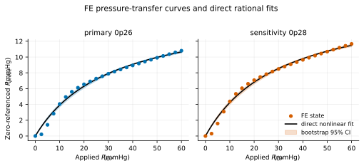

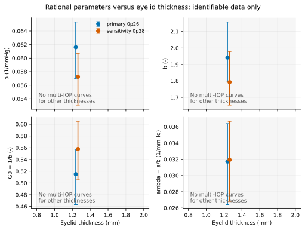

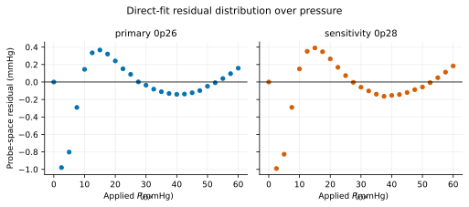

## 4. $k_l,k_{c,0},\alpha$ 的提取结果

现有 7 条厚度力—位移曲线可在 0.20–0.35 mm 目标窗口提取总探头反力斜率。该斜率同时包含眼睑、角膜、bonded 界面和整体运动，故严格记为 $k_{probe,coupled}$，不能命名为 $k_l$。逐厚度的局部线性、割线、平均切线和目标点切线结果见 [`stiffness_parameters.csv`](stiffness_parameters.csv)。

耦合刚度幂律拟合给出 $k_{probe,coupled}=C h^m$，其中 $m=0.9919$；若强行写成题设 $C h^{-n}$，则 $n=-0.9919$（95% CI -1.002 至 -0.9847，对数空间 $R^2=0.9999$）。因此该**耦合结构刚度**不支持 $n=1$ 的一维逆厚度规律；但这不能作为眼睑单体 $k_l$ 的直接反证，因为观测量不同。

每个 IOP 仅有一个保留推进状态，没有每个压力下的角膜力—位移斜率，故 $k_c(P)$、$k_{c,0}$ 与 $\alpha$ 均不可识别。材料弹性模量未被用作结构刚度替代。审计见 [`mechanical_identifiability.csv`](mechanical_identifiability.csv)。

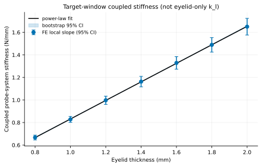

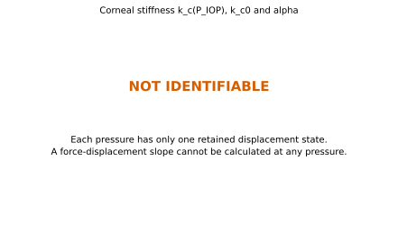

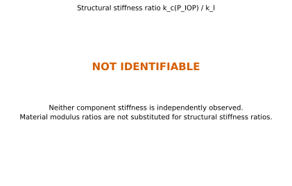

## 5. 理论值与拟合值的一致性

$A_p$、$s$、$R_c$ 可用，但独立 $k_l$、$k_{c,0}$、$\alpha$ 缺失，因此 $a_{theory}$、$b_{theory}$、$G_{0,theory}$、$\lambda_{theory}$ 不能计算。可比较配对数为 0；Pearson、Spearman、相对误差、Bland–Altman 和一致性回归均无定义，而不是“相关系数为零”。现有面积代理推导依赖未独立验证的 $A_{c,5^\circ}$ 与耦合假设，未冒充独立理论验证。

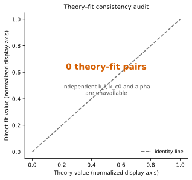

## 6. 厚度对四个参数的灵敏度

| 输出 | 状态 | S_h | S 95%CI下限 | S 95%CI上限 | 最大相对偏差 | CV |
|---|---|---|---|---|---|---|
| a | not_identifiable_across_thickness | NA | NA | NA | NA | NA |
| b | not_identifiable_across_thickness | NA | NA | NA | NA | NA |
| G0=1/b | not_identifiable_across_thickness | NA | NA | NA | NA | NA |
| lambda=a/b | not_identifiable_across_thickness | NA | NA | NA | NA | NA |
| zero_iop_baseline_force | estimable_single_factor | 1.033 | 1.017 | 1.049 | 0.6034 | 0.2787 |
| total_probe_force_at_20 | estimable_single_factor | 0.9518 | 0.9398 | 0.9639 | 0.553 | 0.2589 |
| G_eff_at_20=P_probe/P_IOP | estimable_single_factor | 0.009323 | -0.06288 | 0.08153 | 0.04239 | 0.02331 |
| shared_calibration_iop_prediction | estimable_single_factor | 0.01656 | -0.1048 | 0.1379 | 0.07335 | 0.03915 |

四个精确参数的厚度灵敏度与 CV 均不可估计。可观测组合 $G_{eff,20}$ 的三项代理检查为：灵敏度阈值 满足，相对偏差阈值 满足，共享标定误差阈值 满足。即使代理全部通过，也不能替代对 $G_0$ 和 $\lambda$ 的分别检验。

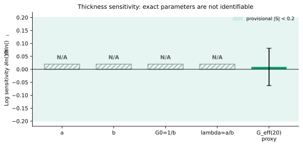

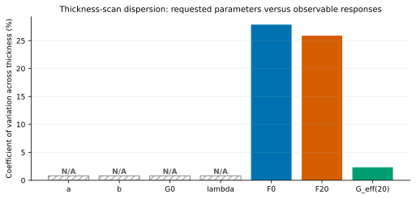

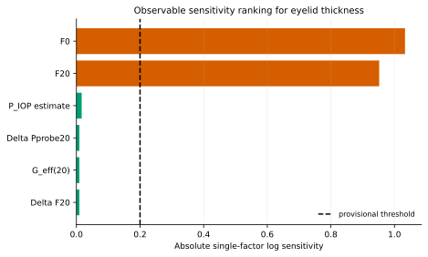

## 7. 厚度对最终眼压误差的影响

以 1.25 mm、0.28 mm 推进的完整压力曲线得到共享 $G_0,\lambda$，再用于各厚度 20 mmHg 端点。总误差 MAE 为 1.506 mmHg，RMSE 为 1.694 mmHg，最大绝对误差为 2.869 mmHg，最大相对误差为 14.34%。相对 1.25 mm 参考预测的纯厚度位移最大绝对值为 1.563 mmHg。

厚度矩阵只含 20 mmHg，因此“厚度效应在高眼压是否被放大”无法直接检验。仅对 1.25 mm 的模型误差分层时，正常范围 MAE 为 1.239 mmHg，高眼压范围 MAE 为 1.003 mmHg；这是模型随压力的误差，不是厚度×压力交互效应。

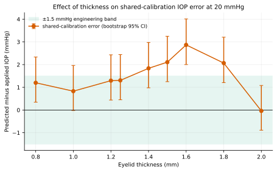

## 8. 结论成立的参数范围

当前唯一可支持的窄结论是：在眼睑厚度 0.80–2.00 mm、角膜厚度 0.60 mm、固定材料设定、探头面积 14.6574 mm²、推进 0.28 mm、IOP=20 mmHg 且逐厚度使用独立 0 IOP 基线时，组合增益 $G_{eff,20}$ 的厚度敏感性较低。此结论不等价于低压极限 $G_0=1/b$ 稳定，也不包含高眼压、不同推进、不同模量、曲率或面积的范围。

## 9. 不支持该结论的条件

- 不能声称逐厚度 $a,b,1/b,a/b$ 已完成拟合；除 1.25 mm 外缺少足够压力点。
- 不能声称重参数化相对 $a,b$ 降低了厚度敏感性；两组量都没有逐厚度可比估计。
- 不能以耦合探头刚度代替 $k_l$，也不能以材料模量代替结构刚度。
- 不能计算理论值—拟合值相关性或 Bland–Altman 一致性；独立理论参数缺失。
- 不能判断厚度效应在高眼压下是否放大；全厚度矩阵只有 20 mmHg。
- 低压接触启用区有系统残差，单一二参数有理式并未完全描述全部 FE 曲线形状。
- 接触归零面积和 5°面积仍是代理/候选定义，不作为独立力学标定真值。

完成验证所需的最小新增矩阵为：至少 5 个压力点（建议 0、10、20、40、60 mmHg）× 当前 9 个厚度，并在每个压力下保存目标窗口内至少 5 个位移点；同时分别积分眼睑承载、角膜承载、界面力和整体支撑反力。这样才能对每个厚度拟合两个压力参数，并独立得到 $k_l$ 与 $k_c(P)$。

## 10. 可直接用于论文 Results 的中文结论段落

在当前有限元数据中，眼睑厚度 0.80–2.00 mm 的扫描仅在 20 mmHg 下提供了逐厚度压力端点，而完整的 0–60 mmHg 压力曲线仅存在于 1.25 mm 厚度。因此，除参考厚度外，$a$、$b$、$1/b$ 和 $a/b$ 无法分别识别，也不能比较重参数化前后的厚度灵敏度。作为受限证据，20 mmHg 下的零基线组合增益 $P_{probe}/P_{IOP}$ 对厚度的归一化敏感度为 0.009323，相对参考厚度的最大偏差为 4.239%，显示单点增量传递对厚度较不敏感。然而，该组合量等于 $G_0/(1+20\lambda)$，不能证明 $G_0=1/b$ 与 $\lambda=a/b$ 各自稳定。故本研究现有有限元结果**不能支持**“重参数化参数普遍比 $a$、$b$ 或直接测量量更不受眼睑厚度影响”的一般性结论；最多只能表述为：在固定材料、0.28 mm 推进和 20 mmHg 工作点，独立零基线后的有效传递增益呈较低厚度敏感性，仍需厚度×多眼压交叉扫描验证。

## 可复现性

运行命令：

```powershell
E:\\SOFTWARE\\annaconda\\annaconda_evn\\python.exe analysis\\run_all.py
```

配置见 [`config.yaml`](../config.yaml)，排除记录见 [`exclusion_log.csv`](exclusion_log.csv)，输出清单见 [`output_manifest.csv`](output_manifest.csv)。所有原始数据均只读。
