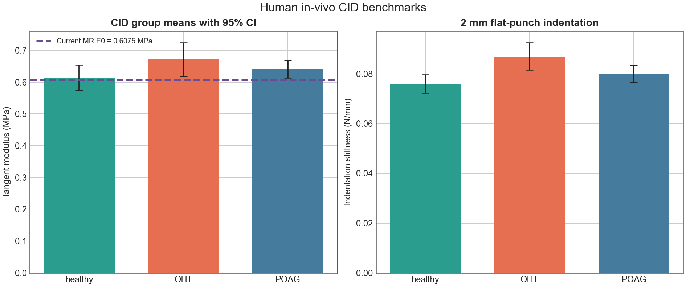
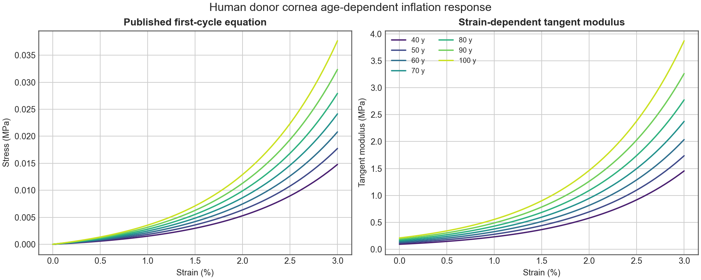
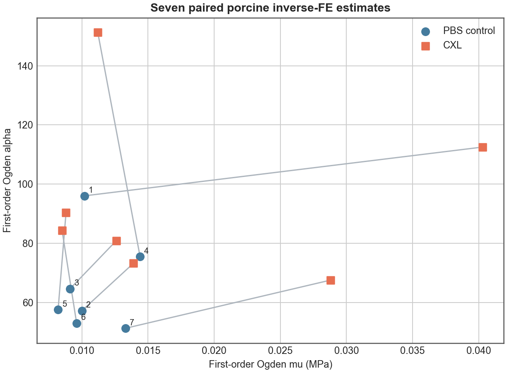
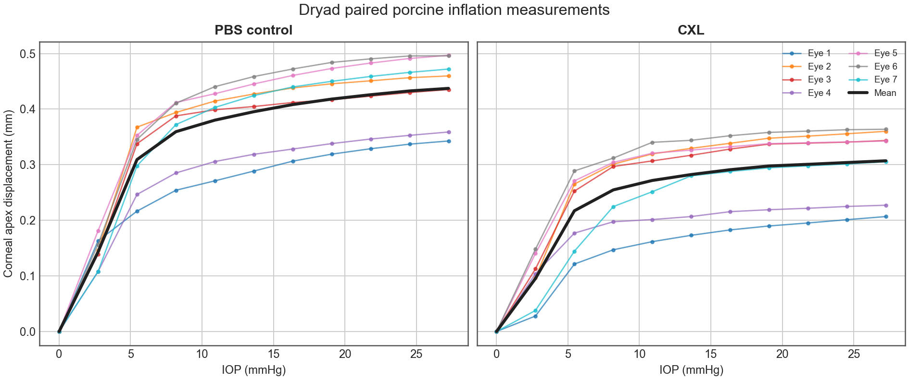
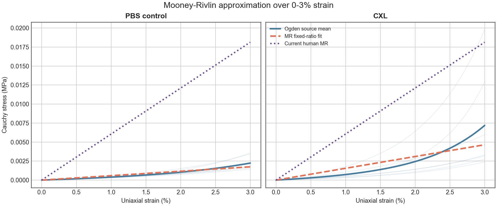
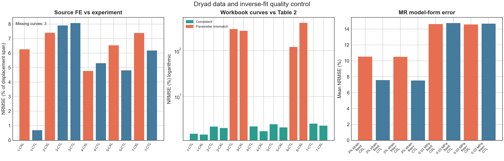
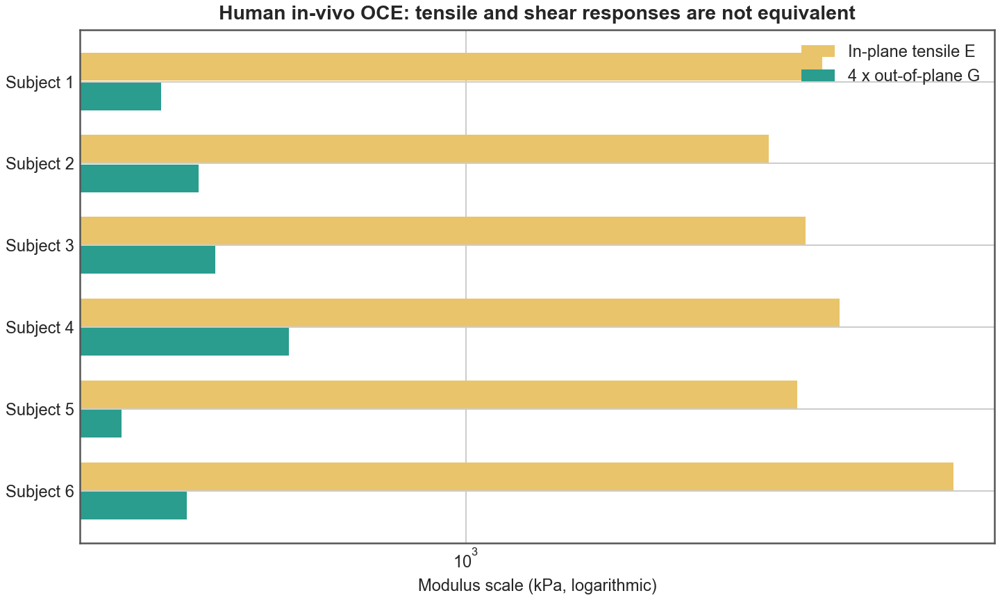

# 角膜材料反演文献数据集

## 1. 目的与范围

本目录汇总可用于当前“角膜-眼睑-探头”模型材料反演、量级校验和指标设计的主流原始研究。数据分成四层：

1. 人眼直接压入的临床统计；
2. 人供体角膜充气实验给出的连续应力-应变关系；
3. 公开猪眼充气实验及逐眼反演参数；
4. 人眼 OCE 给出的面内拉伸与厚度方向剪切响应。

所有机器可读表格均由 [`build_dataset.py`](build_dataset.py) 生成。运行：

```powershell
conda run -n base python data/build_dataset.py
```

脚本只写入本目录，不修改有限元模型或既有结果。

## 2. 核心判断

### 2.1 现有文献可以约束量级和非线性，但不能只靠一篇 CID 文章唯一反演 `C10/C01`

CID 研究包含 186 眼，使用直径 2 mm 平头探头、1 mm 推进和 12 mm/s 速度，以 0.3-0.6 mm 区间斜率计算刚度。健康组切线模量为 `0.614 ± 0.138 MPa`，OHT 为 `0.671 ± 0.154 MPa`，POAG 为 `0.641 ± 0.148 MPa`。原文及补充材料仅提供组统计和重复性结果，没有逐眼完整力-位移曲线、同步接触面积或多个 IOP 下的响应。因此这组数据适合验证整体刚度量级，不能把一个斜率同时唯一分解成 Mooney-Rivlin 的 `C10`、`C01` 和体积参数 `D1`。

当前模型在角膜材料倍率 `0.75` 下：

```text
C10 = 0.0825 MPa
C01 = 0.01875 MPa
E0 ≈ 6(C10+C01) = 0.6075 MPa
```

`E0` 比 CID 健康组均值低约 `1.1%`，说明量级合理；但二者的加载状态、几何修正和模量定义并不相同，只能作为 sanity check，不能表述为材料参数已经被临床数据唯一验证。见 [`cid_human_benchmark.png`](figures/cid_human_benchmark.png) 和 [`current_model_benchmark.csv`](current_model_benchmark.csv)。



### 2.2 人供体充气数据提供了目前最完整的人角膜非线性先验

Elsheikh 等对 57 个人供体角膜进行充气试验，并给出年龄相关的第一、第四加载循环连续公式。本目录在 `0-3%` 应变范围、每 `0.05%` 一个点计算了 `40-100 岁` 曲线，同时保存应力与切线模量。公式结果已与论文表格中的 12 个参考点交叉验证，最大相对差异约 `0.51%`，来自论文公式系数和表值的有限小数位。

该数据适合约束：

- 生理应变范围内的非线性增长；
- 年龄造成的刚度变化；
- 候选材料模型是否能同时复现低应变和较高应变响应。

它不包含眼睑和探头接触，因此不应直接拟合 `Ae/Ac`。



### 2.3 开放猪眼原始数据适合验证反演流程，不适合作为人角膜绝对目标

Chang 等公开了 7 对猪眼的压力-顶点位移、应力-应变和切线模量工作簿，并使用一阶 Ogden 模型反演 `mu/alpha`。论文逐眼参数已整理到 [`porcine_ogden_parameters.csv`](porcine_ogden_parameters.csv)，其反演 RMS 误差为 `5.58 ± 1.79%`。这套数据适合检查优化器能否从完整曲线恢复两个非线性参数，也适合确定搜索范围。

猪角膜厚度、组织结构和 CXL 工况与当前人眼模型不同，因此不能将其 `mu/alpha` 或 `1.73 MPa` 切线模量直接当作当前角膜目标。



Dryad 的 15 个原始工作簿为 CC0 数据，现已全部放入 `raw/dryad_z8w9ghx9f/`，文件大小和 SHA-256 与官方清单 `15/15` 一致。提取后的 154 个实验压力-顶点位移点见 [`dryad_pressure_displacement.csv`](dryad_pressure_displacement.csv)。



原始文件还包含以下质量问题，处理时不能直接盲读：

- 论文 FE 曲线中 11/14 条可用，与实验顶点位移的 NRMSE 为 `0.70%-8.07%`；eye3 CXL 和 eye6 两条曲线标记为 `Missing`。
- `eye3_stressvsstrain.xlsx` 将表 2 的 `mu=0.0091/0.0126 MPa` 写成 `0.091/0.126 MPa`，生成曲线整体放大约 10 倍。
- `eye6_stressvsstrain.xlsx` 的参数和曲线内容与 eye1 相同，不是 eye6 表 2 参数对应的曲线。
- 其余应力-应变工作簿与表 2 参数曲线相差约 `1.5%-2.5%`，来自工作簿内部参数精度高于论文表格保留位数。

因此本目录将论文表 2 的逐眼 `mu/alpha` 作为权威输入，再按来源采用的 Ogden 公式重新生成目标曲线。完整检查见 [`dryad_stress_strain_workbook_qc.csv`](dryad_stress_strain_workbook_qc.csv)。

### 2.4 从 Dryad Ogden 曲线拟合当前 Mooney-Rivlin 模型

使用不可压缩单轴 Cauchy 应力，在 `0-3%` 应变段固定当前 `C01/C10=0.025/0.11` 后，得到：

| 组别 | `C10` (MPa) | `C01` (MPa) | 小应变 `E0` (MPa) | NRMSE |
|---|---:|---:|---:|---:|
| PBS control | 0.00796，95% CI [0.00606, 0.00986] | 0.00181，[0.00138, 0.00224] | 0.0586 | 7.57% |
| CXL | 0.02114，[0.00798, 0.03430] | 0.00480，[0.00181, 0.00780] | 0.1557 | 10.53% |

这组参数只能作为猪角膜 `0-3%` 应变段的 MR 近似。自由非负拟合会使全部 14 条曲线的 `C01=0`，说明两个 MR 参数在该数据和模型形式下不能独立识别。允许负 `C01` 虽能把误差降到约 `1%-5%`，但多组参数出现负初始刚度或近似正负抵消，不能用于稳定有限元求解。

将拟合范围改成 `0-0.03 MPa` 生理应力段后，PBS control 固定比例参数变成 `C10=0.02991 MPa`、`C01=0.00680 MPa`，平均 NRMSE 增至约 `14.75%`。参数随拟合区间变化约 3.8 倍，证明正系数两参数 MR 无法稳定代表该批数据的强应变硬化。



实际使用建议：

1. 复现这批猪眼充气实验时，优先直接使用来源的一阶 Ogden 参数：PBS control 平均 `mu=0.01069 MPa、alpha=65.10`，CXL 平均 `mu=0.01773 MPa、alpha=94.35`。
2. 必须保持当前 MR 模型时，只使用 `0-3%` 固定比例结果做有界敏感性扫描，不作为人角膜最终参数。
3. 当前人眼模型 `C10=0.0825 MPa、C01=0.01875 MPa` 比猪眼 `0-3%` MR 近似约高 10.4 倍；该差异同时包含物种、试验模式和预应力差异，不能据此直接下调现有人眼参数。
4. 下一步人眼材料反演仍应联合 CID 力-位移、多个 IOP 和接触面积数据；Dryad 数据主要用于检验本构形式和反演代码。

全部逐眼策略、稳定性标志和误差见 [`mooney_rivlin_inverse_parameters.csv`](mooney_rivlin_inverse_parameters.csv)，分组 95% CI 见 [`mooney_rivlin_inverse_summary.csv`](mooney_rivlin_inverse_summary.csv)。



### 2.5 人眼 OCE 说明单一各向同性模量只代表等效响应

6 名受试者的 OCE 数据显示，面内拉伸模量约 `3.06-6.06 MPa`，厚度方向剪切模量约 `70-130 kPa`，论文报告的 `E/(4G)` 为 `7.7-22.4`。原文受试者 6 同一行的 `E=6060 kPa`、`G=89 kPa` 实际重算比例为 `17.0`，与报告值 `22.4` 不一致；CSV 同时保留两者并标记异常，图表使用可复算的 `E` 与 `G`。两种响应仍明显不在同一量级，不能把 CID 模量、充气模量和剪切模量无条件互换。

当前各向同性 Mooney-Rivlin 模型仍可用于快速比较厚度趋势，但其参数应写成“当前加载模式下的等效参数”。只有在完整力-位移、接触面积和多 IOP 数据均无法消除系统残差时，才有必要升级到横观各向同性模型。



## 3. 建议补充的反演指标

优先级和最小实验协议见 [`metric_priority.csv`](metric_priority.csv)。最重要的不是再增加一个峰值，而是让同一状态具有相互独立的观测量：

| 优先级 | 指标 | 对当前项目的作用 |
|---:|---|---|
| 1 | 全子步探头力 `F(delta)` | 同时约束刚度量级和曲线非线性 |
| 2 | 外侧接触面积 `Ae(delta)` | 区分“同反力、不同接触足迹”的参数组 |
| 3 | 多 IOP 的 `F(delta, IOP)` | 分离预应力、材料刚度和眼压贡献 |
| 4 | 内侧压平面积 `Ac(delta, theta)` | 保留 `1°/2°/3°`、raw/smooth 和面数，量化阈值敏感性 |
| 5 | 顶点及径向全场位移 `u(r,delta)` | 约束几何、边界条件和各向异性 |
| 6 | 压力加权接触中心 | 约束偏心及装配误差 |
| 7 | 加载-卸载和定程保持 | 仅在引入黏弹性时识别耗散与时间常数 |

峰值压力、峰值应力仍可用于趋势和失效检查，但不应作为材料反演的主要目标；它们对网格、接触边缘和节点平均方式过于敏感。

## 4. 推荐反演顺序

1. **固定问题定义**：保持当前 bonded 界面和加载路径，先确认 CCT、曲率、IOP、探头几何、初始间隙及接触容差一致。
2. **拟合整体倍率**：固定 `C01/C10` 和 `D1`，用完整 `F(delta)`、CID 健康量级及人供体年龄曲线拟合一个角膜倍率。当前 `0.75` 可作为起点。
3. **分离两个偏差参数**：至少增加 `Ae(delta)` 和 3 个以上 IOP 水平，再联合拟合 `C10/C01`；只有单条力曲线时继续固定二者比例。
4. **联合眼睑指标**：用真实实验的 `Ae/Ac(2°)`、探头力和多 IOP 曲线拟合眼睑参数。当前内部约束已写入 [`inverse_targets.csv`](inverse_targets.csv)，与文献来源明确分开。
5. **模型升级判定**：若中心/偏心、不同 IOP 和不同厚度的残差具有同一方向性，再评估横观各向同性；不要用增加材料参数掩盖面积判据或网格问题。

建议目标函数采用归一化残差，避免量纲大的指标支配优化：

```text
J = wF * RMSE(F/Fref)
  + wAe * RMSE(Ae/Aeref)
  + wAc * RMSE(Ac/Acref)
  + wU * RMSE(u/uref)
```

`Ae/Ac` 的 20% 接受误差应作为当前阶段验收项，不应替代 `Ae` 和 `Ac` 两个原始量的分别拟合。

## 5. 文件说明

| 文件 | 内容 |
|---|---|
| `sources.csv` | 文献、数据层级、许可和反演用途 |
| `inverse_targets.csv` | 可直接进入目标函数或量级校验的长表 |
| `metric_priority.csv` | 建议增加的实验/仿真指标和最小协议 |
| `cid_group_metrics.csv` | CID 四组均值、SD 和正态近似 95% CI |
| `cid_repeatability.csv` | CID 两次测量均值、SD 和 ICC |
| `human_age_stress_strain.csv` | 人供体第一/第四循环连续曲线 |
| `human_age_reference_points.csv` | 论文表值与公式计算交叉验证 |
| `human_oce_anisotropy.csv` | 6 名受试者的拉伸/剪切模量 |
| `porcine_ogden_parameters.csv` | 7 对猪眼的逐眼 `mu/alpha` |
| `porcine_inflation_summary.csv` | 猪眼充气汇总及 95% CI |
| `dryad_file_manifest.csv` | 15 个公开原始工作簿的校验清单 |
| `dryad_pressure_displacement.csv` | 7 对猪眼实验及来源 FE 压力-顶点位移长表 |
| `dryad_pressure_displacement_validation.csv` | 来源 FE 曲线对实验曲线的复现误差 |
| `dryad_stress_strain_workbook_qc.csv` | 应力-应变工作簿与论文表 2 的逐眼质量检查 |
| `mooney_rivlin_inverse_parameters.csv` | 逐眼、逐区间、逐策略 MR 反演参数和稳定性标志 |
| `mooney_rivlin_inverse_summary.csv` | MR 反演分组均值、SD 和 95% CI |

95% CI 均由论文提供的 `mean ± SD` 和样本量按 `mean ± 1.96 SD/sqrt(n)` 计算，是组均值区间，不是个体正常范围。

## 6. 主要来源

- [CID 青光眼与高眼压临床研究](https://doi.org/10.1167/tvst.10.9.36)
- [CID-GAT 方法和模量换算](https://doi.org/10.1167/tvst.8.5.10)
- [人供体年龄相关充气曲线](https://doi.org/10.1098/rsif.2010.0108)
- [猪眼完整开放数据集](https://doi.org/10.5061/dryad.z8w9ghx9f)
- [猪眼充气与逆向有限元论文](https://doi.org/10.1371/journal.pone.0240724)
- [CorVis SSI 应力-应变指标](https://doi.org/10.3389/fbioe.2019.00105)
- [人角膜黏弹性充气实验](https://doi.org/10.1371/journal.pone.0112169)
- [人眼面内拉伸/厚度剪切 OCE](https://doi.org/10.1016/j.actbio.2023.12.019)
- [NITI 横观各向同性 OCE 模型](https://doi.org/10.1038/s41598-020-69909-9)
