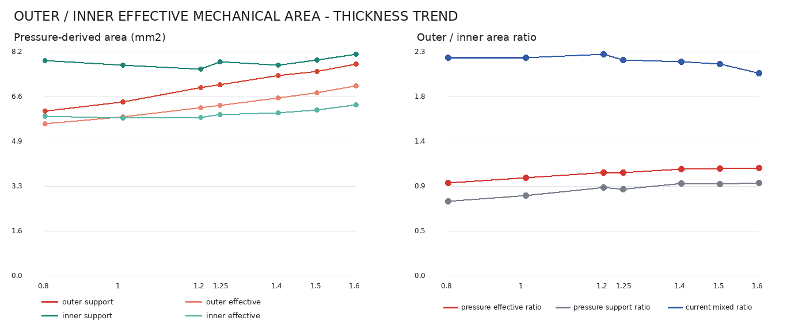

# 眼睑厚度 Ae/Ac 计算与校准

## 当前结论

正式厚度比较统一使用 `0.28 mm` 名义推进。当前可用结果来自 5090d 批次
`20260723T114358Z_973a834a_formal_0p28`，已完成且面数据完整的厚度为
`0.80、1.00、1.20、1.25、1.40、1.50、1.60 mm`。`1.80 mm` 和 `2.00 mm`
算例超时，未混入本报告。

当前采用两种不同但互补的面积定义：

- 外侧面积 $A_e$：眼睑外表面位移参与区在探头圆内的**保守网格下界**；
- 内侧面积 $A_c$：眼睑—角膜 bonded 界面上由推进引起的**增量压力参与面积**。

两者不是同一种阈值算法分别套在内外表面。外侧对应探头可见范围内的几何参与，内侧对应载荷向角膜传递的有效范围。完全 bonded 会把宽范围随动位移传到内表面，若内侧继续使用外侧位移覆盖规则，几乎整个探头圆都会入选，无法区分承载核心。

当前候选比值定义为

$$
K_{L/P}=\frac{A_e^L}{A_c^P}.
$$

七个状态的 $K_{L/P}$ 为 `2.084-2.275`，但随厚度增加总体轻微下降，与希望获得的上升趋势不一致，因此仍标记为 `candidate_not_approved`。这些结果可用于方法评估和下一轮材料/IOP 调整，不能直接作为最终实验回归或专利定量结论。

补充的[首次稳定接触归零实验](../thick/experiments/contact_rezeroed_0p26_0p28/README.md)从同一批次结果历史中重新选取了有效推进 `0.26/0.28 mm` 状态。归零后 $K_{L/P}$ 的绝对值提高到 `2.297-2.771`，但仍随厚度下降；实际承载接触覆盖率仅为 `29.7%-43.4%`。该实验同时发现 `0.80-1.25 mm` 工况在 IOP 预载末端已经出现探头接触，说明固定 `0.05 mm` 初始间隙不足以形成统一的无接触预载状态。归零结果只作为加载路径敏感性诊断，不替换本节正式批次记录。

### 几何初接触重算

当前正式重算不再使用固定 `0.05 mm` 间隙或 `1 mN` 反力阈值定义零点。未加载模型中的探头间隙增至 `g_0=0.30 mm`，载荷路径连续保持在同一次非线性分析中：

1. 仅施加 IOP，探头保持在初始位置；
2. 读取预载末端眼睑顶点抬升 $u_{apex}^{IOP}$，计算剩余间隙并移动至几何初接触；
3. 从几何初接触位置继续推进 `0.26 mm` 或 `0.28 mm`。

每个厚度的接近距离与最终探头位移分别为

$$
g_{pre}=g_0-u_{apex}^{IOP},
\qquad
u_{probe}=-(g_{pre}+\delta),
$$

其中 $\delta$ 是正式推进距离。求解完成后再读取第一、第二载荷步，要求 IOP 预载末端闭合接触单元数和接触面积均为零，且几何初接触反力不超过 `1 mN`。这些条件属于结果有效性检查，不参与零点拟合。

提交 `371ed27` 的代表性验证中，`0.80 mm` 眼睑在 IOP 下的顶点抬升为 `0.0760 mm`，因此接近距离为 `0.2240 mm`；预载接触面积为零，几何初接触反力约为 $8\times10^{-14}\ \mathrm N$。全厚度面积结果完成前，旧批次结论仍保留为历史对照，不与新零点数据混合统计。

## 固定模型与工况

| 项目 | 当前设置 |
|---|---|
| 探头直径 / 半径 | `4.32 mm / 2.16 mm` |
| 探头投影圆面积 | $\pi a^2=14.6574\ \mathrm{mm^2}$ |
| 几何初接触后推进 | `0.26 mm / 0.28 mm` |
| 未加载初始间隙 | `0.30 mm` |
| 探头总位移 | 按厚度计算：$g_0-u_{apex}^{IOP}+\delta$ |
| IOP | `20 mmHg` |
| 眼睑材料倍率 | `1.00` |
| 角膜材料倍率 | `0.75` |
| 角膜厚度 | `0.60 mm` |
| 主网格 | `0.30 mm` |
| 眼睑—角膜界面 | 完全 bonded |
| 加载路径 | IOP 预载 → 几何初接触 → 保持 IOP 正式推进 |

`0.26/0.28 mm` 用于固定低位移比较状态并避开大位移高畸变区。初始球面中心到探头边缘的弧高约为 `0.241-0.276 mm`，这个接近关系只说明几何尺度相当，不代表有限元模型已经形成完整平面，也不能直接生成面积。

## 两种面积定义

### 外侧面积 Ae：位移参与区的保守网格下界

#### 1. 建立位移参与区

对外表面三角面片 $i$，以 IOP 预载状态为基准，计算局部向下位移 $d_i$。使用表面最外侧 `20%` 半径范围估计远场基线 $b_d$ 和稳健噪声：

$$
\sigma_d=1.4826\,\operatorname{MAD}(d_i-b_d),
\qquad
T_d=\max(3\sigma_d,1\ \mu\mathrm m).
$$

保留满足 $d_i-b_d>T_d$、与探头圆有交叠，并与探头轴附近种子面片边连通的中央分量。该步骤只排除远场随动和孤立噪声，不施加法向角或曲率阈值。

#### 2. 用完整网格面片形成保守下界

设探头半径为 $a=2.16\ \mathrm{mm}$，面片 $i$ 在最终变形状态的三个投影顶点为 $(x_{ij},z_{ij})$。只有三个顶点都位于探头圆内时，整片才计入严格集合：

$$
\mathcal C_e^L=\left\{i\;\middle|\;
\max_{j\in\{1,2,3\}}\sqrt{x_{ij}^2+z_{ij}^2}\le a
\right\}.
$$

外侧候选面积为这些完整面片在探头平面上的投影积分：

$$
A_e^L=\sum_{i\in\mathcal C_e^L}A_{i,\perp}.
$$

跨越探头边界的三角面片不计入 $A_e^L$。同一位移支撑集与探头圆精确裁切后的面积记为 $A_e^U$，边界离散不确定量为

$$
\Delta A_e=A_e^U-A_e^L.
$$

当前七个状态的 $A_e^U$ 均约等于探头圆面积 `14.657 mm²`；这只是上限。正式候选采用 $A_e^L=12.998-13.240\ \mathrm{mm^2}$，即探头面积的 `88.7%-90.3%`。随着网格细化，严格下界应从下方趋近圆裁切积分。

对比矩阵左侧显示外表面：红色是计入 $A_e^L$ 的完整面片，黄色是跨边界且排除的面片，蓝色是低于位移门槛、圆外或与中央分量不连通的面片。右侧将压力入选状态映射回真实内表面三角网格：红色是超过增量压力门槛的中央连通面片，蓝色是不计入的界面面片。黑圆均为探头边界，矩阵下方列出 $A_e^L$、$A_c^P$ 和二者比值。


该定义回答的是：“在探头投影范围内，哪些外表面完整网格已稳定参与向下变形？”它不是闭合接触面积，也不是严格的零曲率平面面积。

### 内侧面积 Ac：增量压力参与面积

#### 1. 从预载中分离探头引起的压力

在眼睑—角膜 bonded 界面的角膜侧 `CONTA174` 面片上，分别读取 IOP 预载末端和 `0.28 mm` 推进末端的法向压力、真实曲面面积与面中心。第 $i$ 个面片的压力增量为

$$
\Delta p_i=p_i^{(1)}-p_i^{(0)}.
$$

在探头边缘外的参考环带 $1.2a\le r\le1.6a$ 估计背景和噪声：

$$
b_p=\operatorname{median}_{\mathrm{annulus}}(\Delta p_i),
\qquad
\sigma_p=1.4826\,\operatorname{MAD}_{\mathrm{annulus}}(\Delta p_i-b_p).
$$

定义净增量 $q_i=\Delta p_i-b_p$。仅保留满足 $q_i>3\sigma_p$ 且与探头轴附近面片边连通的中央分量 $\mathcal C_p$。内侧不使用探头圆强制裁切；远端孤立斑块由中央连通约束排除。

#### 2. 区分支撑面积与有效参与面积

显著受压的真实曲面支撑面积为

$$
A_{c,\mathrm{support}}^P=\sum_{i\in\mathcal C_p}A_i.
$$

正式候选 $A_c^P$ 使用压力加权的有效参与面积：

$$
A_c^P=
\frac{\left(\sum_{i\in\mathcal C_p}q_iA_i\right)^2}
{\sum_{i\in\mathcal C_p}q_i^2A_i}.
$$

这里的 $A_i$ 是变形后真实曲面面积。若压力在支撑区内均匀分布，$A_c^P$ 等于支撑面积；压力越集中，$A_c^P$ 越小。该定义同时使用了承载范围和载荷集中程度，比“所有发生位移的内表面”更接近内部有效压缩区。


### 为什么两种面积不能互换

| 对比项 | 外侧 $A_e^L$ | 内侧 $A_c^P$ |
|---|---|---|
| 物理问题 | 探头范围内外表面参与变形的几何覆盖 | 推进载荷通过 bonded 界面传递的有效范围 |
| 原始量 | 预载到最终状态的向下位移 | 预载到最终状态的法向压力增量 |
| 积分尺度 | 探头平面投影面积 | 变形后真实曲面面积 |
| 边界策略 | 探头圆内完整面片形成下界 | 压力阈值中央连通区，不强制圆裁切 |
| 对非均匀场的处理 | 面片等权几何积分 | 压力平方积分降低集中载荷的等效面积 |
| 当前角色 | $A_e$ 候选 | $A_c$ 候选 |

如果把外侧规则直接用于内侧，完全 bonded 造成的整体随动会使内表面接近整圆；如果把压力规则直接用于外侧，则会把外侧可观测几何面积改写成接触载荷面积。二者都偏离当前要描述的内外压平差异。

## 0.28 mm 结果

| 眼睑厚度 | $A_e^L$ | 边界不确定带 | 外侧闭合接触诊断 | $A_{c,\mathrm{support}}^P$ | $A_c^P$ | $K_{L/P}$ |
|---:|---:|---:|---:|---:|---:|---:|
| `0.80 mm` | `13.098 mm²` | `1.559 mm²` | `6.028 mm²` | `7.875 mm²` | `5.848 mm²` | `2.240` |
| `1.00 mm` | `12.998 mm²` | `1.660 mm²` | `6.367 mm²` | `7.713 mm²` | `5.792 mm²` | `2.244` |
| `1.20 mm` | `13.217 mm²` | `1.441 mm²` | `6.893 mm²` | `7.574 mm²` | `5.810 mm²` | `2.275` |
| `1.25 mm` | `13.083 mm²` | `1.574 mm²` | `7.004 mm²` | `7.843 mm²` | `5.902 mm²` | `2.217` |
| `1.40 mm` | `13.112 mm²` | `1.545 mm²` | `7.341 mm²` | `7.720 mm²` | `5.963 mm²` | `2.199` |
| `1.50 mm` | `13.240 mm²` | `1.418 mm²` | `7.482 mm²` | `7.907 mm²` | `6.087 mm²` | `2.175` |
| `1.60 mm` | `13.064 mm²` | `1.593 mm²` | `7.767 mm²` | `8.109 mm²` | `6.268 mm²` | `2.084` |


当前 $A_e^L$ 随厚度基本稳定，而 $A_c^P$ 总体由 `5.848 mm²` 增至 `6.268 mm²`，所以比例下降。实验目标中 `0.80-1.25 mm` 的主要比例区间为 `1.5-2.0`，当前结果 `2.217-2.275` 相对区间上界高 `10.9%-13.8%`，仍在预设 `20%` 容差内；`1.50 mm` 的当前结果 `2.175` 相对目标约 `2.5` 低 `13.0%`。数值误差可接受不等于趋势正确，尤其当前没有 `2.00 mm` 的可用 `0.28 mm` 结果。

### 统一压力有效面积对照

另设独立诊断实验，使外侧和内侧都采用压力增量场，并统一使用

$$
A_s^P=
\frac{\left(\sum q_{s,i}A_{s,i}\right)^2}
{\sum q_{s,i}^2A_{s,i}},
\qquad
K_{P/P}=\frac{A_e^P}{A_c^P}.
$$

该口径下，外侧 $A_e^P$ 由 `5.571 mm²` 增至 `6.953 mm²`，内侧 $A_c^P$ 由 `5.848 mm²` 增至 `6.268 mm²`，$K_{P/P}$ 从 `0.953` 总体增至 `1.109`。七点线性描述斜率为 `+0.199/mm`，$R^2=0.959$，趋势方向转为随厚度上升；但绝对值集中在 `1` 附近，明显不能替代实验中的内外压平面积比例。

这组结果表明：当前模型的外侧接触压力分布随厚度扩展得比内侧增量压力分布更快；同时也表明实验所称的内外压平面积差异不能简化成两个压力场等效承载面积之比。完整公式、数据、网格矩阵和限制见[统一力学有效面积对照实验](../thick/experiments/mechanical_area_comparison/README.md)。



以下区间是七个设计厚度点的描述性 t 区间，不代表重复实验、人群分布或有限元模型误差：

| 指标 | 均值 | 95% CI |
|---|---:|---:|
| $A_e^L$ | `13.116 mm²` | `[13.037, 13.195] mm²` |
| $A_c^P$ | `5.953 mm²` | `[5.794, 6.112] mm²` |
| $K_{L/P}$ | `2.205` | `[2.147, 2.262]` |
| 外侧闭合接触面积 | `6.983 mm²` | `[6.412, 7.555] mm²` |

## 质量检查与敏感性

- 压力参考环带扫描 `1.1a-1.5a、1.2a-1.6a、1.3a-1.7a`，门槛扫描 `2σ、3σ、4σ`。
- `0.80 mm` 的比例敏感性范围为 `2.193-2.294`；`1.60 mm` 为 `1.961-2.293`。
- 压力加权质心的横向偏移约 `0.03 mm`，低于 `0.10 mm` 对称性门槛。
- 外侧黄色边界不确定带为 `1.418-1.660 mm²`，当前粗网格对圆边界仍有明显离散误差。
- 外侧闭合接触面积 `6.028-7.767 mm²` 只用于接触状态 QC，不代替 $A_e$。
- 内侧支撑面积 `7.574-8.109 mm²` 用于检查阈值区域，不代替压力参与面积 $A_c^P$。

正式批准前至少还需要完成：代表厚度的网格细化收敛、材料/IOP 灵敏度、`1.80/2.00 mm` 可用工况，以及同一规则在不同推进距离上的连续性检查。不能通过修改阈值强制得到目标比例或目标趋势。

## 不再作为正式面积的方法

### 球面相交或弧高公式

旧方法使用

$$
r=\min\left(a,\sqrt{2R\delta-\delta^2}\right),
\qquad A=\pi r^2.
$$

该式描述理想平面与未变形球面的几何相交。一旦 $r$ 达到探头半径，`min` 会直接返回完整探头面积，与实际位移场、接触和压力无关。它只可用于几何尺度核对，不能定义 $A_e$ 或 $A_c$。

### 0.5°-10° 法向角扫描

法向夹角阈值只识别中央近水平核心，面积随阈值和网格平滑方式高度变化。相关红蓝图继续用于观察形态与阈值敏感性，不进入材料评分、实验回归或专利结论。

当前独立实验扫描 `0.5°、1°、2°、3°、4°、5°、6°、7°、8°、9°、10°`。`5°` 外侧覆盖率为 `57.7%-65.2%`，角度面积比为 `1.028-1.651`；`10°` 外侧覆盖率达到 `97.8%-99.6%`，角度面积比收缩为 `1.053-1.188`。低角度端同样不稳定，`0.5°` 有一个厚度没有形成有效内侧区域，其他状态的比值最高达到 `37.7`。完整[趋势图](../thick/experiments/flat_region_angle_sweep/figures/flat_region_angle_sweep.png)、[汇总数据](../thick/experiments/flat_region_angle_sweep/figures/flat_region_angle_sweep.csv)和[实验说明](../thick/experiments/flat_region_angle_sweep/README.md)只用于展示阈值敏感性。

### 径向折点与局部平面残差

径向位移折点、曲率消减和局部平面残差可以诊断变形边界，但在完全 bonded 模型中不能稳定区分内表面整体随动与有效承载，当前仅保留为历史复核。

### 闭合接触面积

探头—眼睑闭合接触面积是直接力学量，可用于检查接触是否随推进和厚度合理变化；它描述承载接触，不等于外部参与面积 $A_e$，也不能替代内部压力参与面积 $A_c$。

## 复现入口

外侧位移参与区、保守面积和图像：

```bash
python src/postprocess/plot_displacement_support.py "$RUN_ROOT" \
  --output-dir thick/figures/fe_sweep_indent_0p28/displacement_support \
  --workers 4
```

内侧增量压力面积、灵敏度和趋势图：

```bash
python src/postprocess/analyze_inner_pressure_area.py "$RUN_ROOT" \
  --output-dir thick/figures/fe_sweep_indent_0p28/inner_pressure_area
```

主要机器可读结果：

- `thick/figures/fe_sweep_indent_0p28/displacement_support/displacement_support_manifest.csv`
- `thick/figures/fe_sweep_indent_0p28/inner_pressure_area/inner_pressure_area_candidate.csv`
- `thick/figures/fe_sweep_indent_0p28/inner_pressure_area/inner_pressure_area_sensitivity.csv`

求解场、反力、接触状态和变形面网格仍然有效。材料自动评分只能在未来出现经过批准的面积字段后恢复；当前候选字段不得改名伪装成正式 `Ae/Ac`。
