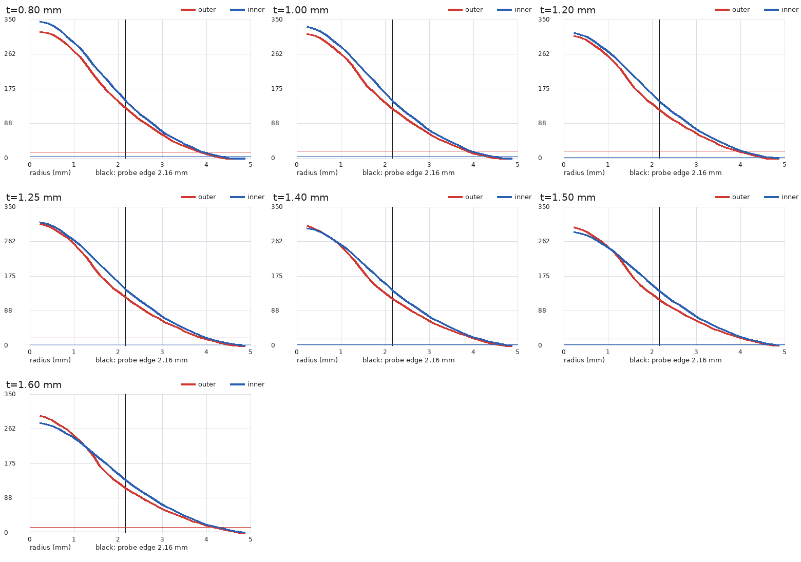
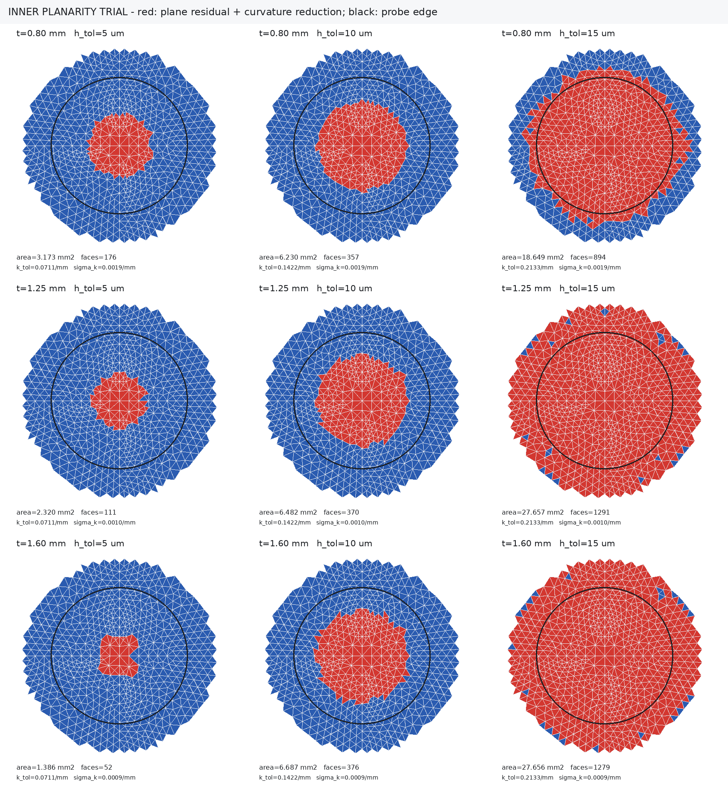
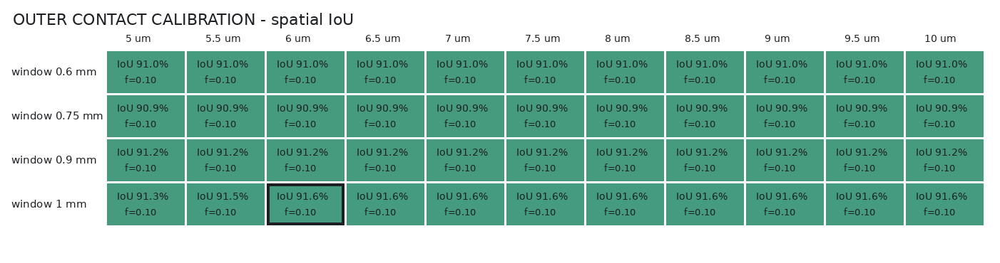
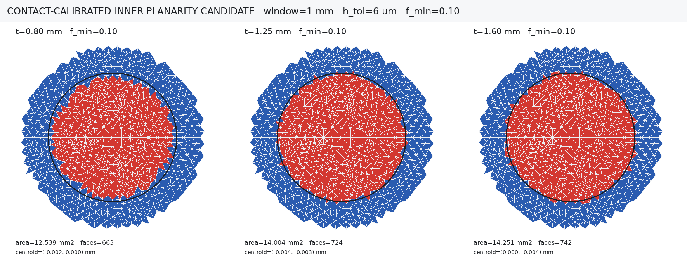

# 眼睑厚度材料校准

## 当前运行结果

5090d 批次 `20260721T070542Z_6a75cde2_calibration_0p26` 已完成 `0.30 mm` 网格九点扫描，但其候选排序把球面覆盖面积同时用于完整比例，内部面积口径无效，因此校准结论仍无效。眼睑倍率 `1.00`、角膜倍率 `0.75`、IOP `20 mmHg` 只能视为该批次的求解参数，不能称为筛选后的材料参数。位移场、反力和接触结果保留为历史对照；正式厚度比较统一使用 `0.28 mm` 名义推进。

本批次不能标记为完整校准结束：三个 `0.15 mm` 全局细网格验证均未形成可用结果，控制器随后因索引缺失网格数据触发 `KeyError: 0.8`，没有生成 `selected_parameters.json`、`mesh_validation.csv`、`calibration_report.md` 和 `calibration_status.json`。已经落盘并通过 QC 的 `0.30 mm` 九点结果仍可使用，状态应理解为“粗网格阶段完成、网格验证未完成”。

初始球面中心至探头边缘半径处的高度差为 `0.241-0.276 mm`，`1.25 mm` 眼睑为 `0.2615 mm`。该值只描述未变形初始几何的轴向高度尺度，不能代表完全压平位移，也不能生成 `Ae`。`0.70-0.75 mm` 只代表有限元闭合接触面积平台。统一 `0.28 mm` 的作用是固定低位移比较状态并避开大位移畸变区，不意味着探头范围已经完全压平。

本流程固定 `20 mmHg` IOP，统一状态为 `0.28 mm`。2026-07-23复核确认：中央连续 `2°` 网格面积只能表示“近水平核心区”，不能表示原几何关系中的完整压平面积 `Ae/Ac`。字段 `ae_over_ac_flat_2deg`、相关红蓝图和角度扫描均降级为灵敏度诊断，不再用于材料选择、实验回归或专利结论。求解得到的位移场、反力、接触状态和表面网格继续有效，无需重新求解后才能修改面积后处理。

## 求解入口状态

材料自动校准当前已停用。在认可的形变面积定义实现前，
`src/runners/run_thickness_calibration.py` 会立即退出，避免历史面积字段参与评分并继续消耗
求解资源。普通厚度求解和已有结果后处理不受影响。

恢复校准后，5090d 的正式仓库必须处于干净 Git 状态：

```bash
cd /home/xuanyu/PROJECT/ziyu/blueknow/simulation
ops/start-thickness-calibration-5090d.sh
```

启动脚本输出 `RUN_ROOT` 和 `CONTROLLER_PID`。控制器通过 `nohup` 独立运行，不依赖
SSH或Codex会话。默认并行度为4个算例、每个算例4个MAPDL核，可通过
`BLUEKNOW_SWEEP_WORKERS` 和 `BLUEKNOW_CASE_NP` 覆盖。

## 状态检查

```bash
python src/postprocess/check_calibration_run.py "$RUN_ROOT"
```

需要保存检查证据时：

```bash
python src/postprocess/check_calibration_run.py "$RUN_ROOT" \
  --write-snapshot "$RUN_ROOT/health_snapshot.json"
```

当控制器仍存活、活动日志持续更新、没有致命/未收敛/高畸变标记，并且已有一个完成
算例或至少三个收敛进度标记时，`healthy_to_leave_unattended` 为 `true`。达到该状态后
不需要持续轮询。

## 0.5°/1°/2°/3°有效形变分布

正式结果完成后生成四组外侧和内侧二值网格图：

```bash
python src/postprocess/plot_flat_region_2deg.py "$RUN_ROOT" --workers 4
```

默认角度为 `0.5°、1°、2°、3°`，也可通过 `--angles` 指定。红色表示满足位移
阈值、中央边连通且平滑面法向夹角不超过当前角度的有效平坦网格；蓝色表示未计入
网格。每个角度输出各厚度俯视图、3D/半剖/中央剖面图、面积与覆盖率 CSV，以及
汇总矩阵。`0.5°、1°、2°、3°` 现在全部只用于灵敏度观察；红色含义是
`θ` 不超过当前阈值，而不是 `θ` 大于当前阈值。

## 0.28 mm位移参与区二值图

不施加角度或曲率门槛、仅检查位移门槛时，使用独立后处理命令：

```bash
python src/postprocess/plot_displacement_support.py "$RUN_ROOT" --workers 4
```

红色表示局部向下位移满足
$\tilde d_i>\max(3\sigma_{\mathrm{MAD}},1\ \mu\mathrm m)$、属于中央边连通分量，且三角面
三个顶点全部位于探头圆内；黄色表示跨越探头边界的不确定面片，主面积不计入；蓝色
表示低于门槛、位于探头圆外或与中央分量不连通。该图没有施加法向角或曲率权重，
因此不能称为压平核心；红色完整面片投影和只作为外侧参与面积的保守下界。


当前正式批次有7个完成且面数据完整的厚度状态：
`0.80、1.00、1.20、1.25、1.40、1.50、1.60 mm`；`1.80、2.00 mm`超时，未将不完整
面数据混入矩阵。7个状态的外表面门槛为
`14.80-19.19 μm`，修正后的眼睑内表面门槛为`2.38-5.10 μm`，但探头圆内红色覆盖率
按精确圆裁切均约为`100%`。排除黄色边界不确定带后，外侧下界为`12.998-13.240 mm²`，
约为探头面积的`88.7%-90.3%`。
这说明稳健位移门槛能排除远场噪声，却不能在本工况中区分压平核心与仅随动变形区域；
因此它只负责给出外侧覆盖下界，内侧仍使用下文的增量压力参与面积。

### 内外表面径向数值探针

位移二值图出现内表面整圆全红后，使用`0.15 mm`径向环形探针复核数值分布：

```bash
python src/postprocess/plot_displacement_probe_profiles.py "$RUN_ROOT" \
  --bin-width-mm 0.15 --x-max-mm 5.0
```



红线为眼睑外表面，蓝线为眼睑内表面，黑线为探头半径`2.16 mm`。修正后的7个厚度
状态具有以下数值范围：

| 数值探针量 | 外表面 | 眼睑内表面 |
|---|---:|---:|
| 位移门槛 | `14.80-19.19 μm` | `2.38-5.10 μm` |
| 探头圆内局部位移中位数 | `183.5-207.6 μm` | `200.6-235.5 μm` |
| 探头边缘局部位移中位数 | `119.6-136.8 μm` | `142.3-156.3 μm` |
| 超过门槛的探头内面片比例 | `100%` | `100%` |

原后处理在`REAL=4`接触对上选择了`CONTA174`，取得的是角膜外侧接触网格，而不是
眼睑内侧网格。现已改为选择同一接触对的眼睑侧`TARGE170`。以`1.25 mm`为例，修正前后
内侧探头圆内位移中位数分别为`219.70 μm`和`219.37 μm`，探头边缘分别为
`151.45 μm`和`152.34 μm`。标签侧选择需要修正，但数值差异小于`1%`，不是整圆全红
的主因。

主因是完全bonded界面把角膜的宽范围弯曲随动传递到眼睑内表面。绝对向下位移直到
探头范围之外仍显著高于噪声门槛，再叠加`r\le2.16 mm`的探头圆裁切，结果必然是圆内
全部入选。不能通过任意提高内侧位移门槛来制造较小的$A_c$；位移门槛只应确定受影响
支撑域，压平程度继续由预载到最终状态的曲率消减或其他形状变化量决定。完整探针数值
保存在`displacement_probe_summary.csv`和`displacement_probe_profiles.csv`中。

### 内表面平面性试绘

使用眼睑侧`TARGE170`预载/最终面，对`0.8、1.25、1.6 mm`三个厚度进行局部平面残差与
曲率消减联合试绘。局部拟合窗口直径固定为`0.75 mm`，黑圈只标示探头边界，不作为
红色区域的强制截断条件：

```bash
python src/postprocess/plot_inner_planarity_trial.py "$RUN_ROOT" \
  --thicknesses 0.8 1.25 1.6 \
  --height-tolerances-um 5 10 15 \
  --window-diameter-mm 0.75 --analysis-radius-mm 3.0
```



| 眼睑厚度 | `5 μm`面积 | `10 μm`面积 | `15 μm`面积 |
|---:|---:|---:|---:|
| `0.80 mm` | `3.173 mm²` | `6.230 mm²` | `18.649 mm²` |
| `1.25 mm` | `2.320 mm²` | `6.482 mm²` | `27.657 mm²` |
| `1.60 mm` | `1.386 mm²` | `6.687 mm²` | `27.656 mm²` |

`5 μm`下中央区域能够自然终止，并随厚度增加而收缩；`10 μm`下三组面积集中在
`6.2-6.7 mm²`；`15 μm`几乎选满整个`3 mm`分析半径。该试绘证明平面残差与曲率变化
可以排除单纯整体随动，但面积对容差仍高度敏感，当前三列均只用于选择算法尺度，不能
作为正式$A_c$。后续已使用外表面闭合接触区校准$h_{\mathrm{tol}}$并检查
`0.6-1.0 mm`拟合窗口，结果见下节。

### 外接触校准对几何方案的否定结果

`post_thickness_geometry.mac`现已逐单元导出探头—眼睑外表面的`CONT:STAT`、
`CONT:PRES`和曲面面积。7个完成工况的真实闭合接触面积为`6.028-7.767 mm²`。
在`5-10 μm`平面残差范围和`0.6-1.0 mm`局部窗口内进行了三轮目标独立检查：

1. 二值近似平面区在`0.60 mm`窗口、`8 μm`门槛下可用`6.9%`平均相对误差复原外接触
   面积，但同一规则得到的内表面面积为`9.45-12.70 mm²`，内表面反而更大。
2. 连续曲率消减权重使内表面面积随厚度由`5.94 mm²`降至`5.18 mm²`，但外表面自身
   低估真实接触面积`11%-25%`，不能通过外表面验收。
3. 用真实闭合/开放状态按空间IoU校准“接触等效”曲率阈值，外表面平均IoU达到
   `91.6%`，但最优曲率消减比例落在搜索下边界`0.10`；应用到内表面后面积达到
   `12.54-14.37 mm²`，接近整个探头圆。

这些结果共同说明，`5-10 μm`可以作为局部几何残差检查范围，但不能单独定义当前
完全bonded模型的内侧有效压缩面积。bonded界面把较宽范围的几何随动传到内表面，继续
提高曲率或平面门槛只会把目标比例写入算法。完整校准网格和试绘保存在：





### 内表面压力参与面积候选

更合理的内表面口径改用眼睑—角膜bonded界面的法向压缩载荷。MAPDL分别在IOP预载
末端和`0.28 mm`推进末端导出角膜侧`CONTA174`的压力、状态、真实曲面面积、节点号和
面中心。第$i$个面片的压力增量为：

$$
\Delta p_i=p_i^{(1)}-p_i^{(0)}.
$$

在探头边缘之外的参考环带$1.2a\le r\le1.6a$中计算背景与噪声：

$$
b_p=\operatorname{median}_{\mathrm{annulus}}(\Delta p_i),
\qquad
\sigma_p=1.4826\,\operatorname{MAD}_{\mathrm{annulus}}(\Delta p_i-b_p).
$$

只保留满足$\Delta p_i-b_p>3\sigma_p$且与探头轴最近面片共享边连通的中央分量
$\mathcal C_p$。这里不使用探头圆裁切；孤立的远端约束压力斑块不会进入中央分量。
显著压缩曲面面积为：

$$
A_{c,\mathrm{support}}^{P}=\sum_{i\in\mathcal C_p}A_i.
$$

令$q_i=\Delta p_i-b_p$，内侧压力参与面积定义为：

$$
A_c^{P}
=\frac{\left(\sum_{i\in\mathcal C_p}q_iA_i\right)^2}
{\sum_{i\in\mathcal C_p}q_i^2A_i}.
$$

该式使用真实曲面面积积分：压力均匀时$A_c^P$等于支撑面积，压力集中时$A_c^P$小于
支撑面积。外层仍以几何覆盖为基础，但改用网格下界。设眼睑初始外表面半径
$R_e=7.8\ \mathrm{mm}+t$，几何覆盖上限为：

$$
r_e=\min\left(a,\sqrt{\max(0,2R_e\delta-\delta^2)}\right),
\qquad
A_e^U=\pi r_e^2.
$$

该定义只用于外侧：实验观察表明推进距离达到外表面边缘弓高时，外部参与面积与探头
投影覆盖高度相关。`0.28 mm`状态下7个厚度均达到
$A_e^U=\pi(2.16\ \mathrm{mm})^2=14.6574\ \mathrm{mm}^2$，但该上限不再直接作为主面积。

对外表面中央位移参与区中的三角面$i$，仅当其三个最终变形顶点全部位于探头圆内时
计入严格集合$\mathcal C_e^L$：

$$
\mathcal C_e^L=\left\{i\;\middle|\;
\max_{j\in\{1,2,3\}}\sqrt{x_{ij}^2+z_{ij}^2}\le a\right\},
\qquad
A_e^L=\sum_{i\in\mathcal C_e^L}A_{i,\perp}.
$$

跨越探头圆的三角面标记为边界不确定带，不进入$A_e^L$；精确圆裁切面积$A_e^U$
继续作为上界。该规则会随网格细化从下方收敛到圆裁切面积，不会把圆外整片网格计入。
正式候选比例改为：

$$
K_{L/P}=\frac{A_e^L}{A_c^P}.
$$

外表面闭合接触面积继续单独输出，用于检查有限元接触状态，但不作为$A_e$。


| 眼睑厚度 | 外面积下界$A_e^L$ | 边界不确定带 | 外闭合接触诊断 | 内压力参与面积$A_c^P$ | $K_{L/P}$ |
|---:|---:|---:|---:|---:|---:|
| `0.80 mm` | `13.098 mm²` | `1.559 mm²` | `6.028 mm²` | `5.848 mm²` | `2.240` |
| `1.00 mm` | `12.998 mm²` | `1.660 mm²` | `6.367 mm²` | `5.792 mm²` | `2.244` |
| `1.20 mm` | `13.217 mm²` | `1.441 mm²` | `6.893 mm²` | `5.810 mm²` | `2.275` |
| `1.25 mm` | `13.083 mm²` | `1.574 mm²` | `7.004 mm²` | `5.902 mm²` | `2.217` |
| `1.40 mm` | `13.112 mm²` | `1.545 mm²` | `7.341 mm²` | `5.963 mm²` | `2.199` |
| `1.50 mm` | `13.240 mm²` | `1.418 mm²` | `7.482 mm²` | `6.087 mm²` | `2.175` |
| `1.60 mm` | `13.064 mm²` | `1.593 mm²` | `7.767 mm²` | `6.268 mm²` | `2.084` |

参考环带`1.1a-1.5a、1.2a-1.6a、1.3a-1.7a`与`2σ、3σ、4σ`的9组组合用于报告
敏感性：`0.80 mm`的$K_{L/P}$范围为`2.193-2.294`，`1.60 mm`为`1.961-2.293`；
中心质心偏移约`0.03 mm`，低于`0.10 mm`对称性门槛。保守口径将主结果降至
`2.08-2.27`，但`0.80-1.25 mm`仍略高于主要实验区间`1.5-2.0`，且当前厚度趋势
轻微下降。它因此继续标记为`candidate_not_approved`。
下一轮应检查材料和IOP能否使$A_c^P$在薄眼睑下增大、随厚度增加而减小，不能通过
压力阈值强制生成该趋势。

## 面积后处理口径复核

### 当前计算策略总览

当前活动计算链分为有限元求解、直接力学量、面积诊断和材料校准四层：

| 层级 | 当前计算方式 | 状态 |
|---|---|---|
| 有限元求解 | IOP预载后保持IOP推进探头；眼睑—角膜完全bonded，主网格`0.30 mm` | 有效 |
| 正式推进状态 | 名义推进`0.28 mm`，加`0.05 mm`初始间隙，总探头位移`0.33 mm` | 有效 |
| 直接力学量 | 探头反力、闭合接触面积、接触压力、穿透量、应力、应变和完整变形面 | 有效 |
| 角度面积 | CSV计算`1°/2°/3°`，红蓝图额外显示`0.5°`；均为中央连通区 | 仅诊断 |
| 径向折点面积 | 对径向位移/最终高度轮廓分段拟合后，在折点半径内积分 | 仅诊断 |
| 初始表面边缘弓高 | $R-\sqrt{R^2-a^2}$ | 仅为高度尺度，不是面积 |
| 外几何覆盖上限 | $\pi\min(a^2,2R_e\delta-\delta^2)$ | 仅作上界，不直接作为$A_e$ |
| 外保守覆盖下界 | 位移参与区中三个顶点均位于探头圆内的完整面片投影和 | 当前$A_e$候选 |
| bonded界面增量压力参与面积 | 背景扣除、`3σ`中央连通区上的压力曲面积分 | 候选，未批准 |
| 混合 $A_e^L/A_c^P$ | 外保守覆盖下界/内压力参与面积 | 已实现候选字段，未批准 |
| 正式 $A_e/A_c$ | 尚无批准字段 | 未启用 |
| 材料自动评分 | 只接受未来的`approved_ae_over_ac` | 当前停用 |

因此，现阶段可以比较反力、接触、压力和形变场，但不能用任何现存面积比判断材料参数
是否复现实验区间。`thickness_geometry.py`输出中的`flat`字段均按诊断量解释，不构成
正式口径；新生成的JSON元数据明确标记为`diagnostic_only`。

### 当前挂载脚本实际计算的量

正式 `0.28 mm` 求解进程基于提交 `973a834`。MAPDL在IOP预载结束和探头推进结束时，
分别导出两层变形三角面：

- 外层：探头—眼睑接触侧的 `CONTA174` 面；
- 内层：眼睑—角膜完全粘结界面的眼睑侧 `TARGE170` 面。

设第 $i$ 个三角面三个节点在预载和最终状态下的纵向坐标平均值分别为
$\bar y_{i,\mathrm{pre}}$ 和 $\bar y_{i,\mathrm{final}}$，当前算法首先计算相对预载状态的
向下位移：

$$
d_i = \bar y_{i,\mathrm{pre}} - \bar y_{i,\mathrm{final}}.
$$

使用远端外环面片的位移中位数 $b$ 消除整体漂移：

$$
b = \operatorname{median}_{r_i \ge 0.8r_{\max}}(d_i),
\qquad
\tilde d_i = \max(d_i-b,0).
$$

外环残差的稳健噪声估计为：

$$
\sigma_{\mathrm{MAD}}
= 1.4826\,\operatorname{median}
\left(\left|(d_i-b)-\operatorname{median}(d_i-b)\right|\right).
$$

参与形变的位移门槛为：

$$
T = \max\left(3\sigma_{\mathrm{MAD}},\ 0.05\tilde d_{\max},\ 1\ \mu\mathrm{m}\right).
$$

对最终变形网格进行节点法向平滑后，第 $i$ 个面片与探头轴之间的夹角为：

$$
\theta_i = \cos^{-1}
\left(\frac{|n_{y,i}|}{\|\mathbf n_i\|}\right).
$$

给定角度阈值 $\theta_0$，候选面片集合为：

$$
\mathcal S(\theta_0)
= \left\{i\;\middle|\;
\tilde d_i \ge T,\;
\theta_i \le \theta_0,\;
r_i \le a
\right\},
\qquad a=2.16\ \mathrm{mm}.
$$

随后只保留与探头轴最近面片相连的中央边连通分量 $\mathcal C(\theta_0)$，删除其他
离散小岛。设最终状态三角面的两条边为 $\mathbf e_{1,i}$ 和 $\mathbf e_{2,i}$，
$\alpha_i$ 是三角面落在探头圆内的面积比例，则当前外层面积为：

$$
A_e^{(\theta_0)}
= \sum_{i\in\mathcal C_{\mathrm{outer}}(\theta_0)}
\alpha_i\,
\frac{\left|\left(\mathbf e_{1,i}\times\mathbf e_{2,i}\right)_y\right|}{2}.
$$

内层使用相同算法：

$$
A_c^{(\theta_0)}
= \sum_{i\in\mathcal C_{\mathrm{inner}}(\theta_0)}
\alpha_i\,
\frac{\left|\left(\mathbf e_{1,i}\times\mathbf e_{2,i}\right)_y\right|}{2}.
$$

当前角度面积比和外层覆盖率分别为：

$$
K_{\theta_0}=\frac{A_e^{(\theta_0)}}{A_c^{(\theta_0)}},
\qquad
\eta_{\theta_0}=\frac{A_e^{(\theta_0)}}{\pi a^2}.
$$

探头圆裁切和面片部分裁切只提供上界：

$$
0\le A_e^{(\theta_0)}\le \pi a^2,
\qquad
0\le\eta_{\theta_0}\le1.
$$

它们只能防止面积越出探头投影，不能保证 $\eta_{\theta_0}$ 接近 $1$。因此这里的
“覆盖率”是一个待检查的结果，不是算法保证条件；中央连通筛选还可能继续降低该数值。

其中原计划采用 $\theta_0=2^\circ$，而 `0.5°、1°、3°` 用于阈值敏感性检查。

### 几何覆盖面积的限定恢复

此前使用眼睑初始外表面半径 $R$、探头半径 $a$ 和探头推进量 $\delta$ 构造：

$$
r_{\mathrm{cut}} = \min\left(a,\sqrt{2R\delta-\delta^2}\right),
\qquad
A_{\mathrm{cut}}=\pi r_{\mathrm{cut}}^2.
$$

这个式子在数学上描述“一个平面切割未变形球面”时的投影覆盖。有限元中的眼睑还受
IOP预载、接触和大变形共同作用，因此它不等于闭合接触面积，也不能定义内表面面积。

当推进量达到下式给出的初始表面边缘弓高时：

$$
\delta_g = R-\sqrt{R^2-a^2}.
$$

裁切半径会被 $\min(a,\cdot)$ 按定义截断为探头半径：

$$
A_{\mathrm{cut}}=A_{\mathrm{probe}}
=\pi(2.16\ \mathrm{mm})^2
=14.6574\ \mathrm{mm}^2.
$$

所以“面积在 `0.26-0.28 mm` 附近接近探头面积”仍然是几何覆盖关系，不是有限元闭合
接触计算。根据当前外部覆盖与推进距离的观测，它被保留为外侧几何上界$A_e^U$；
主面积采用排除跨边界面片的网格下界$A_e^L$，内部面积继续使用bonded界面增量压力
曲面积分$A_c^P$。旧字段
`gat_ae_area_mm2`、`gat_ae_fill_fraction`和`ae_over_ac_gat`不恢复，避免历史材料评分
误用；新混合比例使用独立字段`ae_over_ac_hybrid`，且仍需通过趋势和网格验证。

当前 `2°` 外层红区覆盖率约为 `41%-49%`，它同样不能替代正式面积，因为角度算法只
描述最终表面中局部坡度接近零的中央核心。

### 为什么不能把角度面积作为正式 Ae/Ac

1. $\theta_i\le\theta_0$ 是局部坡度条件，不是压平量、曲率降低量或压缩贡献条件。
2. 初始球面的中心区域本身接近水平，小角度不必然由探头压平产生。
3. 厚度改变会使内表面法向略微跨过阈值，导致整片网格突然进入或退出 `Ac`。
4. 当前 `0.30 mm` 网格采用整面片二值分类，角度边界存在明显离散跳变。
5. 严格阈值下内层面积收缩快于外层；当前 `0.5°` 面积比可达到约 `1.8-10.2`，
   主要反映阈值和网格敏感性，而不是稳定的生物力学比例。

因此，当前 $A_e^{(\theta_0)}$、$A_c^{(\theta_0)}$ 和 $K_{\theta_0}$ 只能用于显示局部
平坦核心与网格敏感性。它们不得进入正式 `Ae/Ac` 曲线、材料反演评分、实验区间比较
或专利汇报。

### 仍然有效的结果

- IOP预载与 `0.28 mm` 推进后的位移场；
- 探头反力、接触状态、接触压力和闭合接触单元；
- 外层和内层的完整预载/最终变形三角面；
- 应力、应变、穿透量和多视角结果；
- `0.5°/1°/2°/3°` 红蓝图，限于阈值敏感性诊断。

## 已评估但未采用的曲率消减方案

本节保留曲率消减方案的设计与验收记录。上文外接触校准已经证明该方案不能同时稳定
描述当前模型的内外面积，因此不再作为当前首选；当前候选为$A_e^L/A_c^P$。

### 定义目标

新方法暂命名为“曲率消减等效投影面积”。它回答的问题是：在探头作用范围内，预载
曲面有多少投影面积真正向平面状态演化。外层记为 $A_e^{\mathrm{CR}}$，内层记为
$A_c^{\mathrm{CR}}$。两层使用同一算法，不将接触面积、探头面积或实验目标直接代入
面积计算。

该方法仍使用现有MAPDL导出的同拓扑三角面，因此不需要先重新求解全部厚度工况：

- 状态0：IOP预载结束；
- 状态1：探头推进结束；
- 每一层自身的预载与最终面片通过元素号和节点号保持一一对应；外层与内层不要求
  使用相同网格拓扑。

### 第一步：建立受探头影响的中央区域

对表面 $s\in\{e,c\}$ 的第 $i$ 个面片，计算相对预载状态的局部向下位移：

$$
d_{s,i}
=\bar y_{s,i}^{(0)}-\bar y_{s,i}^{(1)},
\qquad
\tilde d_{s,i}=\max(d_{s,i}-b_{d,s},0),
$$

其中 $b_{d,s}$ 是远端外环位移中位数。位移噪声为：

$$
\sigma_{d,s}
=1.4826\,\operatorname{MAD}_{\mathrm{annulus}}
\left(d_{s,i}-b_{d,s}\right),
$$

新方法只使用统计噪声门槛：

$$
T_{d,s}=\max\left(3\sigma_{d,s},1\ \mu\mathrm m\right).
$$

不再使用“局部最大位移的5%”作为正式边界，因为该相对阈值会随厚度、材料和推进量
改变。候选区域限制在探头投影圆内，并只保留与探头轴最近面片相连的中央分量：

$$
\Omega_s
=\mathcal C_0\left\{
i\;\middle|\;
r_i\le a,\ \tilde d_{s,i}>T_{d,s}
\right},
\qquad a=2.16\ \mathrm{mm}.
$$

该门槛只负责排除未参与探头作用的远场噪声，不决定“压平程度”。

### 第二步：计算预载与最终曲率

在每个面片中心建立局部坐标，用相同的材料邻域分别拟合预载面和最终面。拟合模型为：

$$
y(x,z)=
\beta_0+\beta_x x+\beta_z z
+\frac{1}{2}\beta_{xx}x^2
+\beta_{xz}xz
+\frac{1}{2}\beta_{zz}z^2.
$$

代码实现采用显式设计矩阵。拟合使用稳健面积权重，正式窗口半径暂定`0.60 mm`，同时
计算`0.45、0.75 mm`用于敏感性检查。

由拟合曲面的第一、第二基本形式得到两个主曲率 $\kappa_1$、$\kappa_2$，定义与方向
无关的曲率强度：

$$
\kappa_{s,i}^{(q)}
=\sqrt{\frac{
\left(\kappa_{1,s,i}^{(q)}\right)^2
+\left(\kappa_{2,s,i}^{(q)}\right)^2}{2}},
\qquad q\in\{0,1\}.
$$

平面对应 $\kappa=0$；球面对应两个主曲率幅值相同。

### 第三步：形成连续压平权重

先用远端外环扣除曲率估计偏差：

$$
b_{\kappa,s}
=\operatorname{median}_{\mathrm{annulus}}
\left(\kappa_{s,i}^{(0)}-\kappa_{s,i}^{(1)}\right),
$$

$$
\Delta\kappa_{s,i}
=\kappa_{s,i}^{(0)}-\kappa_{s,i}^{(1)}-b_{\kappa,s}.
$$

曲率噪声定义为：

$$
\sigma_{\kappa,s}
=1.4826\,\operatorname{MAD}_{\mathrm{annulus}}
\left(\Delta\kappa_{s,i}\right),
\qquad
\kappa_{\min,s}=3\sigma_{\kappa,s}.
$$

每个面片的曲率消减权重为：

$$
w_{\kappa,s,i}=
\begin{cases}
0,
& \Delta\kappa_{s,i}\le3\sigma_{\kappa,s},\\[4pt]
\operatorname{clip}\left(
\dfrac{\Delta\kappa_{s,i}}
{\max\left(\kappa_{s,i}^{(0)},\kappa_{\min,s}\right)},
0,1
\right),
& \Delta\kappa_{s,i}>3\sigma_{\kappa,s}.
\end{cases}
$$

含义是：曲率没有显著降低时权重为0；曲率部分降低时按比例计入；最终曲面确实接近
平面时权重接近1。该权重不使用`1°/2°/3°`法向角阈值。

### 第四步：积分内外等效面积

设 $A_{s,i,\perp}^{(1)}$ 是最终变形三角面在探头法向平面上的投影面积，并对探头圆
边界处的三角面做部分裁切，则：

$$
A_s^{\mathrm{CR}}
=\sum_{i\in\Omega_s}
w_{\kappa,s,i}A_{s,i,\perp}^{(1)}.
$$

最终候选指标为：

$$
A_e=A_e^{\mathrm{CR}},
\qquad
A_c=A_c^{\mathrm{CR}},
\qquad
K_{\mathrm{CR}}=\frac{A_e^{\mathrm{CR}}}{A_c^{\mathrm{CR}}},
\qquad
\eta_e=\frac{A_e^{\mathrm{CR}}}{\pi a^2}.
$$

$\eta_e$ 只报告覆盖率，不参与反推 $A_e$。如果有限元结果只压平了部分探头范围，
$A_e$ 就应小于探头面积；只有整个范围实际由曲面演化为近似平面时，积分才会自然接近
$\pi a^2$。

### 独立一致性指标

外层必须同时与CONTA174闭合接触区比较。设 $c_i=1$ 表示面片闭合接触，否则为0，
定义曲率压平面积与接触区的加权重叠率：

$$
\phi_{\mathrm{contact}}
=\frac{
\sum_{i\in\Omega_e}
c_iw_{\kappa,e,i}A_{e,i,\perp}^{(1)}
}{A_e^{\mathrm{CR}}}.
$$

计算 $\phi_{\mathrm{contact}}$ 前，`post_thickness_geometry.mac`需要新增逐接触单元的
`element_id、CONT:STAT、CONT:PRES`导出；当前汇总中的总接触面积不足以恢复 $c_i$。

同时输出压平面积质心：

$$
\bar x_s
=\frac{1}{A_s^{\mathrm{CR}}}
\sum_{i\in\Omega_s}
x_iw_{\kappa,s,i}A_{s,i,\perp}^{(1)},
$$

中心工况的 $\bar x_s$、$\bar z_s$ 应接近0。接触面积、角度面积和径向折点面积继续
分列输出，只用于解释差异，不参与 $K_{\mathrm{CR}}$。

## 合理性评估

### 当前判断

该方案比球面相交面积和单一角度阈值更合理，原因如下：

1. 它比较同一材料面在IOP预载结束与探头推进结束两个状态，面积边界来自实际形变场。
2. 曲率对刚体平移不敏感；远端位移基线还能消除整体下沉。
3. “从曲面变平”直接表现为曲率降低，不需要把局部法向角硬切成红/蓝两类。
4. 外层和内层使用完全相同的定义，所得比例不再拼接两个不同算法。
5. 已知圆盘区域若确实从球面变为平面，区域内权重会接近1，面积可以自然接近圆盘面积，
   但算法没有使用探头面积强制这一结果。
6. 厚眼睑若削弱曲率变化向内表面的传递，$A_c$ 可以自然减小，使 $A_e/A_c$ 增加；
   这是一种允许出现的结果，不是预设趋势。

该方案目前只能称为“候选正式方法”，还不能直接启用材料评分。最大风险是`0.30 mm`
粗网格上的二阶曲率估计可能受不规则三角形、接触边缘和拟合窗口影响；bonded界面也会
影响真实的内表面传递，但这是模型假设风险，不应通过面积算法补偿。

### 必须通过的验收条件

| 检查 | 通过条件 |
|---|---|
| 无变形测试 | 预载面等于最终面时，$A_e/A_{\mathrm{probe}}$和$A_c/A_{\mathrm{probe}}$均小于1% |
| 刚体运动测试 | 仅施加平移或旋转后，面积变化小于1% |
| 已知平坦圆盘 | 合成网格中已知半径圆盘由球面变平，面积相对误差不超过10% |
| 中心对称性 | 中心工况面积质心偏移不超过`0.10 mm`，左右面积差不超过5% |
| 拟合窗口 | `0.45/0.60/0.75 mm`窗口下，$A_e$、$A_c$变化分别不超过10% |
| 网格敏感性 | `0.30/0.20/0.15 mm`代表工况中，单个面积变化不超过10%，比例变化不超过15% |
| 推进连续性 | `0、0.14、0.28 mm`结果不出现无法由接触状态解释的大幅反向跳变 |
| 外层接触一致性 | 预期充分压平状态下$\phi_{\mathrm{contact}}\ge0.80$；未达到时必须单独解释 |
| 目标独立性 | 代码和配置中不得读取实验目标区间，也不得用探头面积归一化回写面积 |

第一轮只需对`0.8、1.25、2.0 mm`三个厚度应用该方法。现有`0.28 mm`预载/最终面可以
完成算法开发和窗口敏感性检查；网格验收需要补充代表性细网格结果。全部条件通过后，
才能把输出复制到`approved_ae_over_ac`并重新启用材料校准。

## 后续校准约束

- 正式位移固定为 `0.28 mm`，总探头位移为 `0.33 mm`，其中包含 `0.05 mm` 初始间隙闭合。
- `Ae/Ac` 新口径完成前暂停材料参数自动评分，禁止使用 `ae_over_ac_flat_2deg` 选择材料。
- 角度面积、闭合接触面积和径向折点面积均作为独立诊断，不作为正式面积；初始表面边缘弓高不是面积。
- 新面积必须同时报告探头面积覆盖率和网格敏感性，但不得把接近探头面积作为正确性判据。
- 主厚度：`0.8、1.0、1.2、1.25 mm`，目标区间 `1.5-2.0`。
- 至少3个主厚度点相对区间误差不超过20%，四点平均误差不超过20%。
- `1.5 mm` 的次要范围为 `2.0-3.0`；`2.0 mm` 为 `4.0-8.0`。
- 第一轮为眼睑倍率 `0.5/1/2` 与角膜倍率 `0.75/1/1.25` 的完整组合。
- 第一轮不足时，控制器只在最优参数附近执行一次细化；再次失败即报告模型形式不足。

## 输出和存储

控制器在运行目录写入：

- `candidate_scores.csv`：候选评分；
- `selected_parameters.json`：最终材料参数；
- `mesh_validation.csv`：0.15 mm网格验证；
- `calibration_report.md`：最终结果表；
- `calibration_status.json`：最终状态。

筛选算例在0.28 mm结果提取完成后删除主 `.db/.rst`，保留指标、面数据和日志。最终
计算只为 `0.8、1.2、2.0 mm` 保留主结果文件；所有最终厚度保留0.8 mm和0.28 mm
状态图片。
