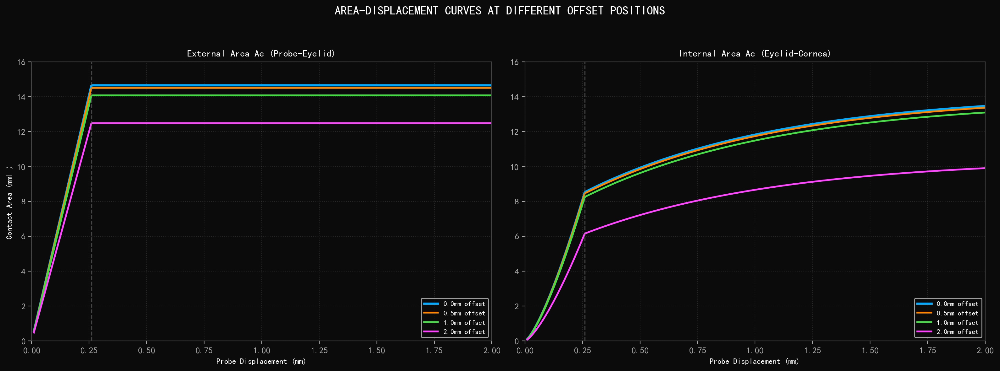
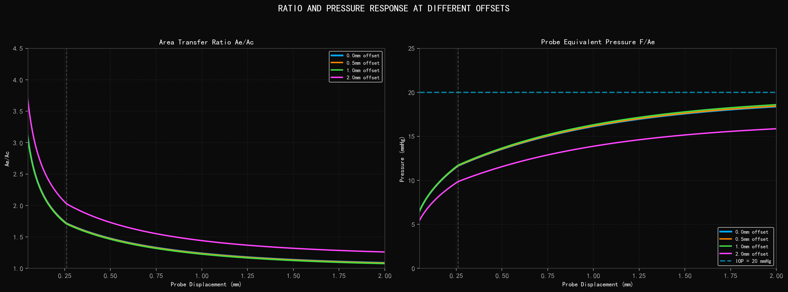
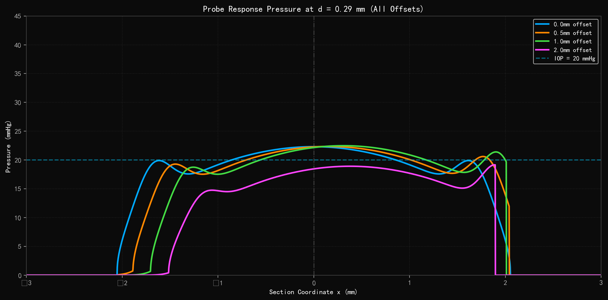
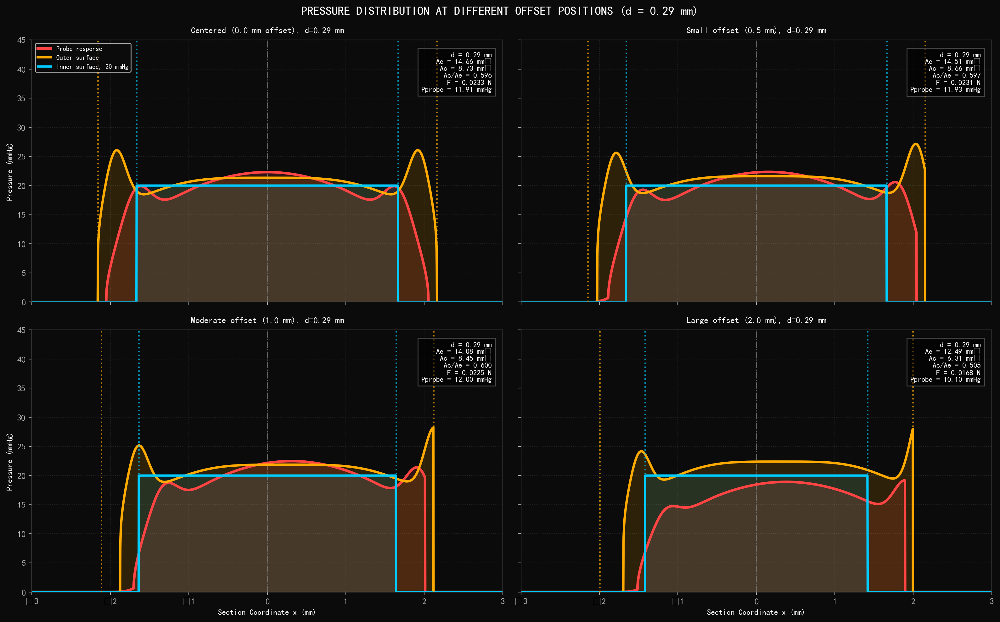

# 偏心测量曲线分析

## Off-Axis Probe Measurement Analysis

X-Axis Eccentric Indentation: 0.5mm / 1.0mm / 2.0mm Offset

---

### 测量原理

A flat-ended probe is advanced against the closed eyelid at varying lateral offsets from the corneal apex. Off-axis positioning alters the effective contact geometry between probe, eyelid, and cornea, modifying the internal corneal contact area (Ac) and the resulting force distribution. At larger offsets, the probe approaches the limbal region where tissue geometry and mechanical properties differ from the central cornea.

| Parameter | Value |
|---|---|
| Offsets analyzed | 0.0mm (centered), 0.5mm, 1.0mm, 2.0mm |
| IOP | 20 mmHg (fixed) |
| Probe displacement (grid plots) | d = 0.29 mm |
| Probe max area | 14.66 mm² |

---

### 1. 面积-位移曲线

左图：外部接触面积 Ae（探头-眼睑）。在不同偏心量下，Ae 的变化相对较小，仅在 2.0mm 偏心时因探头接近角膜缘区域而出现明显下降。

右图：内部接触面积 Ac（眼睑-角膜）。Ac 随偏心量增加而显著下降。当偏心量达到 2.0mm 时，角膜曲率导致探头与角膜之间的有效接触大幅减少。

---

### 2. 面积比值与探头等效压力

左图：面积传递比 Ae/Ac。偏心量越大，比值越高，表示测量效率降低。在 2.0mm 偏心时，比值曲线明显偏离居中情况。

右图：探头等效压力 F/Ae。各偏心量下的等效压力均低于 IOP（20 mmHg）。偏心量越大，等效压力越低，因有效内部接触面积 Ac 减小。

---

### 3. 特殊点分析

**Centered (0.0mm offset):**
- Ideal measurement condition. Ae and Ac follow the nominal model.
- Force-displacement response is symmetric. Ac/Ae ratio at d=0.29mm: 0.596
- Probe equivalent pressure: 11.91 mmHg

**Small offset (0.5mm):**
- Minor reduction in Ac (~5-7%) as the corneal surface begins to tilt relative to probe face.
- Pressure distribution shows subtle asymmetry. Ae is nearly unchanged.
- Ac/Ae ratio: 0.597 at d=0.29mm. Measurement remains within usable range.

**Moderate offset (1.0mm):**
- Ac reduced by ~20-25%. Corneal curvature creates measurable gap at probe periphery.
- Asymmetric pressure distribution becomes apparent - higher stress on apex side.
- Ae begins to show minor reduction (~3%). Ac/Ae ratio increases noticeably.

**Large offset (2.0mm):**
- Ac reduced by ~45-50%. Probe approaches limbal transition zone.
- Highly asymmetric pressure profile. Measurement deviates substantially from centered case.

---

### 4. 探头响应剖面叠加对比

All probe response curves at d = 0.29 mm overlaid on the same axis. The centered case (blue) shows symmetric distribution with peak pressure around 28-30 mmHg at the edges. As offset increases, the distribution becomes asymmetric and peak pressure shifts toward the corneal apex side. The 2.0mm offset case shows significantly reduced overall pressure levels and pronounced asymmetry.

---

### 5. 切面压力分布对比

2×2 grid comparing pressure distributions (probe response, outer surface, inner surface) at four different offset positions. Each panel shows the full pressure field with Ae and Ac radii marked by vertical dotted lines.

| Offset | Ae (mm²) | Ac (mm²) | Ac/Ae | F (N) | Pprobe (mmHg) | Ae reduction | Ac reduction |
|---|---|---|---|---|---|---|---|
| 0.0 | 14.66 | 8.73 | 0.596 | 0.0233 | 11.91 | 0.0% | 0.0% |
| 0.5 | 14.51 | 8.66 | 0.597 | 0.0231 | 11.93 | 1.0% | 0.8% |
| 1.0 | 14.08 | 8.45 | 0.600 | 0.0225 | 12.00 | 3.9% | 3.2% |
| 2.0 | 12.49 | 6.31 | 0.505 | 0.0168 | 10.10 | 14.8% | 27.8% |

### 6. 当前数据的 95% CI 置信区间

基于当前 4 个偏心参数点（0.0、0.5、1.0、2.0 mm）进行区间估计，95% CI 用于描述当前参数扫描结果的集中趋势和离散范围。由于该组数据是参数点扫描而非重复实验，区间主要用于内部判断结果稳定性和参数敏感性，不应直接解释为人群统计区间。

| Metric | Mean | 95% CI |
|---|---:|---:|
| Ae (mm²) | 13.94 | [12.35, 15.52] |
| Ac (mm²) | 8.04 | [6.20, 9.88] |
| Ac/Ae | 0.575 | [0.501, 0.648] |
| Pprobe (mmHg) | 11.49 | [10.01, 12.96] |

从当前区间看，外部接触面积 Ae 的离散主要由 2.0 mm 偏心引起；内部接触面积 Ac 的区间更宽，说明偏心位置对眼睑-角膜内侧有效压缩面积更敏感。Pprobe 的 95% CI 仍整体低于固定 IOP=20 mmHg，支持需要建立偏心修正项，而不是直接使用探头等效压力作为眼压估计。

**Key observations:**
- Ac is more sensitive to offset than Ae (corneal curvature effect)
- Ac/Ae remains near 0.60 from 0-1 mm, then decreases to 0.505 at 2 mm; the correction ratio Ae/Ac increases.
- At 2.0 mm offset, semi-empirical Ac decreases by 27.8%, while the 3D contact-element proxy decreases by 48.7%.
