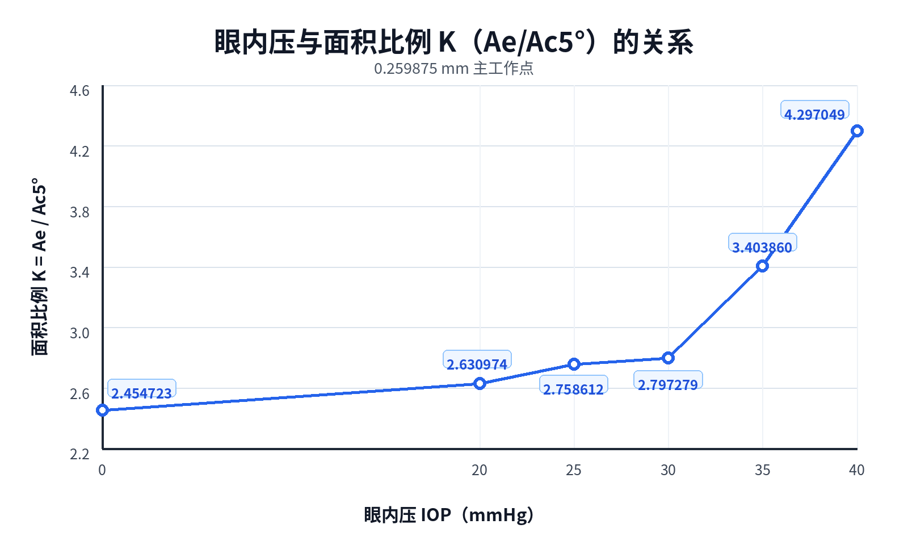
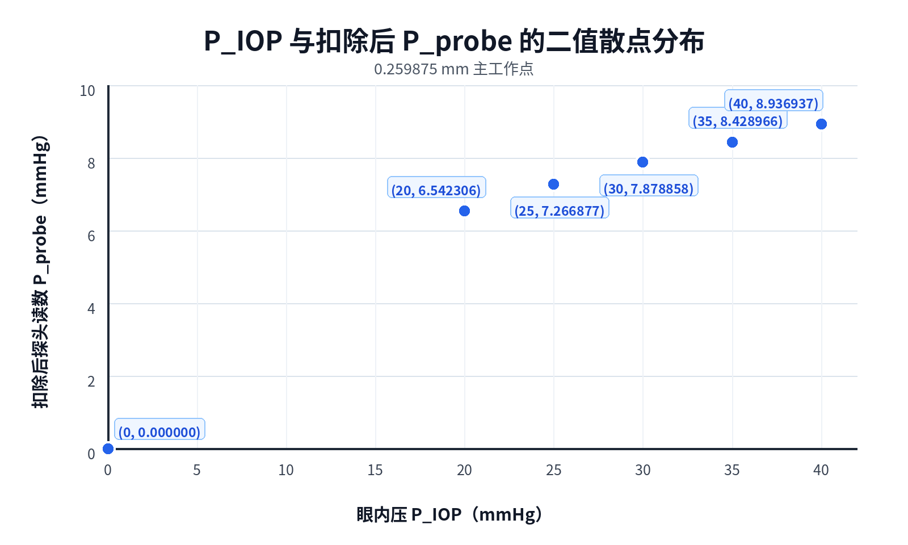

# 真实几何面积比例K及其IOP换算结果

## 1. 定义澄清

本文件给出用户要求的面积比例K。这里的“真实”表示直接从各压力、各推进状态下的FE变形网格测得Ae和Ac5°后相除，不通过已知输入IOP拟合K，也不使用`Ksensor=p/ΔP`。

$$
K_{area,5^\circ}=\frac{A_e}{A_{c,5^\circ}}
$$

该K的拟合参数数量为0。它仍是FE几何测量，不等于已经通过真实人体图像测量得到的物理世界面积。

## 2. 面积一致的压力换算

当前探头增量读数使用完整探头面积：

$$
\Delta P_{probe}=\frac{\Delta F}{A_{probe}}
$$

因此不能直接计算 $K_{area}\Delta P_{probe}$，因为K的分子是Ae，而探头读数的面积分母是Aprobe。必须先把压力重新归一化到Ae：

$$
\Delta P_e
=\frac{\Delta F}{A_e}
=\frac{A_{probe}}{A_e}\Delta P_{probe}
$$

再使用面积比例K：

$$
\boxed{
IOP_{area}
=K_{area}\Delta P_e
=\frac{A_{probe}}{A_{c,5^\circ}}\Delta P_{probe}
}
$$

上述计算没有经验拟合系数。

## 3. 0.259875 mm主工作点

| 输入IOP/mmHg | Ae/mm² | Ac5°/mm² | 真实面积比例K=Ae/Ac | 扣除后探头读数/mmHg | 面积一致换算IOP/mmHg | 误差/mmHg |
|---:|---:|---:|---:|---:|---:|---:|
| 0 | `13.052876` | `5.317453` | `2.454723` | `0.000000` | `0.0000` | `0.0000` |
| 20 | `12.992362` | `4.938233` | `2.630974` | `6.542306` | `19.4185` | `-0.5815` |
| 25 | `12.981326` | `4.705746` | `2.758612` | `7.266877` | `22.6348` | `-2.3652` |
| 30 | `13.020737` | `4.654787` | `2.797279` | `7.878858` | `24.8097` | `-5.1903` |
| 35 | `13.059743` | `4.592259` | `2.843860` | `8.428966` | `26.9033` | `-8.0967` |
| 40 | `13.098560` | `4.552777` | `2.877049` | `8.936937` | `28.7720` | `-11.2280` |

主工作点面积法性能：

- MAE：`5.4923 mmHg`；
- RMSE：`6.7007 mmHg`；
- MAPE：`16.1745%`；
- 最大绝对误差：`11.2280 mmHg`。

## 4. 0.28 mm推进敏感性对照

| 输入IOP/mmHg | Ae/mm² | Ac5°/mm² | 真实面积比例K=Ae/Ac | 扣除后探头读数/mmHg | 面积一致换算IOP/mmHg | 误差/mmHg |
|---:|---:|---:|---:|---:|---:|---:|
| 0 | `13.117809` | `5.956871` | `2.202131` | `0.000000` | `0.0000` | `0.0000` |
| 20 | `12.956444` | `5.344842` | `2.424102` | `7.072201` | `19.3944` | `-0.6056` |
| 25 | `12.997151` | `5.295689` | `2.454289` | `7.827667` | `21.6654` | `-3.3346` |
| 30 | `12.986024` | `5.219702` | `2.487886` | `8.486554` | `23.8310` | `-6.1690` |
| 35 | `13.025256` | `5.061779` | `2.573257` | `9.079618` | `26.2919` | `-8.7081` |
| 40 | `13.064304` | `4.978205` | `2.624300` | `9.643527` | `28.3936` | `-11.6064` |

0.28 mm面积法性能：MAE `6.0847 mmHg`、RMSE `7.2122 mmHg`、MAPE `18.1651%`。

## 5. 结论

1. 面积比例K完全来自Ae/Ac5°，没有IOP响应拟合或高阶模型；
2. 约0.26 mm下Karea从20 mmHg的`2.6310`增加到40 mmHg的`2.8770`；
3. 面积一致换算在20 mmHg附近较准确，结果为`19.42 mmHg`；
4. 随输入压力升高，面积法系统性低估：25、30、35、40 mmHg分别约算得`22.63、24.81、26.90、28.77 mmHg`；
5. 这说明面积比例描述了几何传播，但不能单独包含高IOP下材料预应力、接触重分布和非线性饱和传力；
6. 不应为了消除该误差反调5°阈值，否则面积K将失去独立几何定义；
7. 原报告中的Ksensor应明确称为“FE压力响应经验系数”，不能再与本文件的面积比例K混称。

## 6. 机器可读结果

- `results/20260730_area_ratio_k_iop_results.json`
- `results/20260730_area_ratio_k_iop_results.csv`
- 复现脚本：`postprocess_area_ratio_iop.py`
