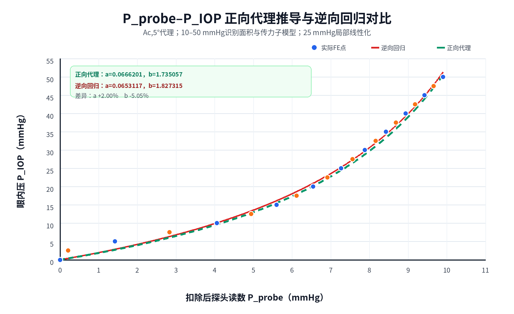

# a、b正向代理推导及逆向回归对比

## 1. 目的和范围

目标是从面积变化与力传递子模型出发，推导：

$$
P_{IOP}=\frac{bP_{probe}}{1-aP_{probe}}
$$

并与全部21点逆向回归结果比较。

本轮不新增ANSYS求解，使用0–50 mmHg、步长2.5 mmHg、0.259875 mm状态的现有FE结果。由于独立的眼睑—角膜界面力积分尚未完成，本轮采用冻结的 $A_{c,5^\circ}$几何面积代理，因此称为“正向代理推导”，不是最终硬件物理标定。

## 2. 固定输入

| 参数 | 数值 |
|---|---:|
| 完整探头面积 $A_p$ | 14.6574147 mm² |
| 角膜名义曲率半径 $R_c$ | 7.8 mm |
| 主工作点推进量 $s$ | 0.259875 mm |
| 子模型识别压力区间 | 10–50 mmHg |
| 局部线性化参考压力 $p_*$ | 25 mmHg |

10 mmHg以下存在明显接触启用效应，不用于面积与传力子模型的线性识别，但仍纳入最终0–50 mmHg误差评价。

## 3. 面积模型

定义：

$$
K_A(p)=\frac{A_p}{A_{c,5^\circ}(p)}
$$

10–50 mmHg线性识别得到：

$$
\boxed{
K_A(p)=2.798332664+0.0104365012p
}
$$

其中：

$$
c_0=2.798332664
$$

$$
c_1=0.0104365012\ \mathrm{mmHg^{-1}}
$$

面积模型：

$$
R^2=0.938099
$$

代入理论面积式：

$$
c_1=\frac{\alpha}{k_l}\frac{A_p}{2\pi s}
$$

$$
c_0=\frac{A_p}{2\pi sR_c}\frac{k_l+k_{c,0}}{k_l}
$$

可识别两个刚度组合量：

$$
\boxed{
\frac{k_{c,0}}{k_l}=1.43154
}
$$

$$
\boxed{
\frac{\alpha}{k_l}=8.72045\ \mathrm{mm/N}
}
$$

在没有独立 $k_l$之前，不能继续唯一分离 $k_{c,0}$与 $\alpha$。

## 4. 力传递模型

基于当前面积代理定义：

$$
\eta_{eff}(p)
=\frac{pA_{c,5^\circ}(p)}{F(p)-F(0)}
$$

10–50 mmHg内得到：

$$
\boxed{
\eta_{eff}(p)
=0.661953770+0.0179845724p
}
$$

其线性度为：

$$
R^2=0.995304
$$

25 mmHg时：

$$
\eta_{eff}(25)=1.11156808
$$

这说明力传递修正不能在10–50 mmHg内简单视为常数，压力相关变化是综合非线性的主要来源之一。

需要强调：这里的 $\eta_{eff}$使用了FE已知输入IOP，因此适合做机制分解和训练，但不是独立界面力测量。后续必须用眼睑—角膜界面力与旁路反力积分替代该代理。

## 5. 常数η假设的诊断

如果仍使用原始常数形式：

$$
a=\eta_0c_1,\qquad b=\eta_0c_0
$$

并取25 mmHg处 $\eta_0=1.11156808$，得到：

$$
a=0.0116008816\ \mathrm{mmHg^{-1}}
$$

$$
b=3.11053727
$$

它与逆向回归：

$$
a_{inv}=0.0653117307,\qquad b_{inv}=1.8273148620
$$

明显不一致。因此，“常数力传递×线性面积”不是当前FE响应的充分模型。

## 6. 压力相关η的一阶正向扩展

令：

$$
K_A(p)=c_0+c_1p
$$

$$
\eta_{eff}(p)=\eta_0+\eta_1p
$$

则综合修正为：

$$
G(p)=\eta_{eff}(p)K_A(p)
=d_0+d_1p+d_2p^2
$$

本次得到：

$$
d_0=1.852366856
$$

$$
d_1=0.0572352978\ \mathrm{mmHg^{-1}}
$$

$$
d_2=0.0001876960\ \mathrm{mmHg^{-2}}
$$

在参考压力 $p_*=25$ mmHg处对 $G(p)$做局部线性化：

$$
G(p)\approx b_{fwd}+a_{fwd}p
$$

其中：

$$
a_{fwd}=d_1+2d_2p_*
$$

$$
b_{fwd}=d_0-d_2p_*^2
$$

得到正向代理参数：

$$
\boxed{
a_{fwd}=0.0666200984\ \mathrm{mmHg^{-1}}
}
$$

$$
\boxed{
b_{fwd}=1.735056849
}
$$

对应：

$$
\boxed{
P_{IOP}^{fwd}=
\frac{1.735056849P_{probe}}
{1-0.0666200984P_{probe}}
}
$$

## 7. 与逆向回归比较

| 参数 | 正向代理 | 逆向回归 | 相对差异 |
|---|---:|---:|---:|
| $a$/mmHg⁻¹ | 0.06662010 | 0.06531173 | +2.00% |
| $b$ | 1.73505685 | 1.82731486 | -5.05% |

两种方法得到的参数量级和曲线形态接近。尤其是 $a$仅相差约2%，说明压力相关的面积与力传递分解能够解释逆向曲线的大部分非线性。

正向代理在全部21点上的性能：

| 指标 | 正向代理 | 逆向回归 |
|---|---:|---:|
| MAE/mmHg | 0.989128 | 0.765836 |
| RMSE/mmHg | 1.196342 | 0.954059 |
| 最大绝对误差/mmHg | 2.278632 | 2.139799 |
| $R^2$ | 0.993755 | 0.996028 |

正向代理在10–50 mmHg识别区间的MAE为0.877387 mmHg、RMSE为1.035788 mmHg。

## 8. 曲线对比

- 蓝色/橙色点：实际FE结果；
- 红色实线：全部21点逆向回归；
- 绿色虚线：面积和传力子模型正向代理推导。

两条曲线在当前观测区间内整体接近，主要差异仍集中在低压接触启用段及35–45 mmHg附近。

## 9. 结论和下一门控

本轮得到的主要结论是：

1. 单独使用线性面积变化和常数 $\eta$不能解释拟合参数；
2. 将 $\eta_{eff}$的压力相关变化纳入后，正向参数与逆向参数接近到约2%和5%；
3. 当前接近性仍不是独立物理验证，因为 $\eta_{eff}$由已知IOP、面积代理和探头增量力反算；
4. 下一步应从RST直接积分眼睑—角膜界面轴向力和旁路反力，建立不依赖 $pA_c/\Delta F$反定义的力传递模型；
5. 机械有效 $A_c$验证后，需要重复本推导并检查 $a$、$b$是否仍接近。

## 10. 产物

- `derive_forward_rational_parameters.py`
- `results/20260731_forward_rational_parameters_ac5_proxy.json`
- `results/20260731_forward_rational_parameters_ac5_proxy.csv`
- `figures/forward_vs_inverse_rational_iop_0_to_50_step2p5.png`
