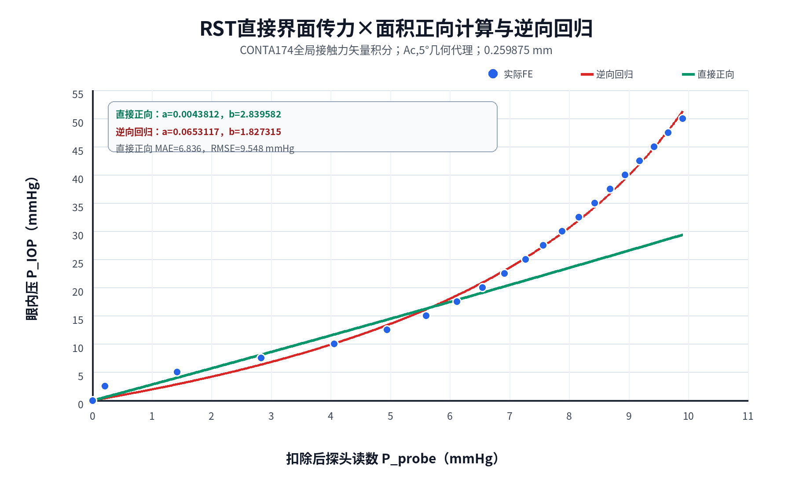
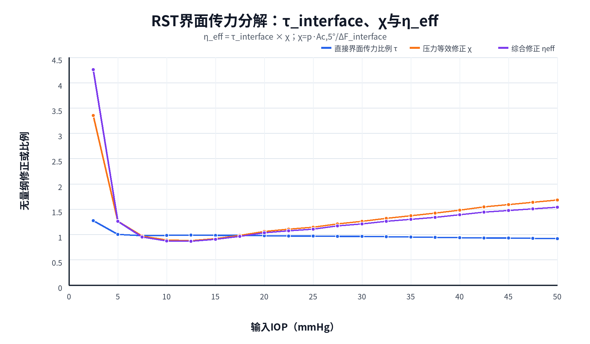

# RST直接界面力积分与正向计算结果

## 1. 任务状态

- 状态：完成，21/21压力点通过。
- 方法：只读取现有DB/RST，不重新求解。
- 运行提交：`3ce7c957e7920d63334c86657f182a7027ba3404`。
- 原始后处理目录：`/home/xuanyu/PROJECT/ziyu/blueknow-data/high_iop_mechanical_transfer_t1p25_c0p60/interface_force_integrals/20260731T030336Z_3ce7c957_contact_vectors`。
- 结果工作点：0.259875 mm。
- 总墙钟：2分08秒。

通过`CONTA174`元素结果直接积分：

- `NMISC,43–45`：全局接触力矢量CNFX、CNFY、CNFZ；
- `NMISC,186–188`：切向接触力矢量CNTX、CNTY、CNTZ；
- `NMISC,58`：接触面积。

## 2. 质量检查

全部检查通过：

```text
all_pressures_present = true
all_mapdl_error_counts_zero = true
all_probe_contact_reaction_checks_pass = true
probe_force_matches_fe_summary = true
factorization_identity_pass = true
```

探头—眼睑接触合力与探头顶部反力的最大相对差异为0.6024%，低于1%门限。0、20、50 mmHg代表点的差异分别为：

- 0 mmHg：0.1150%；
- 20 mmHg：0.1630%；
- 50 mmHg：0.2725%。

这证明RST接触力矢量积分口径可靠。

## 3. 直接界面传力比例

定义探头增量力：

$$
\Delta F_p(p)=F_p(p)-F_p(0)
$$

定义眼睑—角膜界面增量力：

$$
\Delta F_{ec}(p)=F_{ec}(p)-F_{ec}(0)
$$

不使用已知IOP的直接界面传力比例为：

$$
\boxed{
\tau_{interface}(p)=\frac{\Delta F_{ec}(p)}{\Delta F_p(p)}
}
$$

代表值：

| IOP/mmHg | ΔFprobe/N | ΔFinterface/N | τinterface |
|---:|---:|---:|---:|
| 2.5 | 0.000416 | 0.000529 | 1.27095 |
| 5.0 | 0.002775 | 0.002776 | 1.00037 |
| 10.0 | 0.007923 | 0.007769 | 0.98062 |
| 20.0 | 0.012785 | 0.012473 | 0.97560 |
| 30.0 | 0.015397 | 0.014764 | 0.95893 |
| 40.0 | 0.017464 | 0.016381 | 0.93798 |
| 50.0 | 0.019359 | 0.017728 | 0.91577 |

2.5 mmHg点由于两个增量力均很小，对差值噪声高度敏感。稳定区内 $\tau_{interface}$接近1并缓慢下降，说明大部分探头增量轴向力确实传到眼睑—角膜界面。

## 4. 压力等效修正χ

直接界面力不自动等于IOP乘以5°几何面积。定义：

$$
\boxed{
\chi(p)=\frac{pA_{c,5^\circ}(p)}{\Delta F_{ec}(p)}
}
$$

因此综合修正可精确分解为：

$$
\boxed{
\eta_{eff}(p)=\tau_{interface}(p)\chi(p)
}
$$

并有：

$$
p=\tau_{interface}(p)\chi(p)K_A(p)P_{probe}
$$

代表值：

| IOP/mmHg | τinterface | χ | ηeff=τχ |
|---:|---:|---:|---:|
| 5.0 | 1.00037 | 1.25700 | 1.25747 |
| 10.0 | 0.98062 | 0.88738 | 0.87018 |
| 20.0 | 0.97560 | 1.05570 | 1.02994 |
| 30.0 | 0.95893 | 1.26100 | 1.20921 |
| 40.0 | 0.93798 | 1.48217 | 1.39024 |
| 50.0 | 0.91577 | 1.67894 | 1.53753 |

10–50 mmHg中，直接传力比例只从0.981降到0.916，而 $\chi$从0.887增至1.679。因此高压非线性主要不是“越来越少的力到达角膜界面”，而是界面增量合力与 $pA_{c,5^\circ}$之间的压力等效关系发生显著变化。

## 5. 只使用直接传力×面积的正向结果

若将用户公式中的 $\eta$直接解释为 $\tau_{interface}$，则：

$$
p\stackrel{?}{=}\tau_{interface}(p)K_A(p)P_{probe}
$$

对10–50 mmHg的 $\tau_{interface}K_A$做线性识别，得到：

$$
\boxed{
a_{direct}=0.0043812389\ \mathrm{mmHg^{-1}}}
$$

$$
\boxed{b_{direct}=2.8395815785}
$$

与逆向回归比较：

| 参数 | RST直接传力正向 | 逆向回归 | 相对差异 |
|---|---:|---:|---:|
| a/mmHg⁻¹ | 0.00438124 | 0.06531173 | -93.29% |
| b | 2.83958158 | 1.82731486 | +55.40% |

其全21点结果：

| 指标 | 数值 |
|---|---:|
| MAE | 6.83636 mmHg |
| RMSE | 9.54752 mmHg |
| 最大绝对误差 | 20.59352 mmHg |
| $\tau K_A$线性度 $R^2$ | 0.60537 |

50 mmHg时，直接界面力除以 $A_{c,5^\circ}$只对应29.7807 mmHg，明显低于真实输入50 mmHg。

因此，直接传力比例和面积比本身不足以构成当前IOP反演关系。

## 6. 对算法定义的修正

原式：

$$
p=\eta K_AP_{probe}
$$

若 $\eta$称为“直接力传递效率”，该式被当前RST积分否定。严谨写法应为：

$$
\boxed{
p=\tau_{interface}\chi K_AP_{probe}}
$$

或者将二者合并：

$$
\eta_{eff}=\tau_{interface}\chi
$$

再写成：

$$
p=\eta_{eff}K_AP_{probe}
$$

所以后续必须区分：

- $\tau_{interface}$：不依赖已知IOP的直接界面传力比例；
- $\chi$：界面力到压力—面积合力的等效修正；
- $\eta_{eff}$：二者乘积，是反演公式中的综合修正，而不是单纯力传递效率。

$\eta_{eff}$的定义、0–60 mmHg数值范围、低压异常和代数闭环见[`ETA_EFF_EFFECTIVE_CORRECTION_ANALYSIS.md`](ETA_EFF_EFFECTIVE_CORRECTION_ANALYSIS.md)。

此前得到接近逆向回归的正向代理 $a=0.0666201$、$b=1.7350568$，实际使用的是 $\eta_{eff}$，其中已经包含 $\chi$，因此不能将那次接近性解释为“直接传力×面积”获得独立验证。

## 7. 图像





## 8. 下一步

当前直接积分已经完成，下一步不再是重复提取 $\tau_{interface}$，而是正向解释和预测 $\chi(p)$。需要从现有RST或小扰动算例识别：

- 眼睑等效刚度 $k_l$；
- 角膜—眼球刚度 $k_c(p)$；
- 角膜实际压平位移；
- 界面力中的材料、预张力和几何重分配；
- 机械有效面积与 $A_{c,5^\circ}$的差异。

只有 $\chi$能够在未知IOP条件下由这些可观测量预测，才形成真正可部署的正向算法。

后续载荷分流推导已将该问题进一步改写为预测全局载荷份额 $\lambda$，详见`GLOBAL_LOAD_SHARE_DERIVATION.md`。该推导表明 $\chi=A_c/(\tau_{interface}\lambda A_{IOP,proj})$，总公式可化简为 $p=A_pq/(\lambda A_{IOP,proj})$。

## 9. 轻量产物

- `results/20260731_3ce7c957_interface_force_integrals_summary.json`
- `results/20260731_3ce7c957_interface_force_integrals_summary.csv`
- `plot_interface_force_forward_analysis.py`
- `figures/interface_force_direct_forward_vs_inverse.png`
- `figures/interface_force_factor_decomposition.png`

大体积DB/RST仍保存在仓库外`blueknow-data`。
