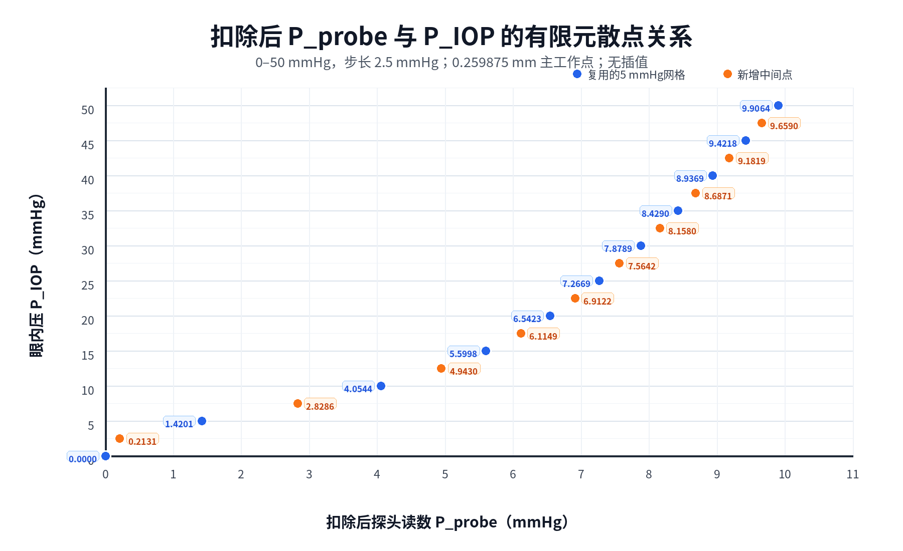

# 0–50 mmHg、步长2.5 mmHg有限元补充实验结果

## 1. 实验状态

- 状态：完成并通过自动验收。
- 服务器运行提交：`290d0544218a3928009fc28f907a001cfed34c2c`。
- 原始数据：`/home/xuanyu/PROJECT/ziyu/blueknow-data/high_iop_mechanical_transfer_t1p25_c0p60/20260730T100745Z_290d0544_iop0_to50_step2p5`。
- 新增压力：2.5、7.5、12.5、17.5、22.5、27.5、32.5、37.5、42.5、47.5 mmHg。
- 复用压力：0、5、10、15、20、25、30、35、40、45、50 mmHg。
- 主工作点：RST中最接近0.26 mm的实际结果集，全部为0.259875 mm。
- 求解终点：0.28 mm。
- 并发：两个8核任务。

运行时间：

- 启动：2026-07-30 18:07:45 +08:00；
- 新求解全部完成：2026-07-30 19:12:29 +08:00；
- 状态提取、汇总和绘图完成：2026-07-30 19:22:25 +08:00；
- 总墙钟：74分40秒。

新增原始数据实际占用约21 GiB。完成后`/home`可用约241 GiB，使用率72%。

## 2. 质量检查

10个新增工况均满足：

- 首次尝试完成；
- ANSYS返回码0；
- ANSYS错误数0；
- 预载、几何接近和正式推进三个载荷步均收敛；
- 主状态实际推进量0.259875 mm；
- 0–50 mmHg探头力和扣除后探头读数严格单调增加。

自动汇总检查为：

```text
campaign_pass = true
QC = 185 / 185
```

## 3. 0.259875 mm实际FE散点

探头读数定义为：

$$
P_{probe}=\frac{F(p)-F(0)}{A_p}
$$

完整探头面积：

$$
A_p=14.6574147\ \mathrm{mm^2}
$$

| 输入PIOP/mmHg | 扣除后Pprobe/mmHg | 来源 |
|---:|---:|---|
| 0.0 | 0.000000000 | 复用 |
| 2.5 | 0.213122539 | 新增FE |
| 5.0 | 1.420075281 | 复用 |
| 7.5 | 2.828621976 | 新增FE |
| 10.0 | 4.054410650 | 复用 |
| 12.5 | 4.943005552 | 新增FE |
| 15.0 | 5.599841227 | 复用 |
| 17.5 | 6.114935701 | 新增FE |
| 20.0 | 6.542306493 | 复用 |
| 22.5 | 6.912171365 | 新增FE |
| 25.0 | 7.266876996 | 复用 |
| 27.5 | 7.564234291 | 新增FE |
| 30.0 | 7.878858150 | 复用 |
| 32.5 | 8.157971755 | 新增FE |
| 35.0 | 8.428966226 | 复用 |
| 37.5 | 8.687134114 | 新增FE |
| 40.0 | 8.936937456 | 复用 |
| 42.5 | 9.181879637 | 新增FE |
| 45.0 | 9.421805330 | 复用 |
| 47.5 | 9.659020831 | 新增FE |
| 50.0 | 9.906446283 | 复用 |

## 4. 补充后的关系图



- 蓝色：复用的5 mmHg网格；
- 橙色：本次新增的2.5 mmHg中间点；
- 所有点均为实际FE值；
- 图中没有插值点，也没有使用新增点拟合曲线。

## 5. 与分式关系的对应

候选反演关系为：

$$
P_{IOP}=\frac{bP_{probe}}{1-aP_{probe}}
$$

整理后：

$$
\frac{P_{IOP}}{P_{probe}}=b+aP_{IOP}
$$

因此，若固定的`a、b`在某个压力区间成立，则：

1. `PIOP–Pprobe`散点应呈向上弯曲；
2. `PIOP/Pprobe`应随`PIOP`近似线性增加；
3. 当`Pprobe`接近`1/a`时，反演曲线斜率明显增大。

新散点显示：

- 约10–50 mmHg区间呈清楚的向上弯曲；
- `PIOP/Pprobe`从10 mmHg的2.4664增加到50 mmHg的5.0472，整体接近递增线性趋势；
- 因此该图能够直观表达已建立接触后的分式反演形态。

## 6. 低压力接触启用段

新增2.5 mmHg点为：

$$
(P_{probe},P_{IOP})=(0.213123,2.5)\ \mathrm{mmHg}
$$

对应：

$$
\frac{P_{IOP}}{P_{probe}}=11.7303
$$

而：

- 5 mmHg时为3.5209；
- 7.5 mmHg时为2.6515；
- 10 mmHg时为2.4664。

这说明0–10 mmHg存在明显的低压力接触启用或载荷路径转换段。一个`a>0、b>0`的固定分式要求曲线斜率随`Pprobe`单调增加，但实际0–2.5 mmHg割线斜率为11.7303，2.5–5 mmHg降为2.0713，因此单一固定`a、b`不能无条件描述完整0–50 mmHg区间。

当前合规解释是：

- 该分式是已建立稳定接触后的主候选关系；
- 低压力段需要单独检查接触面积、闭合接触承载比例和力传递修正；
- 不得为了让全区间落在同一分式上而使用本次新增点事后重调参数；
- 后续应检验分段模型或带接触启用状态的力传递模型。

## 7. 与新全局算法方向的关系

当前全局分解为：

$$
P_{IOP}=\eta_{eff}(P_{IOP})\frac{A_p}{A_c(P_{IOP})}P_{probe}
$$

当力传递修正近似常数、面积比随IOP近似线性时，才归结为固定`a、b`分式。本次新增点没有参与参数拟合，保留为该机制模型的独立检验数据。

远程自动汇总中仍包含旧冻结线性`Ksensor`的历史诊断列，但本报告没有使用这些列拟合或形成结论。

## 8. 本地轻量产物

- `results/20260730_290d0544_iop_0_to_50_step2p5_summary.json`
- `results/20260730_290d0544_iop_0_to_50_step2p5_summary.csv`
- `results/20260730_290d0544_iop_0_to_50_step2p5_launch_metadata.json`
- `results/20260730_290d0544_iop_0_to_50_step2p5_controller_state.txt`
- `results/20260730_290d0544_iop_0_to_50_step2p5_artifact_sha256.txt`
- `figures/piop_vs_delta_pprobe_scatter_0_to_50_step2p5.png`

大体积DB、RST和完整求解目录继续保存在仓库外`blueknow-data`。
