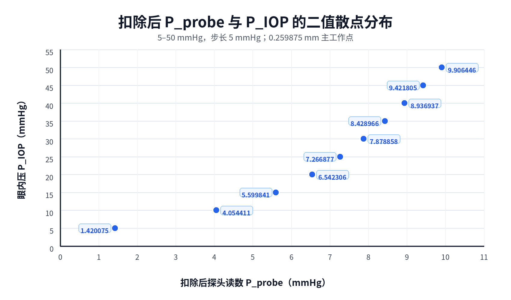

# IOP 5–50 mmHg步长5 mmHg补充实验结果

## 1. 实验范围

在既有固定眼睑厚度`1.25 mm`、角膜厚度`0.60 mm`实验基础上，补充求解缺少的压力点：

```text
5、10、15、45、50 mmHg
```

与已验收的`20、25、30、35、40 mmHg`工况合并，形成：

```text
5、10、15、20、25、30、35、40、45、50 mmHg
```

所有新增工况继续采用：

- 初始间隙：`0.30 mm`；
- 网格尺寸：`0.30 mm`；
- 求解推进终点：`0.28 mm`；
- 主结果集：`0.259875 mm`；
- 探头面积：`14.6574147 mm²`；
- 零眼压参考反力：`0.146033122338 N`；
- 扣除后探头读数：`[F(p)-F(0)]/Aprobe`。

## 2. 求解与质量检查

- 50 mmHg最高压力首先完成收敛门控；
- 五个新增工况均首次求解成功，无重试；
- 返回码均为0；
- ANSYS错误数均为0；
- 三个载荷步全部收敛；
- IOP预载阶段探头接触数均为0；
- 最大穿透为`0.013566 mm`，低于`0.03 mm`限值；
- 主结果集均为`0.259875 mm`；
- 汇总质量检查`95/95`通过；
- 补充实验总墙钟约`41 min 14 s`。

## 3. 主工作点二值数据

| PIOP/mmHg | 探头总反力/N | 扣除后反力/N | 扣除后Pprobe/mmHg | 数据来源 |
|---:|---:|---:|---:|---|
| 5 | `0.148808178411` | `0.002775056073` | `1.420075` | 新增FE |
| 10 | `0.153956094484` | `0.007922972146` | `4.054411` | 新增FE |
| 15 | `0.156976115018` | `0.010942992680` | `5.599841` | 新增FE |
| 20 | `0.158817844110` | `0.012784721773` | `6.542306` | 已验收FE |
| 25 | `0.160233771704` | `0.014200649367` | `7.266877` | 已验收FE |
| 30 | `0.161429681554` | `0.015396559217` | `7.878858` | 已验收FE |
| 35 | `0.162504681436` | `0.016471559098` | `8.428966` | 已验收FE |
| 40 | `0.163497339124` | `0.017464216787` | `8.936937` | 已验收FE |
| 45 | `0.164444849131` | `0.018411726794` | `9.421805` | 新增FE |
| 50 | `0.165391915697` | `0.019358793360` | `9.906446` | 新增FE |

十个点的探头总反力和扣除后探头读数均随PIOP严格单调增加。图中全部点均为实际FE结果，没有插值或拟合点。

## 4. PIOP—扣除后Pprobe二值散点分布

横轴为扣除后探头读数Pprobe，纵轴为眼内压PIOP。



## 5. 数据位置

仓库内汇总：

- `results/20260730_440e44e5_iop_5_to_50_summary.json`
- `results/20260730_440e44e5_iop_5_to_50_summary.csv`
- `results/20260730_440e44e5_iop_5_to_50_artifact_sha256.txt`
- `plot_piop_vs_delta_pprobe_5_to_50.py`

服务器完整原始数据：

```text
/home/xuanyu/PROJECT/ziyu/blueknow-data/high_iop_mechanical_transfer_t1p25_c0p60/20260730T061631Z_440e44e5_iop5_to50_step5
```

原始数据约`11 GB`，保留于仓库外`blueknow-data`。
