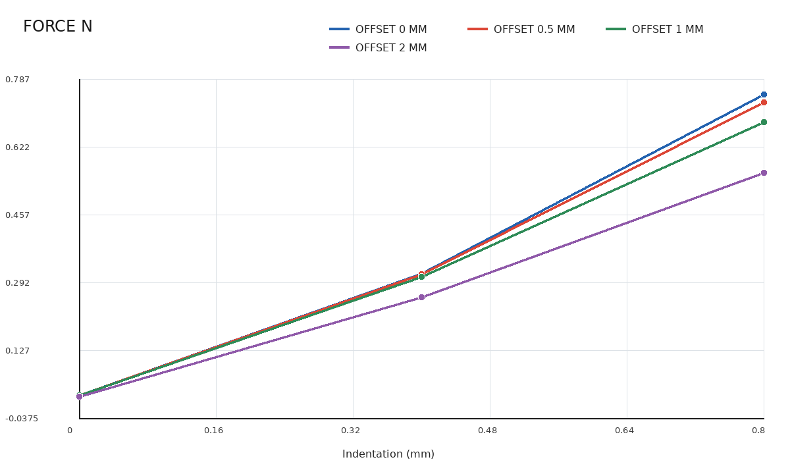
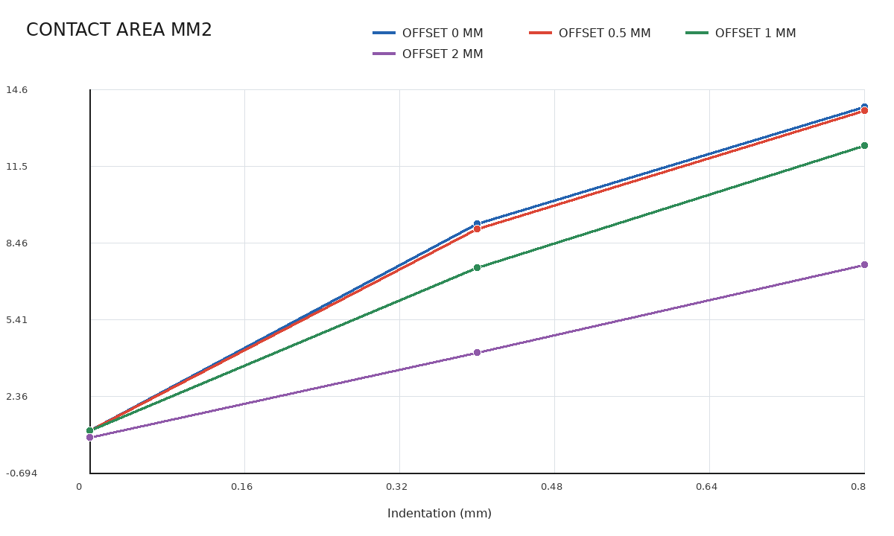
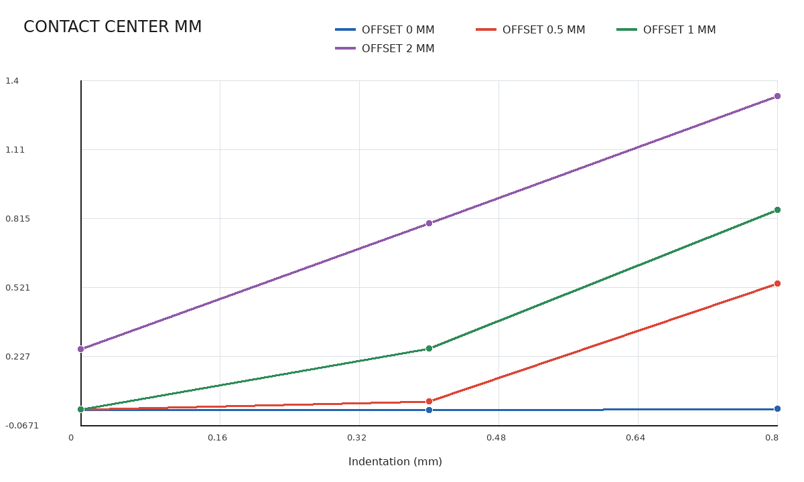
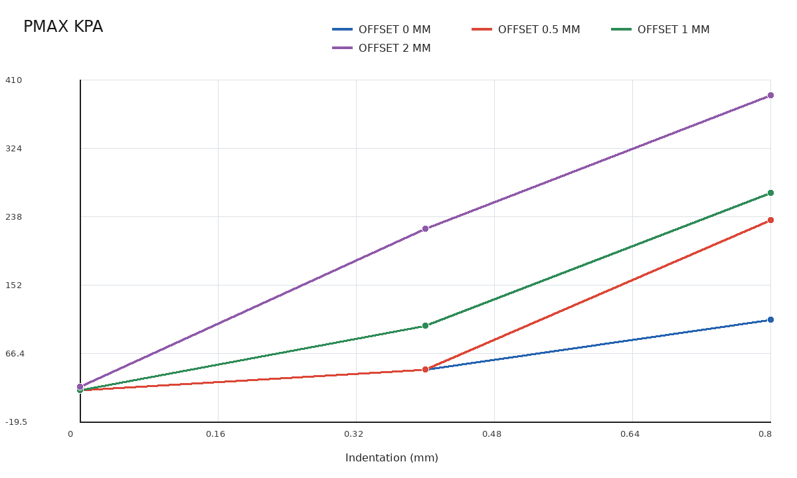
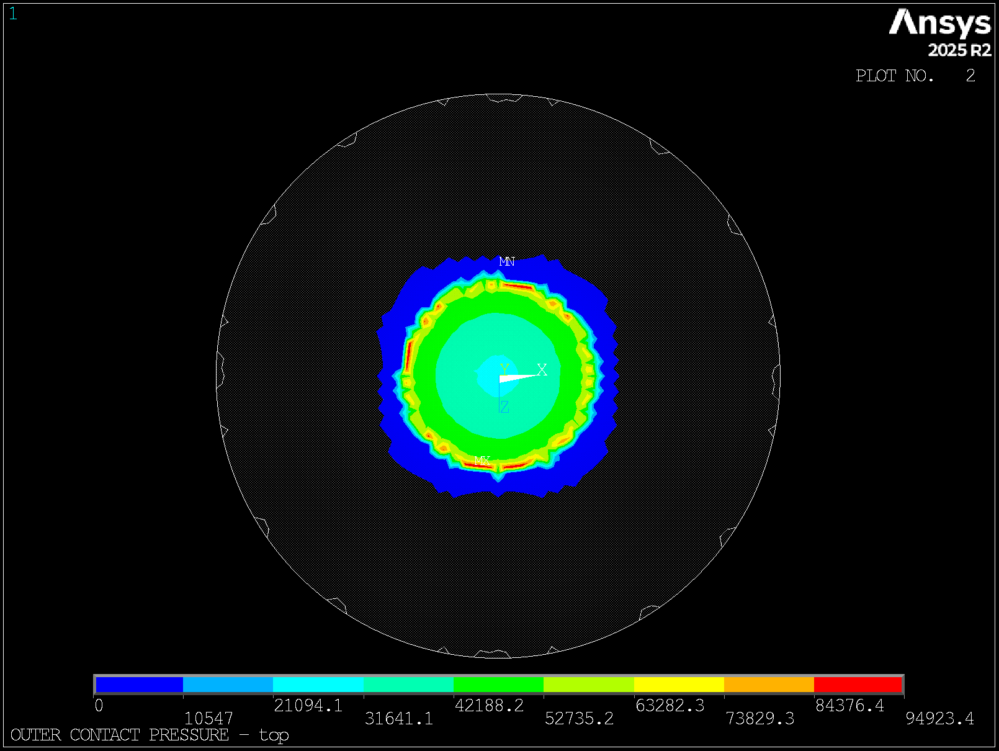
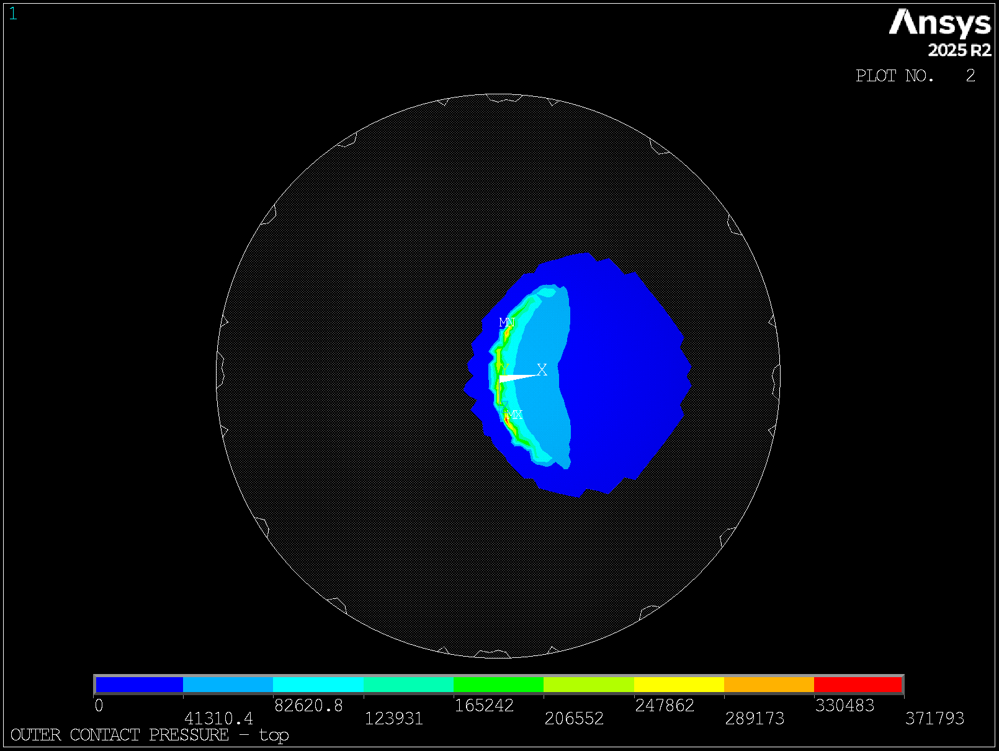
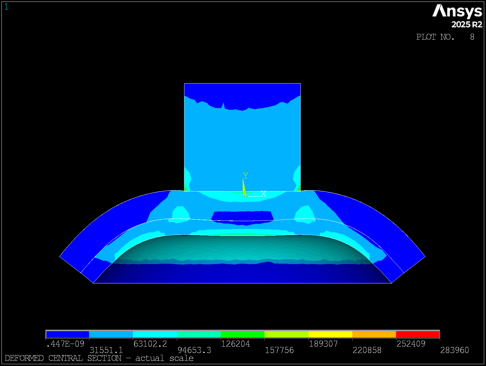
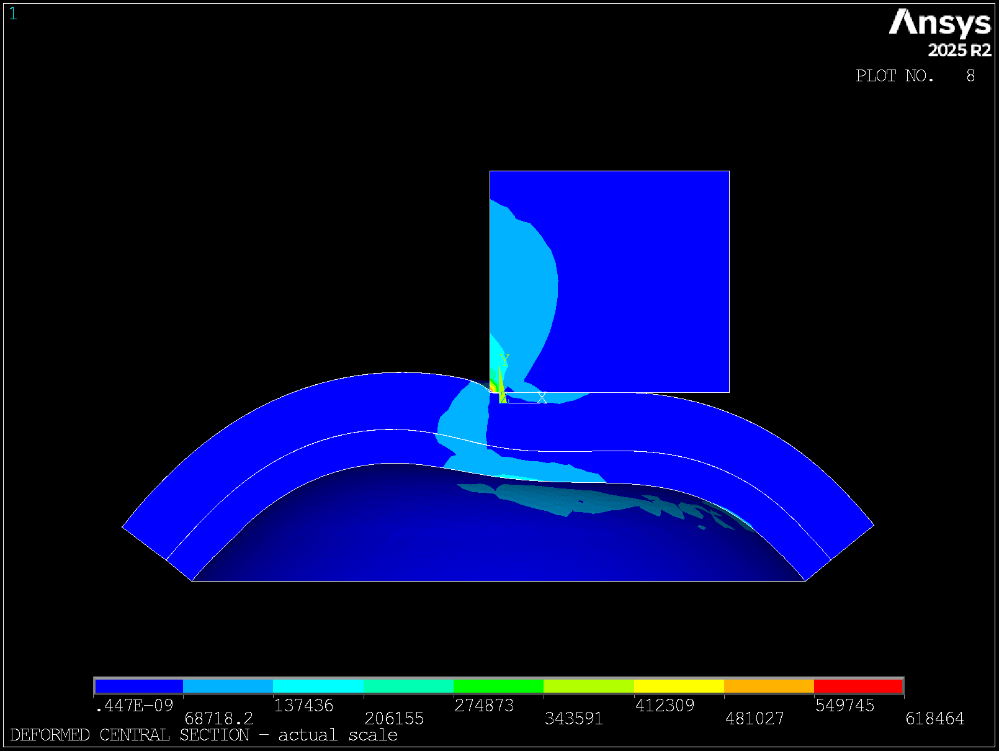

# 偏心压入粗扫描评估报告

## 1. 数据范围

本报告汇总参数化三维有限元 coarse 扫描。计算使用 Git 提交 `bc8610601a6cfeb201330ea96af96d1f253e4f3b`、ANSYS Mechanical APDL 2025 R2、0.3 mm 主扫描网格。眼睑厚度为 1.0 mm，角膜厚度为 0.6 mm，眼睑与角膜完全 bonded，IOP 为 2666.4 Pa。模型先建立 IOP 预应力，再保持 IOP 施加探头推进。

扫描矩阵为偏心量 `0、0.5、1.0、2.0 mm` 与名义推进量 `0、0.4、0.8 mm` 的组合，共 12 个工况。原始求解目录位于 5090d：

```text
/home/xuanyu/PROJECT/ziyu/blueknow-data/indentation_sweep/20260720T122940Z_bc861060_coarse
```

规范数据见 [indentation_coarse.csv](../../results/summary/indentation_coarse.csv)，批次质检见 [indentation_coarse_qc.json](../../results/summary/indentation_coarse_qc.json)。
全部 12 个工况的 108 张图片见 [偏心粗扫描完整视图索引](../../results/summary/indentation_coarse_views/README.md)。

## 2. 完整性与收敛

- 12 个工况全部一次完成，两个载荷步均收敛，MAPDL 返回码均为 0。
- 每个工况均生成 9 张固定结果视图，最终结果均为载荷步 2、时间 2。
- 探头位移与命令值一致；批次 QC 为 0 error、0 warning。
- 与先前 smoke 重复的四个工况结果一致，最大力差小于 `1.5e-13 N`。
- 最大平均数值穿透为 `0.00629-0.01576 mm`，低于 `0.03 mm` 警戒线。
- 自动保留策略删除 252 个 MPI 分片和求解暂存文件，释放约 37.56 GiB；12 个主 RST、DB、指标、日志和 108 张工况视图保留在 5090d。

## 3. 探头读数和接触面积

名义 0 mm 工况仍包含 0.05 mm 初始间隙闭合，因此以下探头力采用同一偏心量下的 0 mm 结果作基线扣除。

| 偏心量 (mm) | 0.4 mm 净探头力 (N) | 相对中心值 | 0.4 mm 接触面积 (mm²) | 0.8 mm 净探头力 (N) | 相对中心值 | 0.8 mm 接触面积 (mm²) |
|---:|---:|---:|---:|---:|---:|---:|
| 0.0 | 0.2956 | 100.0% | 9.239 | 0.7309 | 100.0% | 13.870 |
| 0.5 | 0.2954 | 99.9% | 9.036 | 0.7125 | 97.5% | 13.743 |
| 1.0 | 0.2877 | 97.3% | 7.490 | 0.6641 | 90.9% | 12.339 |
| 2.0 | 0.2415 | 81.7% | 4.108 | 0.5429 | 74.3% | 7.594 |





结果显示，0.5 mm 以内偏心对总反力影响较小；1.0 mm 开始形成稳定低估；2.0 mm 时影响显著。在 0.8 mm 推进下，2.0 mm 偏心使净探头力降低 25.7%，外侧闭合接触面积降低 45.3%。

若仅将中心工况作为参考，0.8 mm 推进下的力修正倍率约为 `1.000、1.026、1.101、1.346`；0.4 mm 推进下约为 `1.000、1.001、1.028、1.224`。修正倍率明显依赖推进量，因此不能只按偏心量设置单一常数。

## 4. 接触中心和局部压力

| 偏心量 (mm) | 0.8 mm 压力中心 X (mm) | `|Fx/Fy|` | 最大接触压力 (kPa) |
|---:|---:|---:|---:|
| 0.0 | 0.004 | 0.02% | 108.9 |
| 0.5 | 0.538 | 2.20% | 234.1 |
| 1.0 | 0.852 | 4.12% | 268.2 |
| 2.0 | 1.337 | 9.58% | 390.4 |





接触压力斑块由中心工况的近似环形边缘承载逐步转变为偏心工况的月牙形集中区，压力中心和横向反力均朝偏心方向增加。这一变化与接触面积下降相互一致。

| 中心压入：0.0 mm 偏心、0.8 mm 推进 | 边界工况：2.0 mm 偏心、0.8 mm 推进 |
|---|---|
|  |  |

上图使用各工况自动色标，只用于比较接触斑块位置与形状；颜色不能跨图直接比较绝对压力，绝对值以汇总表为准。

最大接触压力对网格、目标面三角片和接触边缘高度敏感。0.5 mm 偏心时总力和面积变化很小，但 `pmax` 已增加一倍以上，因此 `pmax` 仅用于识别局部集中，不用于直接标定眼压。

## 5. 视图与模型警告

实际比例中央截面没有显示探头边界发生异常大变形。此前看似鼓包或交叠的区域主要是统一应力色标跨越不同材料后形成的等值区，不等同于几何边界。结合数值穿透和求解日志，当前 0.8 mm 上限内没有明确穿模证据。

| 中心实际比例变形截面 | 2.0 mm 偏心实际比例变形截面 |
|---|---|
|  |  |

日志仍有三类需要在正式定型前处理的提示：

1. 每个模型有 1 个眼睑 SOLID187 单元超过最大角度警告值，但无 Jacobian 错误。
2. 三角化目标面存在平滑精度提示，局部峰值压力会受此影响。
3. bonded 界面出现节点同时连接 contact 和 target 的提示。当前几何可能已经共享节点，接触约束存在重复定义的可能。

这些提示没有破坏本轮收敛和整体力平衡，但在细网格验证前不应把局部峰值解释为精确绝对值。

## 6. 工程结论

- 探头顶部约束反力求和可作为探头读数；在准静态平衡下，它与探头表面总载荷等价。
- 0.5 mm 以内偏心对总读数影响有限，1.0 mm 以上应进入修正模型，2.0 mm 属于高风险偏心状态。
- 偏心使总反力和接触面积下降，同时使局部压力、压力中心偏移及横向力上升。
- 当前结果可支持偏心趋势和专利修正链条的汇报，不能替代内外压平面积修正或真实仿体统计。
- 单个确定性算例不能形成统计 95% CI。后续 95% CI 应来自独立装配体重复实验；有限元部分使用网格和判据敏感性范围描述数值不确定性。
