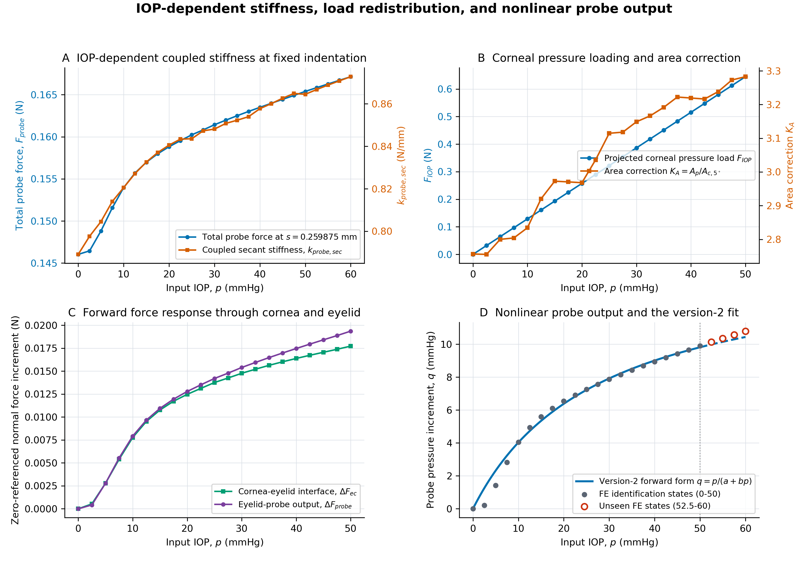
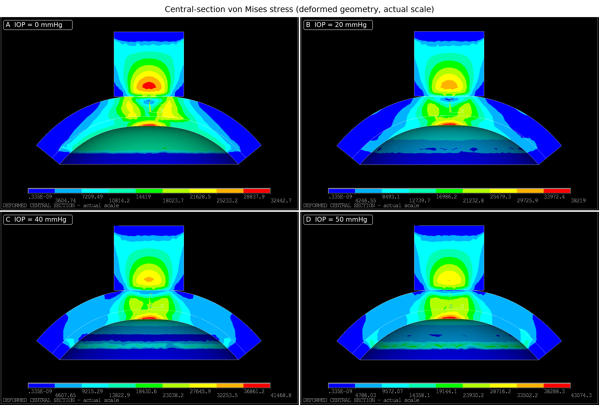
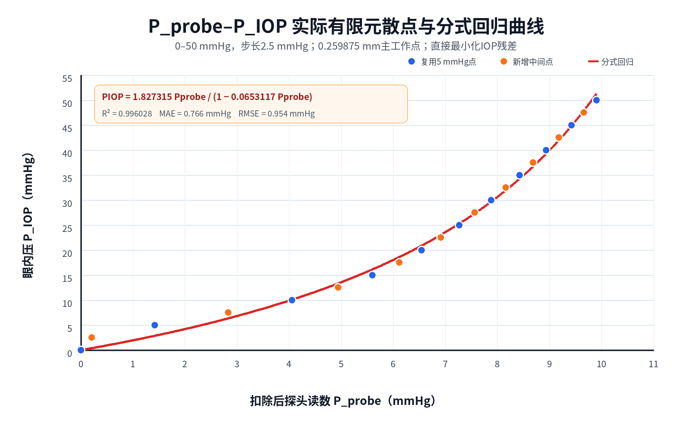
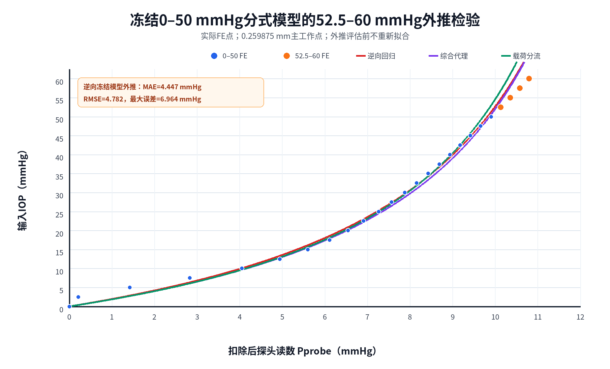
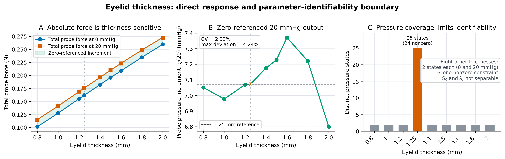
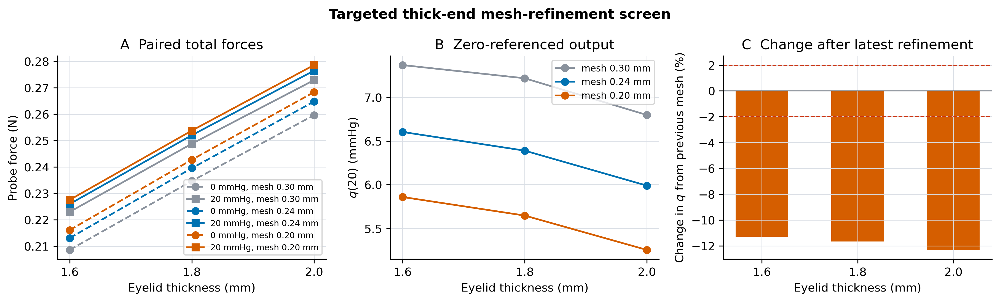

# 经眼睑眼压测量的经验分式拟合：0–50 mmHg 有限元识别、未见高压外推与眼睑厚度可识别性

**English title:** Empirical rational fitting for transpalpebral tonometry: finite-element identification over 0–50 mmHg, unseen high-pressure extrapolation, and eyelid-thickness identifiability

> - 稿件状态：内部完整初稿；尚未按目标期刊格式化。
> - 论文算法主张：使用第二版本经验分式 $p=aq/(1-bq)$ 作为唯一拟合方案。
> - 力学传递效率/全局载荷份额：只用于解释拟合边界，不作为本文采用的最新算法版本。
> - 证据等级：有限元研究，不是临床试验、真实硬件标定或生产算法验证。
> - 有限元求解源码冻结点：Git 提交 `cef09f91ca328cc39488b55047afaf9e078a980a`；论文和网格审计轻量证据由当前分支继续治理。
> - 作者、单位、基金和外部参考文献：投稿前填写。

## 作者与单位

**作者：**［待填写］

**单位：**［待填写］

**通讯作者：**［待填写］

**电子邮箱：**［待填写］

---

## 中文摘要

### 目的

经眼睑眼压测量中，探头反力同时受到内压、眼睑与角膜材料、接触面积、预张力和边界载荷分流影响。本研究采用第二版本经验分式作为拟合方案，利用三维有限元结果识别探头读数与眼压之间的非线性关系，检验冻结参数在未见高眼压区间的外推能力，并评估现有数据是否足以识别眼睑厚度对分式参数的影响。有效面积换算和力学传递量仅作为误差解释与边界审计，不作为本文提出或采用的新算法。

### 方法

建立眼睑—角膜—眼球—探头三维有限元模型。固定眼睑厚度 1.25 mm、角膜厚度 0.60 mm、探头半径 2.16 mm、网格尺寸 0.30 mm，以连续三载荷步完成眼压预载、几何初接触和探头压入。主分析读取实际推进 0.259875 mm 的结果，并由相邻 0.280000 mm 状态计算耦合两点割线刚度；在 0、20、40 和 50 mmHg 下从既有 RST 统一后处理包含探头—眼睑—角膜的实际比例中央剖面等效应力云图。基于固定推进串联近似、球面小压平几何和 $k_c=k_{c,0}+\alpha R_cp$，推导 $K_A=A_p/A_c=K_0+K_1p$；若直接力传递系数 $\eta$ 近似为常数，则 $p=\eta K_Aq$ 化为第二版本分式。0–50 mmHg 的 21 点用于参数识别，52.5–60 mmHg 的四点用于冻结外推。结果按“等效刚度—场变量重分布—角膜至探头载荷路径—非线性输出”的顺序展示，并将 $q=p/(a+bp)$ 代数反演为 $p=aq/(1-bq)$。另使用九个眼睑厚度端点及力—位移曲线进行可识别性分析，并对 1.60、1.80、2.00 mm 厚端的 0/20 mmHg 配对响应开展 0.30、0.24、0.20 mm 三级网格审计。

### 结果

0–50 mmHg 内，0.259875–0.280000 mm 窗口的耦合割线刚度由 0.789117 N/mm 增至 0.864499 N/mm，表明 IOP 预应力改变了固定推进下的系统级结构响应；同推进的代表性中央剖面云图显示探头—眼睑—角膜载荷路径内的应力场并非随 IOP 作统一比例放大。10–50 mmHg 内，角膜压力投影合力由 0.128744 N 增至 0.644565 N，而眼睑—角膜接口增量力仅由 0.007769 N 增至 0.017728 N，眼睑介导的探头增量力由 0.007923 N 增至 0.019359 N。面积修正近似为 $K_A=2.79833+0.0104365p$；直接接口传力比由 0.9806 降至 0.9158，但仅用 $\eta\approx\tau_{interface}$ 和 $K_A$ 的预测 RMSE 为 9.5475 mmHg，说明恒定传力与压力—面积等效假设不能同时定量成立。第二版本经验拟合得到 $a=1.8273148620$、$b=0.0653117307\ \mathrm{mmHg^{-1}}$，样本内 RMSE 为 0.9541 mmHg；冻结模型在 52.5–60 mmHg 的 RMSE 上升至 4.7817 mmHg。0.30 mm 厚度扫描的 20 mmHg 单点组合增益对数灵敏度为 0.009323，但非参考厚度不足以分别识别两个参数。三个网格均保持 $q(1.60)>q(1.80)>q(2.00)$，但 0.20 mm 相对 0.24 mm 的最大 $q$ 变化仍为 12.31%，表明厚端下降次序稳健而绝对幅值未达到网格无关。

### 结论

本文采用的第二版本经验分式能够描述固定有限元配置下 0–50 mmHg 的样本内关系，但未能通过冻结参数后的 52.5–60 mmHg 外推，因此其 claim 应限定为“固定配置、识别区间内的有限元拟合”，不能表述为 60 mmHg、跨厚度或真实硬件生产标定。现有厚度数据只支持 0.30 mm 网格上 20 mmHg 单工作点组合增益较稳定的受限描述；三级网格保留了厚端下降次序，却未得到收敛的绝对幅值，因而不支持一般性的厚度无关参数或 1.60 mm 物理阈值。

**关键词：** 经眼睑眼压测量；有限元；串联等效；面积修正；力传递；经验分式；高眼压外推；参数可识别性

---

## English Abstract

### Purpose

To identify and evaluate the second-version empirical rational equation for converting transpalpebral probe reaction into intraocular pressure (IOP), and to test its unseen high-pressure extrapolation and eyelid-thickness identifiability using finite-element (FE) evidence. Effective-area and mechanical-transfer quantities were used only as auxiliary diagnostics rather than as the claimed fitting algorithm.

### Methods

A three-dimensional eyelid–cornea–globe–probe FE model was evaluated with a 1.25-mm eyelid, a 0.60-mm cornea, a 2.16-mm-radius probe, a 0.30-mm mesh, and a retained indentation state of 0.259875 mm. A coupled two-state secant stiffness was calculated using the adjacent 0.280000-mm state, and actual-scale central-section equivalent-stress contours spanning the probe, eyelid, and cornea were postprocessed from existing RST files at 0, 20, 40, and 50 mmHg. A fixed-indentation series approximation, small spherical applanation geometry, and $k_c=k_{c,0}+\alpha R_cp$ yielded $K_A=A_p/A_c=K_0+K_1p$; with an approximately constant direct transfer coefficient $\eta$, $p=\eta K_Aq$ reduces to the version-2 rational equation. Twenty-one states from 0 to 50 mmHg were used for parameter identification, and four states from 52.5 to 60 mmHg for frozen extrapolation. Results were ordered from effective stiffness and field redistribution to the cornea-to-probe load path and nonlinear output. The forward form $q=p/(a+bp)$ was algebraically inverted to $p=aq/(1-bq)$ using the same parameters. A separate nine-thickness dataset was audited for identifiability, and paired 0/20-mmHg responses at 1.60, 1.80, and 2.00 mm were examined on 0.30-, 0.24-, and 0.20-mm meshes.

### Results

From 0 to 50 mmHg, coupled secant stiffness over the 0.259875–0.280000-mm window increased from 0.789117 to 0.864499 N/mm, demonstrating an IOP-dependent system-level response; representative fixed-indentation central sections showed nonuniform stress redistribution along the probe–eyelid–cornea load path. From 10 to 50 mmHg, the projected corneal load increased from 0.128744 to 0.644565 N, whereas the cornea–eyelid increment increased from 0.007769 to 0.017728 N and the eyelid-mediated probe increment from 0.007923 to 0.019359 N. The area correction was approximated by $K_A=2.79833+0.0104365p$. Although the direct interface ratio decreased only from 0.9806 to 0.9158, combining this ratio with $K_A$ produced an RMSE of 9.5475 mmHg, rejecting the simultaneous constant-transfer and pressure–area-equivalence simplification. The empirical version-2 fit gave $a=1.8273148620$ and $b=0.0653117307\ \mathrm{mmHg^{-1}}$, with an RMSE of 0.9541 mmHg over 0–50 mmHg. Frozen extrapolation RMSE over 52.5–60 mmHg was 4.7817 mmHg. The 20-mmHg log-thickness sensitivity on the 0.30-mm dataset was 0.009323, but the two parameters were not separately identifiable at non-reference thicknesses. All three meshes preserved $q(1.60)>q(1.80)>q(2.00)$, whereas the maximum change from the 0.24- to 0.20-mm mesh remained 12.31%; thus, the thick-end ordering was robust but the amplitude was not mesh independent.

### Conclusions

The second-version fixed rational equation provides an accurate sample-internal fit over 0–50 mmHg under one FE configuration but fails frozen high-pressure extrapolation. Its claim must therefore remain restricted to an empirical FE fit within the identification range; it is not a validated 60-mmHg, cross-thickness, or real-hardware calibration. Three-mesh testing supported the direction of the sampled thick-end decrease but not a mesh-independent magnitude or a physical threshold at 1.60 mm.

**Keywords:** transpalpebral tonometry; finite element analysis; series approximation; area correction; force transfer; empirical rational fitting; high-pressure extrapolation; identifiability

---

# 1 引言

眼压是青光眼筛查、病程评估和治疗监测的重要指标。传统眼压测量通常依赖角膜表面的压平、回弹或动态形变，而经眼睑测量试图在不直接接触角膜的条件下，经由眼睑向角膜—眼球系统施加载荷并读取探头响应［外部临床与仪器文献待补］。这一加载路径引入了额外的软组织层、接触界面和边界分流，使探头反力不再只由眼内压决定。

从力学上看，经眼睑探头的反力至少受到五类因素共同影响：眼睑材料压缩、角膜和眼球预张力、外侧与内侧接触/压平面积、眼睑—角膜界面传力，以及眼球外围支承和整体位移。若将这些效应全部压缩成单一比例系数，可能在某一工作点获得较小误差，却难以解释压力变化、个体厚度变化和超出标定范围后的失效。

本项目曾评估有效压平面积直接换算，并在后续开展力学传递和全局载荷份额审计；但本文不把这些路径作为另一套论文算法。本文从固定推进下的眼睑—角膜串联近似、球面小压平几何和压力增刚出发，推导 $p=\eta K_A(p)q$ 在常数传力近似下可化为分式；唯一采用的拟合方案仍是第二版本经验分式。为避免先给出拟合公式再反向选择机制解释，结果首先检验 IOP 预应力是否改变耦合等效刚度，并展示代表性组织应力场；随后沿角膜压力载荷、有效面积、接口传力和探头输出推进到非线性方程。面积和力平衡结果用于检验推导假设、解释分式为何在部分区间有效，以及为何在低压启用段和高压外推段失效。

当前研究有两个核心问题。第一，在固定有限元配置下，第二版本经验分式能否准确拟合 0–50 mmHg，并外推到未参与拟合的 52.5–60 mmHg？第二，现有多厚度数据能否支持分式参数对眼睑厚度的一般性规律？为回答这些问题，本研究联合分析密集压力扫描、冻结模型外推、辅助 RST 力学审计和厚度端点数据，并严格区分样本内拟合、同源机制解释与独立验证。

# 2 材料与方法

## 2.1 研究设计

研究由两个有限元数据域组成。

1. **高眼压机制数据域：** 固定眼睑厚度、角膜厚度、材料、网格和推进策略，形成 0–60 mmHg、2.5 mmHg 间隔的 25 点压力曲线。0–50 mmHg 的 21 点用于模型拟合和机制诊断；52.5、55、57.5、60 mmHg 在参数冻结后求解，作为未见高压外推点。
2. **眼睑厚度数据域：** 眼睑厚度为 0.80、1.00、1.20、1.25、1.40、1.50、1.60、1.80 和 2.00 mm。所有厚度具有独立 0 和 20 mmHg 端点；只有 1.25 mm 具有完整 0–60 mmHg 曲线。另有 0.80–2.00 mm、七个厚度的力—位移曲线用于提取耦合局部刚度。
3. **厚端网格审计数据域：** 复用 1.60、1.80、2.00 mm 的 0.30 mm 基线，并在冻结模型上新增 0.24 和 0.20 mm 网格的 0/20 mmHg 配对工况，用于区分厚端下降次序与响应幅值的网格敏感性。

研究没有把确定性有限元压力点当作独立实验重复。回归误差用于描述给定网格上的模型偏差；bootstrap 区间表示对当前压力设计点重采样后的参数稳定性，不表示临床人群不确定性。

## 2.2 有限元模型与加载路径

正式求解使用 ANSYS Mechanical APDL 2025 R2。高眼压主分析配置见表 1。

**表 1　高眼压有限元主配置**

|参数|数值|
|---|---:|
|眼睑厚度|1.25 mm|
|角膜厚度|0.60 mm|
|探头半径|2.16 mm|
|完整探头面积 $A_p$|14.6574146846 mm²|
|初始安全间隙|0.30 mm|
|网格尺寸|0.30 mm|
|求解终点|0.28 mm|
|主目标推进|0.26 mm|
|实际主结果集推进|0.259875 mm|
|眼睑 Mooney–Rivlin 参数|$C_{10}=0.076$ MPa，$C_{01}=0.010$ MPa，$D_1=10^{-7}$ Pa⁻¹|
|角膜 Mooney–Rivlin 参数|$C_{10}=0.0825$ MPa，$C_{01}=0.01875$ MPa，$D_1=10^{-7}$ Pa⁻¹|
|压力换算|1 mmHg = 133.3223684211 Pa|

每个压力工况采用连续三载荷步：首先在探头与组织保持安全间隙时施加 IOP 预载；随后根据预载后的几何位置移动至初接触；最后从各自的几何初接触位置继续压入至 0.28 mm。主结论读取保留结果中最接近 0.26 mm 的实际状态，即 0.259875 mm。该路径避免把不同预应力或不同几何零点的数据拼接成同一压力曲线。

新求解必须满足返回码为 0、ANSYS 错误数为 0、三个载荷步均收敛、预载时探头接触数为 0、接近阶段反力绝对值不超过 0.001 N、接触穿透不超过 0.03 mm、主推进误差不超过 0.001 mm，以及探头总力和增量读数随压力严格单调。

## 2.3 统一观测量

在固定几何和推进状态下，定义零眼压结构参考后的探头增量力：

$$
\Delta F_{probe}(p)=F_{probe}(p)-F_{probe}(0)
$$

按完整探头面积定义等效探头压力：

$$
q=P_{probe}=\frac{\Delta F_{probe}(p)}{A_p}
$$

这里的 $\Delta F_{probe}$ 是两个不同预应力、接触和变形状态之间的总耦合响应差。它可以作为统一算法输入，但不能解释为材料影响已被完全消除后的“纯 IOP 反力”。

为量化目标推进附近的系统级刚度变化，使用两个相邻保留状态定义耦合割线刚度：

$$
k_{probe,sec}(p)=
\frac{F_{probe}(p,0.280000)-F_{probe}(p,0.259875)}
{0.280000-0.259875}
$$

位移窗口宽度为 0.020125 mm。该量同时包含眼睑、角膜、接触界面、眼球整体运动和边界支承，只用于检验 IOP 预应力是否改变目标工作点附近的总体结构响应；它不是眼睑独立刚度 $k_l$、角膜独立刚度 $k_c$ 或材料切线模量，也不作为第二版本拟合输入。

## 2.4 正向理论推导与第二版本经验模型

### 2.4.1 固定推进下的眼睑—角膜串联近似

为解释第二版本分式的来源，先建立理想化正向模型。令探头等效压力 $P_{Probe}=q$，眼压 $P_{IOP}=p$，探头面积为 $A_p$，角膜有效压平面积为 $A_c$，固定总推进量为 $s$；高眼压主状态对应 $s=0.259875$ mm。暂不考虑探头自身变形，并把推进位移分解为眼睑压缩和角膜压平：

$$
s=\delta_l+\delta_c
$$

将眼睑与角膜—眼球系统在当前工作点分别等效为刚度 $k_l$ 和 $k_c$ 的理想串联系统。若忽略外围并行载荷路径，则串联轴向力相同：

$$
F=k_l\delta_l=k_c\delta_c
$$

因此：

$$
\delta_l=\frac{F}{k_l},
\qquad
\delta_c=\frac{F}{k_c}
$$

代入固定总推进条件：

$$
s=F\left(\frac{1}{k_l}+\frac{1}{k_c}\right)
$$

得到：

$$
F=s\frac{k_lk_c}{k_l+k_c},
\qquad
\boxed{
\delta_c=s\frac{k_l}{k_l+k_c}
}
$$

理想串联体系的等效刚度及其对角膜侧刚度的导数为：

$$
k_{series}=\frac{F}{s}=\frac{k_lk_c}{k_l+k_c},
\qquad
\frac{\partial k_{series}}{\partial k_c}
=\frac{k_l^2}{(k_l+k_c)^2}>0
$$

因此，若 IOP 预张力使 $k_c$ 增加，则固定推进下的系统等效刚度和探头总力增加，而分配给角膜压平的位移比例 $\delta_c/s=k_l/(k_l+k_c)$ 减小。后文只检验这一系统级方向，不用耦合探头刚度反算 $k_l$ 或 $k_c$。

把角膜局部表面近似为半径 $R_c$ 的球面，压平半径 $r_c$ 满足：

$$
r_c^2+(R_c-\delta_c)^2=R_c^2
$$

即：

$$
r_c^2=2R_c\delta_c-\delta_c^2
$$

当 $\delta_c/R_c\ll1$ 时忽略二阶项，并以 $A_c=\pi r_c^2$ 得到：

$$
A_c\approx2\pi R_c\delta_c
$$

于是：

$$
\boxed{
A_c\approx
2\pi R_cs\frac{k_l}{k_l+k_c}
}
$$

这里的 $k_l$ 和 $k_c$ 是耦合结构在给定工作点的等效刚度，不等同于组织材料模量。实际有限元还存在外围支承、曲面压力投影和接触启用，因此该串联关系是待检验的理论近似，而不是直接写入求解器的约束。

### 2.4.2 压力相关角膜刚度与面积修正

假设目标压力区间内角膜—眼球等效刚度可作一阶近似：

$$
k_c(p)=k_{c,0}+\alpha R_cp
$$

其中 $k_{c,0}$ 为零压力外推刚度，$\alpha$ 描述压力预张力引起的增刚。若 $p$ 使用 mmHg 而非一致力学单位，$\alpha$ 必须包含相应压力换算，不能直接视为无量纲材料参数。

代入串联近似得到：

$$
\boxed{
A_c(p)\approx
\frac{2\pi R_cs k_l}
{k_l+k_{c,0}+\alpha R_cp}
}
$$

从而：

$$
p\uparrow
\Rightarrow k_c\uparrow
\Rightarrow \delta_c\downarrow
\Rightarrow A_c\downarrow
$$

定义面积修正系数：

$$
K_A(p)=\frac{A_p}{A_c(p)}
$$

整理得：

$$
\boxed{
K_A(p)\approx
\frac{\alpha}{k_l}\frac{A_p}{2\pi s}p
+\frac{A_p}{2\pi s}\frac{1}{R_c}
\frac{k_l+k_{c,0}}{k_l}
}
$$

为避免与第二版本最终公式的 $a,b$ 混淆，定义理论面积截距和斜率：

$$
K_0 = \frac{A_p}{2\pi R_cs}
\frac{k_l+k_{c,0}}{k_l}
$$

$$
K_1 = \frac{\alpha A_p}{2\pi sk_l}
$$

于是：

$$
\boxed{K_A(p)=K_0+K_1p}
$$

$K_0$ 表示低压力外推下的基础面积修正，$K_1$ 表示面积修正对压力的敏感度。本文使用冻结的内侧 5°中央近平坦面积 $A_{c,5^\circ}$ 计算 $K_A=A_p/A_{c,5^\circ}$，但该面积只是几何代理，不是已独立验证的机械承载面积。

### 2.4.3 力传递系数与分式形式

令 $\eta$ 表示探头增量力传到角膜有效区域的直接力传递系数。若角膜有效区域满足压力—面积等效关系：

$$
pA_c=\eta\Delta F_{probe}
$$

又因 $q=\Delta F_{probe}/A_p$，则：

$$
\boxed{
p=\eta K_A(p)q
}
$$

这就是本文用于解释第二版本结构的理论起点。若进一步假设 $\eta\approx\eta_0$ 在识别区间内近似为常数，并代入 $K_A=K_0+K_1p$：

$$
p=\eta_0(K_0+K_1p)q
$$

整理：

$$
p(1-\eta_0K_1q)=\eta_0K_0q
$$

得到：

$$
\boxed{
p=\frac{\eta_0K_0q}{1-\eta_0K_1q}
}
$$

与本文统一展示的第二版本：

$$
\boxed{p=\frac{aq}{1-bq}}
$$

对应关系为：

$$
\boxed{
a=\eta_0K_0,
\qquad
b=\eta_0K_1
}
$$

若取理想无损近似 $\eta_0=1$，并按题述推导把面积截距命名为 $b_{th}=K_0$、面积斜率命名为 $a_{th}=K_1$，则可写成：

$$
p=\frac{b_{th}q}{1-a_{th}q}
$$

其与本文统一展示符号的映射是 $a=b_{th}$、$b=a_{th}$。本文保留 $p=aq/(1-bq)$，避免与仓库已冻结的参数展示和历史字段再次交换。

同一关系的正向形式为：

$$
\boxed{
q(p)=\frac{p}{a+bp}
=\frac{G_0p}{1+\lambda_rp}
}
$$

其中：

$$
G_0=\frac{1}{a},
\qquad
\lambda_r=\frac{b}{a}
$$

其切线增益：

$$
\frac{\mathrm{d}q}{\mathrm{d}p}
=\frac{a}{(a+bp)^2}
$$

本文全部拟合、冻结和外推 claim 均使用这一第二版本函数族。参数估计使用 0–50 mmHg 的 21 个点，在 IOP 空间执行无权非线性最小二乘；正向展示与逆向预测共享同一组参数，并非两次独立拟合。仓库原始 JSON 使用 `a_per_mmhg` 表示本文的 $b$、`b_dimensionless` 表示本文的 $a$，本文不改写历史字段。

## 2.5 角膜—眼睑正向力学响应与全局力平衡

结果按以下正向观测顺序组织：

$$
p
\longrightarrow F_{IOP}=pA_{IOP,proj}
\longrightarrow \Delta F_{ec}
\longrightarrow \Delta F_{probe}
\longrightarrow q=\frac{\Delta F_{probe}}{A_p}
$$

其中 $F_{IOP}$ 是作用于角膜内表面的轴向压力投影合力；$\Delta F_{ec}$ 是眼睑—角膜 bonded 接口法向接触力相对 0 IOP 状态的增量；$\Delta F_{probe}$ 是眼睑传到探头的轴向反力增量。该箭头表示结果的观测与展示顺序，不表示三个力必须串联相等；外围支承和组织内部存在并行载荷路径。因此，本文把 $F_{IOP}$ 和 $\Delta F_{ec}$ 作为角膜侧响应，把 $\Delta F_{probe}$ 和 $q$ 作为眼睑介导的探头侧响应，但不把它们误称为彼此独立的材料本构响应。

用 RST 直接积分得到的接口传力比为：

$$
\tau_{interface}(p)
=\frac{\Delta F_{ec}(p)}{\Delta F_{probe}(p)}
$$

它是理论 $\eta$ 的直接候选量。要使 $p=\eta K_Aq$ 成立，还必须同时满足 $pA_c=\Delta F_{ec}$。因此定义压力—面积等效项：

$$
\chi(p)=\frac{pA_c(p)}{\Delta F_{ec}(p)}
$$

以及综合修正：

$$
\eta_{eff}(p)
=\tau_{interface}(p)\chi(p)
=\frac{pA_c(p)}{\Delta F_{probe}(p)}
$$

$\eta_{eff}$ 是反演修正而不是 0–1 意义下的直接传力效率；它也可写为 $1/T_{mech}$。由此精确恒等式为：

$$
p=\eta_{eff}(p)K_A(p)q
$$

完整内压投影合力对应的全局探头载荷份额为：

$$
\lambda_{load}(p)
=\frac{\Delta F_{probe}(p)}{pA_{IOP,proj}}
$$

并有：

$$
p=\frac{A_p}{\lambda_{load}(p)A_{IOP,proj}}q
$$

对 0–50 mmHg 的 21 个 RST 状态，积分探头—眼睑和眼睑—角膜接触单元的全局力矢量，并提取外围支承反力。探头接触积分与探头反力的相对差要求低于 1%。由压力投影几何得到：

$$
A_{IOP,proj}=96.3669605\ \mathrm{mm^2}
$$

稳定压力区间的轴向力平衡反算面积均值为 96.6173 mm²，与几何值相对差约 -0.259%，用于检查全局压力合力口径的一致性。

在 10–50 mmHg 区间拟合：

$$
\frac{1}{\lambda_{load}}=c_0+c_1p
$$

但由于 $\eta_{eff}$ 和 $\lambda_{load}$ 都使用已知 $p$ 及同组响应计算，它们只用于检验理论假设、解释分式来源和定位失效环节，不作为独立预测或另一套论文算法。

为观察同一推进下的组织场变量变化，从 0、20、40 和 50 mmHg 的既有 RST 读取实际推进 0.259875 mm 的结果集，以同一 APDL 后处理宏输出包含探头、眼睑和角膜的中央剖面 von Mises 等效应力云图；剖面采用变形后几何的实际比例。该步骤只读取已收敛结果，不新增求解。每幅图保留 MAPDL 原生自动色标、单位和极值，因此可比较应力分布位置及各图图例数值，但不能仅按颜色跨压力作定量比较；正式定量结论仍使用耦合割线刚度、积分力和面积结果。原始 PNG、SHA-256 和 RST 来源记录在图件 manifest 中。

## 2.6 冻结模型外推设计

经验分式使用 0–50 mmHg 数据拟合后冻结参数。随后新增求解 52.5、55、57.5 和 60 mmHg，不允许在报告冻结模型误差前重新拟合。主要评价指标包括 MAE、RMSE、最大绝对误差、单调性以及分母安全裕度。

## 2.7 眼睑厚度与参数可识别性

对完整多压力曲线，正向探头响应可写为：

$$
q=\frac{G_0p}{1+\lambda_r p}
$$

其反演与本文采用的第二版本等价。每个厚度若要分别识别 $G_0$ 和 $\lambda_r$，必须具有多个非零压力点。非参考厚度只有 20 mmHg 一个非零端点，因此只能计算：

$$
G_{eff,20}=\frac{q(20)}{20}
=\frac{G_0}{1+20\lambda_r}
$$

不能把该组合量唯一拆分成 $G_0$ 和 $\lambda_r$。厚度灵敏度使用对数—对数斜率：

$$
S_h=\frac{\partial\ln y}{\partial\ln h}
$$

另在 0.20–0.35 mm 位移窗口提取总探头反力的局部斜率，记为 $k_{probe,coupled}$。该量混合眼睑、角膜、界面和整体运动，不能命名为眼睑独立刚度 $k_l$。

## 2.8 厚端定向网格审计

针对 0.30 mm 网格的图 5B 在 1.60 mm 后下降的现象，预先冻结 1.60、1.80、2.00 mm × 0/20 mmHg 的定向矩阵。0.30 mm 结果作为既有基线，0.24 mm 用于筛查，0.20 mm 用于三级确认；材料、接触、边界、初始间隙和 0.28 mm 推进均保持不变。每个网格和厚度按下式计算：

$$
q(h,m)=\frac{|F_{20}(h,m)|-|F_0(h,m)|}{[A_p\times10^{-6}]\,133.322}
$$

其中 $m$ 为全局网格尺寸，$A_p=14.6574146846\ \mathrm{mm^2}$。接收条件包括三个载荷步收敛、ANSYS error 为 0、最大穿透不超过 0.03 mm、同厚度 0/20 mmHg 离散一致以及来源工作树干净。预设幅值判据为最新网格相对前一级网格的最大 $|\Delta q/q|\leq2\%$；另独立检查 $q(1.60)>q(1.80)>q(2.00)$ 的次序。0.24 mm 单次细化不被定义为网格无关。

细网格在并发运行时受内存和并行文件系统竞争影响，因此最终 0.20 mm 端点按压力串行完成，再按厚度配对。被主动中止且未形成完整终点的资源预检不进入数值比较；两个被接收的压力目录必须具有相同 Git commit、APDL 哈希、ANSYS 版本和模型参数。

## 2.9 统计与复现

模型误差采用：

$$
\mathrm{MAE}=\frac{1}{n}\sum_{i=1}^n|\hat p_i-p_i|
$$

$$
\mathrm{RMSE}
=\sqrt{\frac{1}{n}\sum_{i=1}^n(\hat p_i-p_i)^2}
$$

经验分式参数的名义区间来自局部雅可比协方差；厚度分析使用 1000 次设计点 bootstrap。所有有限元点均为确定性计算状态，统计区间不代表人群分布。代码、配置、轻量数据和结果文件均保存在 Git；大体积 DB/RST 保存在 5090d 外部数据区。

# 3 结果

## 3.1 IOP 预应力改变目标工作点的耦合等效刚度

0–50 mmHg 密集矩阵和 52.5–60 mmHg 新增点均完成三载荷步求解。新增四点均首次求解成功，77 项 QC 全部通过；最大接触穿透为 0.013669 mm，低于 0.03 mm 门限。探头总反力和零眼压参考后的探头读数在 0–60 mmHg 内严格单调。

在固定几何初接触策略下，0.259875 mm 推进处的探头总力由 0 mmHg 时的 0.146033 N 增至 50 mmHg 时的 0.165392 N，60 mmHg 时进一步增至 0.167136 N。用相邻 0.280000 mm 状态计算的 $k_{probe,sec}$ 同期由 0.789117 N/mm 增至 0.864499 N/mm，0–50 mmHg 增幅为 9.55%；60 mmHg 时为 0.872780 N/mm，相对 0 mmHg 增幅为 10.60%。这说明即使推进量和材料参数固定，IOP 预应力仍会改变探头看到的总体结构刚度，因而探头总反力同时包含组织结构基线和 IOP 相关响应。

该趋势与理想串联模型中 $k_c\uparrow\Rightarrow k_{series}\uparrow$、$\delta_c/s\downarrow$ 的方向一致，即压力增刚会重新分配固定推进量。然而，$k_{probe,sec}$ 是全模型耦合量，不能据此分别求得 $k_l$、$k_c$ 或二者比值；这里验证的是系统级预应力增刚，而不是独立角膜材料定律。

图 1 按“耦合刚度—角膜载荷与面积—截面传力—非线性输出”汇总定量结果。第二版本分式仅在最后将有限元正向输出曲线写成可反演形式。

**图 1　IOP 相关耦合刚度、载荷重分布与非线性探头输出。** A：0.259875 mm 处的探头总力及由 0.259875–0.280000 mm 两状态得到的耦合割线刚度；B：角膜内压投影合力及由中央 5°几何代理得到的面积修正 $K_A$；C：眼睑—角膜接口和眼睑—探头的零基线法向力增量；D：FE 探头压力响应与第二版本的等价正向形式 $q=p/(a+bp)$。D 中虚线段及空心点表示参数冻结后的 52.5–60 mmHg 区间。

## 3.2 中央剖面云图显示探头—眼睑—角膜场变量重分布

在相同 0.259875 mm 推进下，0、20、40 和 50 mmHg 的中央剖面均显示从探头接触区、眼睑中央区到角膜穹隆的连续高应力载荷路径（图 2）。随 IOP 升高，眼睑内高应力区的形状、角膜中央及内侧应力带和周边低应力区均发生重分布，而不是零压力场的统一比例放大。四个剖面的原生图例上限约为 32.44、38.22、41.47 和 43.07 kPa；该上限是整个显示剖面的最大值，不能用来分别指认眼睑或角膜的材料峰值。

**图 2　固定推进下代表性 IOP 状态的探头—眼睑—角膜中央剖面 von Mises 等效应力云图。** A–D 对应 IOP 0、20、40 和 50 mmHg，实际推进均为 0.259875 mm；显示变形后几何，比例为 1:1。图件由既有收敛 RST 统一后处理生成。每幅子图保留 MAPDL 原生自动色标，单位为 Pa；由于色标范围随状态变化，不能直接按颜色跨子图比较，跨压力定量判断应读取各自图例并结合图 1 的刚度和积分力。

这些剖面结果与耦合割线刚度共同说明：IOP 预应力不只是向固定组织反力上叠加一个 $pA$ 项，而会改变探头—眼睑—角膜载荷路径内部的变形与应力分配。剖面云图提供空间位置证据，割线刚度提供系统级定量证据；二者均不构成眼睑和角膜独立本构参数的识别。

## 3.3 从角膜压力到探头反力：有效面积与载荷路径

### 3.3.1 角膜压力、中央几何与接口传力

角膜内表面的轴向压力投影面积为 96.36696 mm²，轴向平衡反算的稳定区均值为 96.61728 mm²，两者相差 -0.259%。因此，$F_{IOP}$ 随输入压力近似线性增加：10 mmHg 时为 0.128744 N，50 mmHg 时为 0.644565 N。

与完整压力合力不同，传入眼睑—角膜 bonded 接口的零基线法向增量 $\Delta F_{ec}$ 在 10–50 mmHg 仅由 0.007769 N 增至 0.017728 N。同期中央 5°面积代理 $A_{c,5^\circ}$ 从 5.17126 mm² 降至 4.46507 mm²，下降 13.65%；相应面积修正 $K_A=A_p/A_{c,5^\circ}$ 从 2.83440 增至 3.28268。代表性正向响应见表 2。

**表 2　角膜—眼睑正向力学响应的代表性状态**

|输入 IOP $p$/mmHg|$F_{IOP}$/N|$K_A=A_p/A_c$|$\Delta F_{ec}$/N|$\Delta F_{probe}$/N|探头输出 $q$/mmHg|
|---:|---:|---:|---:|---:|---:|
|10|0.128744|2.83440|0.007769|0.007923|4.05441|
|20|0.257521|2.96815|0.012473|0.012785|6.54231|
|30|0.386412|3.14889|0.014764|0.015397|7.87886|
|40|0.515426|3.21945|0.016381|0.017464|8.93694|
|50|0.644565|3.28268|0.017728|0.019359|9.90645|

10–50 mmHg 的面积修正可近似为：

$$
K_A(p)=2.79833+0.0104365p,
\qquad R^2=0.93810
$$

其正斜率与串联理论的 $K_A=K_0+K_1p$ 方向一致，但面积一致换算还要求 $\Delta F_{probe}=pA_c$。该基线在 20 mmHg 误差为 -0.5815 mmHg，却在 40 mmHg 低估 11.2280 mmHg；主工作点 MAE 为 5.4923 mmHg、RMSE 为 6.7007 mmHg。因此，角膜中央几何响应支持“$K_A$ 随压力增加”的定性推导，但不能单独确定第二版本参数。

### 3.3.2 眼睑介导的接口传递、探头反力与读数饱和

主状态的 0 IOP 探头反力基线为 0.1460331 N。眼压升高到 50 mmHg 后，总反力为 0.1653919 N，但真正进入第二版本拟合的是零基线增量 $\Delta F_{probe}=0.0193588$ N，对应 $q=9.90645$ mmHg。60 mmHg 时总反力为 0.1671365 N，$\Delta F_{probe}=0.0211033$ N，$q=10.79918$ mmHg。

10–50 mmHg 内，直接接口传力比：

$$
\tau_{interface}=\frac{\Delta F_{ec}}{\Delta F_{probe}}
$$

由 0.98062 缓慢降至 0.91577。这说明眼睑—角膜接口增量力与探头增量力保持接近，但不能说明完整角膜压力合力都传到探头。相对于 $F_{IOP}$ 的全局探头载荷份额：

$$
\lambda_{load}=\frac{\Delta F_{probe}}{F_{IOP}}
$$

同期由 0.06154 降至 0.03003，下降约 51.2%。因此，局部接口传递接近 1 与全局探头捕获份额下降可以同时成立：大部分内压载荷经外围支承和组织内部并行路径平衡，只有较小且随压力下降的份额表现为探头增量。

探头输出 $q$ 从 10 mmHg 时的 4.05441 mmHg 增至 50 mmHg 时的 9.90645 mmHg；当输入压力增加 5 倍时，输出只增加约 2.44 倍。直接接口传力候选 $\eta\approx\tau_{interface}$ 接近 1，但压力—面积等效项 $\chi=pA_c/\Delta F_{ec}$ 由 0.88738 增至 1.67894，使综合修正 $\eta_{eff}=\tau_{interface}\chi$ 呈显著压力依赖。

若直接采用理论简化：

$$
p\overset{?}=\tau_{interface}K_Aq
$$

则 21 点 RMSE 为 9.54752 mmHg，50 mmHg 仅得到 29.7807 mmHg。这说明“直接力传递接近无损”并不足以保证 $pA_c=\Delta F_{ec}$；恒定 $\eta$、5°面积代表真实承载面积和纯串联传力等假设不能同时成立。第二版本拟合实际吸收的是角膜—眼睑—边界的总耦合响应，而不是单一接口效率。

## 3.4 从正向响应得到第二版本经验反演

由有限元输入 $p$ 和探头输出 $q$ 形成的经验正向衰减 $K_{fwd}=p/q$ 在稳定压力区随压力升高。第二版本用 $K_{fwd}=a+bp$ 对这一总耦合趋势参数化，在 0–50 mmHg 识别后得到：

$$
a=1.8273148620,
\qquad
b=0.0653117307\ \mathrm{mmHg^{-1}}
$$

其中 $a$ 表示外推至零压力的总衰减截距，$b$ 表示单位 IOP 增加对应的经验衰减增量；两者不是眼睑或角膜的独立材料常数。若“常数 $\eta_0$ × 面积修正”推导能够定量成立，应同时满足 $a/K_0=b/K_1=\eta_0$。使用 10–50 mmHg 的 5°面积代理拟合得到的 $K_0=2.79833$、$K_1=0.0104365\ \mathrm{mmHg^{-1}}$ 计算，两比值分别为 0.6530 和 6.2580，并不存在同一个常数 $\eta_0$。由于拟合区间和面积定义仍有限，这一比较是机制诊断；但它明确说明不能把第二版本的 $a,b$ 直接解释为单纯面积参数。

将经验参数写成正向响应：

$$
\boxed{
q(p)=\frac{p}{1.8273148620+0.0653117307p}
=\frac{0.547251063p}{1+0.035744191p}
}
$$

因此，零压力处的模型切线增益为 0.54725；10、20 和 50 mmHg 时分别降至 0.29700、0.18610 和 0.07045。正向表达直接呈现了角膜—眼睑耦合输出的增益衰减。代数极限 $q_{\infty}=1/b=15.3112$ mmHg 只描述该函数的饱和形状，不应解释为生理极限。

对同一正向式求解 $p$，得到论文采用的第二版本反演：

$$
\boxed{
p=\frac{1.8273148620q}{1-0.0653117307q}
}
$$

正向式与反演式共享同一组参数；图 1D 的正向曲线不是额外拟合。21 个识别点的 $R^2$ 为 0.996028，MAE 为 0.765836 mmHg，RMSE 为 0.954059 mmHg，最大绝对误差为 2.139799 mmHg。最大误差位于 5 mmHg，说明低压接触启用段仍存在结构性偏差。两个参数的名义相关系数为 -0.9668，提示参数耦合较强。

**图 3　** 由正向探头响应代数反演得到的第二版本 0–50 mmHg 样本内拟合。中高压区拟合较好，低压接触启用段残差较大。

冻结模型用于未见高压点后，误差随压力系统性增加（表 3）。

**表 3　冻结 0–50 mmHg 分式的未见高压检验**

|实际 IOP/mmHg|实际 $q$/mmHg|冻结模型预测/mmHg|误差/mmHg|
|---:|---:|---:|---:|
|52.5|10.133793|54.762486|+2.262486|
|55.0|10.357770|58.503750|+3.503750|
|57.5|10.579466|62.555719|+5.055719|
|60.0|10.799184|66.964397|+6.964397|

四点 MAE 为 4.446588 mmHg，RMSE 为 4.781690 mmHg。0–60 mmHg 全 25 点的 RMSE 为 2.103074 mmHg。60 mmHg 时分母仅为约 0.294687，反演对很小的探头压力偏差高度敏感。该结果表明，正向响应仍然连续不等于固定参数可以无条件外推。

**图 4　** 冻结 0–50 mmHg 第二版本在 52.5–60 mmHg 的未见外推。有限元正向响应继续平滑，但固定分式反演系统性高估。

## 3.5 眼睑厚度：可识别性边界与厚端网格审计

基于原始 0.30 mm 九厚度数据，0 IOP 总反力基线的对数厚度灵敏度为 1.033（95% CI：1.017～1.049），20 mmHg 总探头反力的灵敏度为 0.9518（95% CI：0.9398～0.9639）。相比之下，20 mmHg 的增量探头压力及组合增益灵敏度均为 0.009323（95% CI：-0.06288～0.08153），厚度单因素对数回归 $R^2$ 仅为 0.0131。下述三级网格结果表明，这些数值只能作为该粗网格数据域的描述，不能视为已收敛的厚度效应。

**表 4　厚度分析的主要结果**

|量|状态|对数厚度灵敏度|主要解释|
|---|---|---:|---|
|0 IOP 总反力基线|可估计|1.033|结构基线随厚度显著增加|
|20 mmHg 总探头反力|可估计|0.9518|总读数仍明显受厚度影响|
|20 mmHg 增量组合增益 $G_{eff,20}$|单点代理|0.009323|当前工作点下厚度趋势弱|
|$G_0$|不可识别|NA|非参考厚度只有一个非零压力|
|$\lambda_r$|不可识别|NA|不能与 $G_0$ 从单点分离|

$G_{eff,20}$ 相对 1.25 mm 的最大偏差为 4.239%，CV 为 2.331%。用 1.25 mm 的共享参数预测九个厚度的 20 mmHg 端点时，总 MAE 为 1.506 mmHg、RMSE 为 1.694 mmHg、最大绝对误差为 2.869 mmHg、最大相对误差为 14.34%。因此“组合增益对厚度不敏感”只能作为固定 20 mmHg、固定推进、逐厚度独立零基线和原始 0.30 mm 网格条件下的窄描述。

图 5 不再把不可识别参数画成 `NA` 灵敏度柱，而是直接展示观测量和数据覆盖。绝对总反力随厚度明显增加；零基线 20 mmHg 输出仅在 6.7996–7.3720 mmHg 间变化；最关键的是，除 1.25 mm 外，每个厚度只有 0 和 20 mmHg 两个状态，即只有一个非零压力约束。

**图 5　眼睑厚度的直接响应与参数可识别性边界。** A：0 和 20 mmHg 下的探头总反力，填充区域表示两者的零基线增量；B：20 mmHg 零基线探头压力输出，虚线和星号表示 1.25 mm 参考状态；C：各厚度可用的压力状态数。只有 1.25 mm 具有 25 点完整压力曲线；其余八个厚度各只有 0 和 20 mmHg，因而不能分别识别 $G_0$ 与 $\lambda_r$。A、B 中的九厚度数值来自 0.30 mm 网格。

图 5B 的粗网格曲线在 1.60 mm 后下降，因此进一步对 1.60、1.80、2.00 mm 开展三级网格审计。0.24 和 0.20 mm 的 12 个新增正式端点均完成；六个 0.20 mm 端点的三个载荷步均收敛、ANSYS error 为 0、同厚度配对节点/单元数一致，最大穿透为 0.009760 mm。

**表 5　厚端零基线输出的三级网格结果**

|网格/mm|$q(1.60)$/mmHg|$q(1.80)$/mmHg|$q(2.00)$/mmHg|1.60→2.00 mm 变化|
|---:|---:|---:|---:|---:|
|0.30|7.3720|7.2205|6.7996|-7.76%|
|0.24|6.6048|6.3904|5.9892|-9.32%|
|0.20|5.8586|5.6457|5.2518|-10.36%|

**图 6　厚端响应的 0.30、0.24 和 0.20 mm 三级网格审计。** A：0/20 mmHg 配对总反力；B：零基线输出 $q$；C：最新一级相对前一级网格的 $q$ 变化。三个网格均保持 $q(1.60)>q(1.80)>q(2.00)$，说明当前模型内厚端下降的方向和次序不依赖单一粗网格。然而，0.20 mm 相对 0.24 mm 的最大变化仍为 12.31%，超过预设 2% 判据，且三个厚度的 $q$ 均继续同向下降。因此绝对幅值未达到网格无关，1.60 mm 也不能被解释为已验证的物理阈值。事后形状诊断显示，最新细化在三个厚度引起约 -0.74 mmHg 的近似共同偏移，而 $q(1.60)-q(2.00)$ 仅变化 -1.43%；这支持形状比绝对幅值更稳定，但不是预设主判据，不能据此改判网格无关。

七条力—位移曲线得到：

$$
k_{probe,coupled}=0.83153h^{0.99194}
$$

对数空间 $R^2=0.99995$。该结果说明当前总结构斜率近似随厚度正比例增加，但它包含角膜、界面和整体支承，不能作为眼睑独立刚度 $k_l$ 的直接估计。

# 4 讨论

## 4.1 主要发现

本文的算法 claim 是第二版本经验分式，但结果按照“等效刚度—场变量—载荷路径—非线性输出”组织。本研究的主要发现有五点。第一，固定推进邻域的耦合割线刚度随 IOP 增加，代表性云图同时显示角膜和眼睑场变量发生非统一比例的重分布，说明探头反力不是固定组织基线上简单叠加一个压力—面积项。第二，角膜内压投影合力随 $p$ 线性增加，而眼睑—角膜接口力和眼睑介导的探头增量增长明显更慢；全局探头载荷份额下降使 $q(p)$ 呈饱和形态。第三，该正向响应的第二版本分式在固定配置和 0–50 mmHg 识别区间内具有较高描述精度。第四，冻结参数后模型在真正未见的 52.5–60 mmHg 点上失效，说明固定曲率参数不能覆盖持续变化的高压增益。第五，当前厚度数据可以评估 0.30 mm 网格上的 20 mmHg 组合增益，却不足以分别识别两个分式参数的厚度规律；三级网格保留厚端下降次序，但绝对 $q$ 幅值未达到网格无关。面积、应力云图和 RST 积分量用于解释上述响应，不是另一套论文算法或独立验证。

## 4.2 为什么有效面积不是最终标定系数

辅助面积换算的吸引力在于公式简单、几何直观，并且 20 mmHg 附近误差仅约 0.58 mmHg。然而，面积法隐含了 $\Delta F=pA_c$。这一假设要求探头增量力与内压在所选面积上的轴向合力完全等价，忽略了压力预张力、材料变形、边界旁路和整体眼球运动。

结果显示，从 20 到 40 mmHg，内侧 5°面积缩小并未充分补偿增量力响应的变化。理论推导正确预言了 $k_c$ 增加、$A_c$ 减小和 $K_A$ 增大的方向，但 $a/K_0$ 与 $b/K_1$ 分别为 0.6530 和 6.2580，不能由同一个常数 $\eta_0$ 连接。更重要的是，5°面积是离散网格和几何阈值定义的代理，而不是从完整力平衡独立确定的机械承载区域。若为了降低 IOP 误差而调整阈值，会使同一数据同时承担定义和验证，形成循环标定。因此，面积推导解释了分式结构的可能来源，但面积不能直接升级为传感器换算系数。

## 4.3 经验分式的价值与边界

第二版本的正向表达：

$$
q(p)=\frac{p}{a+bp}
$$

能自然描述探头读数逐渐饱和的现象；其代数反演 $p=aq/(1-bq)$ 则说明反演增益为何随压力升高。在 0–50 mmHg 内，其 RMSE 小于 1 mmHg，表明它是有用的压缩表达和诊断基准。但该模型有三个局限。

首先，低压接触启用段的误差最大，说明单一光滑分式没有描述从未接触、初始接触到稳定承载的路径转换。其次，参数高度相关，不同参数组合可能给出相近曲线。第三，分母在高压下逐渐接近零，使很小的 $q$ 偏差被显著放大。52.5–60 mmHg 的系统性高估并不是有限元散点失稳，而是固定参数曲率与实际高压增益不匹配。

因此，本文采用第二版本作为冻结配置和明确范围内的经验拟合模型，但不能仅凭样本内 $R^2$ 声称具有跨压力、厚度、推进量或材料的可迁移性。

## 4.4 第二版本的辅助力学解释

理论式 $p=\eta K_Aq$ 中的 $\eta$ 是直接力传递系数，其 RST 候选量是 $\tau_{interface}$；它不能与可能大于 1 的综合反演修正 $\eta_{eff}$ 混用。RST 积分结果否定了一个看似合理的简化：高压非线性主要来自眼睑—角膜界面传力效率下降。事实上，$\tau_{interface}$ 在稳定区只下降约 6.6%，而 $\chi$ 和综合修正变化更大。这意味着直接到达界面的增量力与“内压 × 局部几何面积”并不等价，外围约束、曲面压力投影和组织内载荷路径必须进入模型。

本文所称“角膜侧响应”和“眼睑侧响应”是同一耦合系统中不同截面的力、几何和场变量观测，不代表已经把角膜和眼睑的独立本构响应分离。新增 $k_{probe,sec}$ 定量显示总体结构随 IOP 增刚，应力云图显示空间分布随压力改变，但二者仍受相同接触、外围支承和整体位移耦合。它们支持“预应力改变载荷分配”的方向性解释，不足以把变化唯一归因于 $k_c$，更不能从云图色带反算材料参数。若要分别识别两种组织的刚度或应力—应变规律，需要每个压力工作点附近更多小位移扰动、组织分区场量及独立材料信息；当前结果不支持这种更强的 claim。

全局载荷份额：

$$
\lambda_{load}
=\frac{\Delta F_{probe}}{pA_{IOP,proj}}
$$

能够把这些效应集中到完整轴向平衡中，并解释为什么局部区间会出现分式形式。不过，现有 $\lambda_{load}$ 使用已知 IOP 计算，因此它只是对第二版本同一 $p/q$ 曲线的机械重参数化。本文不使用该重参数化替代经验分式，也不把它列为论文的最新算法 claim；它只说明第二版本参数可能综合了全局载荷分流效应。

## 4.5 眼睑厚度的两种不同作用

厚度数据呈现出一个值得后续检验的现象：绝对总反力对厚度高度敏感，而 20 mmHg 相对 0 IOP 的增量力对厚度相对稳定。这提示眼睑厚度可能首先影响结构基线，而不一定在所有压力下同等强烈地改变增量传递。

但该结论不能直接用于在体测量。有限元中可以对同一厚度分别求解 0 和 20 mmHg，从而得到个体化零眼压参考；真实眼睛无法在测量时降至 0 mmHg。若产品算法需要使用 $\Delta F=F(p)-F(0)$，必须说明个体结构基线如何从硬件零点、外部厚度测量、多位移力曲线或联合参数估计中获得。

此外，非参考厚度只有一个非零压力点。单点稳定只能约束 $G_0/(1+20\lambda_r)$，不能证明 $G_0$ 和 $\lambda_r$ 各自稳定，更不能判断厚度效应在 40–60 mmHg 是否放大。厚端定向网格审计进一步把“趋势方向”和“响应幅值”分开：1.60、1.80、2.00 mm 的次序在三个网格上一致，但 0.24→0.20 mm 仍有 11.30%～12.31% 的下降。该结果支持当前模型内的厚端下降方向，却否定把图 5B 的粗网格幅值当作收敛定量值。由于细网格没有覆盖 1.50 mm，且幅值仍未收敛，1.60 mm 不是已识别的转折阈值。

厚度一般化需要正交的“厚度 × 多压力 × 多位移”数据矩阵；若要定量使用厚端响应，还需要接触区局部细化、跨厚度尽量一致的表面拓扑和新的预注册收敛判据。

## 4.6 对下一阶段算法和实验的启示

下一阶段不宜直接继续增加经验分式阶数，而应先明确未知 IOP 条件下可获得的输入。建议的最小识别矩阵为九个厚度乘至少五个压力点（0、10、20、40、60 mmHg），每个压力在目标推进窗口保存不少于五个位移点，并分别积分探头、界面、旁路和外围支承反力。

模型比较应至少包括：共享压力参数的零假设、低自由度厚度相关分式、力学载荷份额模型，以及受单调约束的非参数响应面。训练压力和盲检压力应在求解前冻结；厚度相关模型只有在留一厚度和未见压力验证中明确优于共享模型时才应增加复杂度。真实硬件阶段还需考虑传感器零点、动态响应、装配重复性和个体厚度的可观测性。

## 4.7 研究优势

本研究的优势包括：

1. 使用连续三载荷步保持 IOP 预载、初接触和压入路径一致；
2. 采用 2.5 mmHg 密集压力网格，不依赖两个端点推断非线性；
3. 在参数冻结后新增四个高压点，形成真正的未见外推检验；
4. 直接读取 RST 接触力矢量，并以探头反力和完整轴向平衡做 QC；
5. 明确保存面积法和直接界面法的负结果；
6. 将厚度数据不足表述为不可识别，而不是把缺失证据解释为厚度无影响；
7. 以三个全局网格专门审计图 5B 的厚端下降，并同时报告保留的次序和未收敛的幅值；
8. 代码、配置、轻量结果和 Git 历史可追溯。

## 4.8 局限性

本研究也存在重要限制。

第一，高眼压主曲线仅来自一个眼睑厚度、一个角膜厚度、固定材料、固定网格和固定推进工作点。第二，5°内侧面积是几何代理，其机械有效性尚未被独立实验确认。第三，52.5–60 mmHg 尚未补做直接界面力积分，因此高压区不能继续分解 $\tau_{interface}$ 与 $\chi$。第四，现有多压力数据在每个压力下缺少足够的小位移扰动，无法独立识别眼睑和角膜结构刚度。第五，厚度、材料、曲率和推进量尚未形成正交矩阵。第六，所有结果均来自确定性有限元，未包括实验重复、人群差异或测量噪声。第七，当前零眼压参考方法在真实在体硬件中的可实现性尚未解决。第八，厚端次序虽经三个网格保持，但绝对 $q$ 在最细两级间仍变化最多 12.31%，尚未达到定量网格无关。

因此，本研究结论应理解为固定有限元配置下的算法审计和机制边界，而不是临床准确性结论。

# 5 结论

固定推进结果首先表明，IOP 升高伴随目标工作点耦合割线刚度增加，并在角膜和眼睑内形成非统一比例的应力重分布。随后沿载荷路径可见：角膜内压投影合力随 IOP 线性增加，但经眼睑—角膜接口和眼睑传到探头的增量响应增长更慢，全局探头载荷份额随压力下降，最终形成饱和的 $q(p)$ 曲线。固定推进串联模型从 $k_c(p)$、位移分配、$A_c(p)$ 和 $p=\eta K_Aq$ 推导出分式结构，但耦合刚度不能分解为独立组织参数，5°面积与直接接口效率也不能定量重建拟合参数，因此该推导是机制解释而非独立标定。在此基础上，本文采用第二版本经验分式 $q=p/(a+bp)$ 及其等价反演 $p=aq/(1-bq)$ 作为唯一拟合方案。该模型在固定有限元配置的 0–50 mmHg 识别区间内拟合良好，但未通过 52.5–60 mmHg 的冻结外推。因此，本文支持的 claim 仅为“第二版本分式能够描述固定配置、0–50 mmHg 范围内的有限元输入—输出关系”，不支持其直接用于 60 mmHg、其他厚度或真实硬件。

当前 0.30 mm 眼睑厚度数据表明，总结构反力强烈依赖厚度，而 20 mmHg 单点零基线增量组合增益的全厚度趋势较弱。定向三级网格在 1.60、1.80、2.00 mm 上保留了下降次序，但最细两级之间的绝对 $q$ 仍变化 11.30%～12.31%；因此只能把厚端回落升级为当前模型内的方向性稳健趋势，不能称为网格无关幅值或 1.60 mm 真实阈值。再加上非参考厚度缺少多压力曲线，现有证据不能建立一般性的厚度无关分式参数。后续工作应优先获得厚度 × 压力 × 位移的正交数据，改进接触区网格收敛，并在冻结第二版本参数或预先声明扩展形式后，使用新压力、几何和真实硬件进行独立验证。

---

# 声明

## 伦理审批

本稿仅分析计算有限元模型，不涉及人体受试者、动物或可识别临床数据。正式投稿时应根据目标期刊要求确认伦理声明格式。

## 知情同意

不适用。

## 利益冲突

［作者待填写。］

## 资金支持

［待填写；如无资助，应明确写“本研究未获得专项资金支持”。］

## 作者贡献

［按 CRediT 规范待填写：概念设计、方法学、软件、验证、数据整理、分析、可视化、初稿、审阅与监督。］

## 数据与代码可用性

代码、配置、轻量 CSV/JSON 结果和文档保存在项目 Git 仓库。大体积 ANSYS DB/RST、求解日志和中间文件保存在 5090d 外部数据区，不进入 Git。对外共享方式、仓库可见性和长期归档地址需在投稿前确定。

## 人工智能辅助说明

本稿由项目仓库中的结构化数据、冻结结论和算法审计结果辅助生成。所有数值应由作者在投稿前对照机器可读结果复核；外部文献、临床背景和最终学术表述必须由作者审定。

# 参考文献

> 当前未执行系统外部文献检索，为避免伪造引用，本节只列出投稿前必须补充的主题，不生成虚假作者、题名或 DOI。

1. ［待补］Goldmann 压平眼压测量原理及角膜生物力学影响。
2. ［待补］经眼睑或经巩膜眼压测量设备及临床准确性研究。
3. ［待补］眼睑厚度、材料性质和个体差异的实验测量范围。
4. ［待补］角膜预张力、充气结构刚度及眼球有限元研究。
5. ［待补］眼压计有限元验证、接触面积和反力换算方法。
6. ［待补］预测模型外部验证、校准、外推和参数可识别性方法学。

# 附录 A：论文数值溯源

|论文内容|机器可读来源|
|---|---|
|0–60 mmHg、两个推进状态的探头力、$q$、面积|`../high_iop_mechanical_transfer_t1p25_c0p60/results/20260731_5017b619_iop_0_to_60_step2p5_summary.csv`|
|0–50 mmHg 经验分式参数和样本内指标|`../high_iop_mechanical_transfer_t1p25_c0p60/results/20260730_rational_regression_0_to_50_step2p5.json`|
|52.5–60 mmHg 冻结外推指标|`../high_iop_mechanical_transfer_t1p25_c0p60/results/20260731_5017b619_iop60_frozen_model_extrapolation.json`|
|面积法误差|`../high_iop_mechanical_transfer_t1p25_c0p60/results/20260730_area_ratio_k_iop_results.json`|
|$K_A=K_0+K_1p$ 拟合及正向参数诊断|`../high_iop_mechanical_transfer_t1p25_c0p60/results/20260731_forward_rational_parameters_ac5_proxy.json`|
|21 点界面力、$\tau_{interface}$、$\chi$、$\eta_{eff}$|`../high_iop_mechanical_transfer_t1p25_c0p60/results/20260731_3ce7c957_interface_force_integrals_summary.csv`|
|全局投影面积、$\lambda_{load}$ 和机制重参数化|`../high_iop_mechanical_transfer_t1p25_c0p60/results/20260731_global_load_share_derivation.json`|
|耦合割线刚度与正向力学响应四联图|`build_figures.py`，由两个推进状态、上述压力、界面力、全局平衡和分式结果共同生成|
|代表性探头—眼睑—角膜中央剖面等效应力云图|`figures/mechanical_contours_raw/manifest.json`、按 manifest 校验的 4 张原始 PNG 及 `build_figures.py`；大体积源 RST 留在 5090d|
|厚度拟合参数|`../analysis/outputs/fitted_parameters.csv`|
|厚度直接响应与可识别性图|`../analysis/outputs/thickness_iop_predictions.csv`、`../analysis/outputs/fitted_parameters.csv` 及 `build_figures.py`|
|厚度灵敏度|`../analysis/outputs/sensitivity_results.csv`|
|厚度预测误差|`../analysis/outputs/pressure_error_summary.csv`|
|刚度幂律|`../analysis/outputs/stiffness_power_law.csv`|
|厚度结论与不可识别性审计|`../analysis/outputs/report.md`|

# 附录 B：投稿前关键核对项

- [ ] 确定目标期刊和文章类型。
- [ ] 填写作者、单位、通讯作者和作者贡献。
- [ ] 完成外部文献检索并逐条核验引用。
- [ ] 核对期刊是否允许将厚度可识别性与高眼压机制放在同一篇文章。
- [ ] 确认全部图件分辨率、字体、颜色和版权要求。
- [ ] 确认 `0.259875 mm` 与名义 `0.26 mm` 的表述一致。
- [ ] 全文区分 $a_{display},b_{display}$、题述推导的 $a_{th},b_{th}$ 与原始 JSON 字段。
- [ ] 不把 $F(p)-F(0)$ 称为纯 IOP 反力。
- [ ] 不把 $A_{c,5^\circ}$ 称为已验证机械有效面积。
- [ ] 不把同源 $p/q$ 重参数化称为独立正向验证。
- [ ] 不把耦合载荷路径上的角膜侧/眼睑侧观测称为两种组织已独立识别的本构响应。
- [ ] 不把 $k_{probe,sec}$ 称为独立 $k_l$、$k_c$ 或材料模量。
- [ ] 不按不同自动色标下的云图颜色作跨压力定量比较。
- [ ] 不把当前公式称为临床或生产硬件标定。
- [ ] 决定代码、轻量数据和大体积 RST 的对外共享方案。
