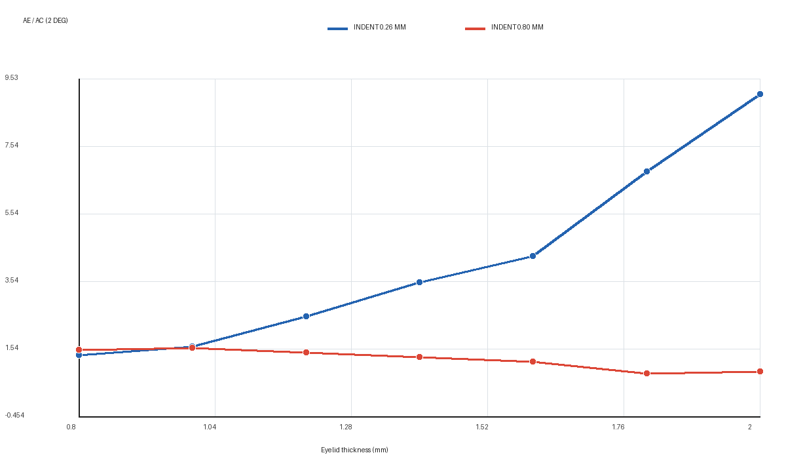
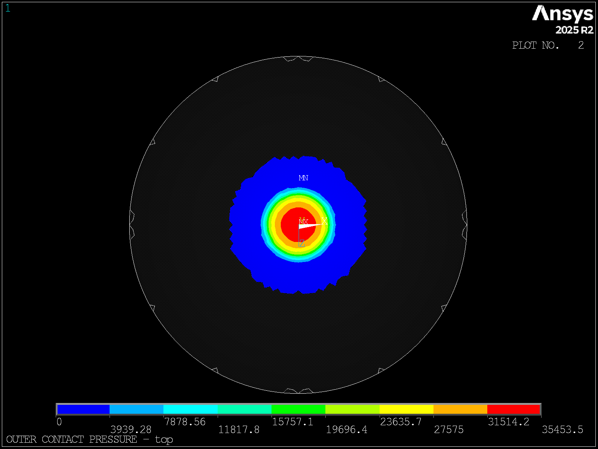
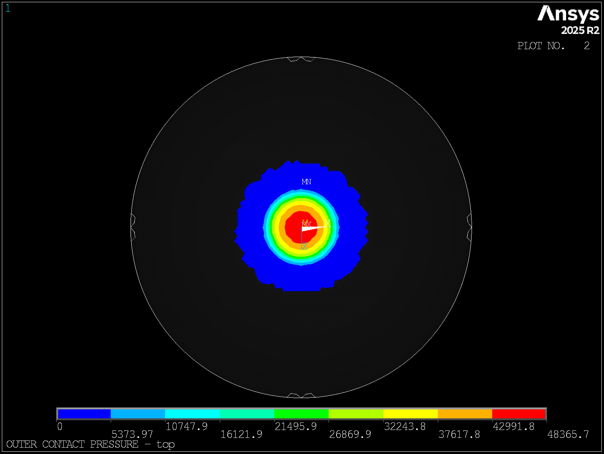
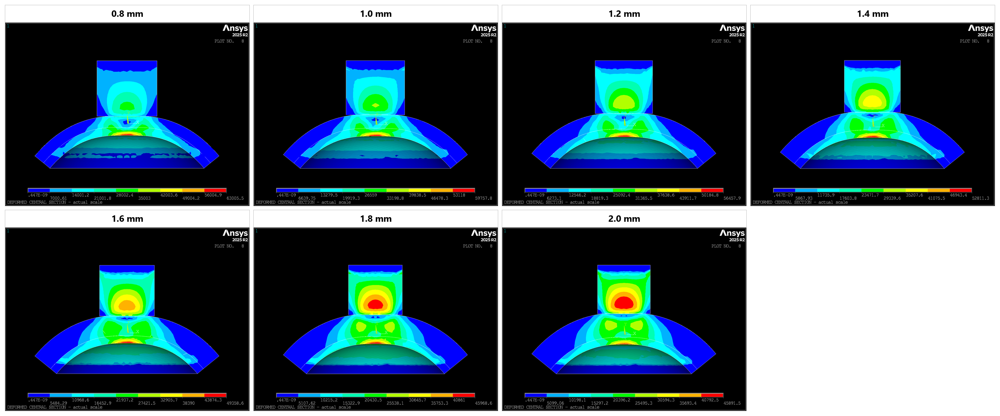
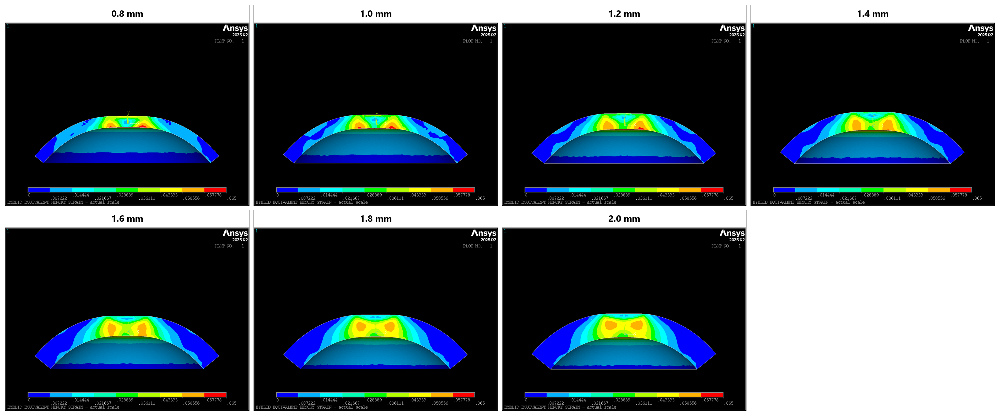
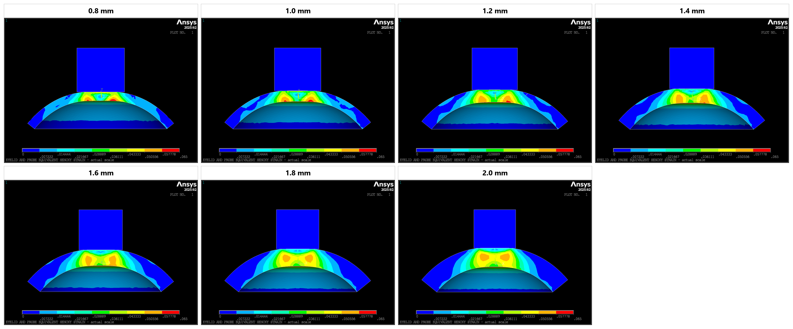

# 眼睑厚度 Ae/Ac(2°) 在 0.26 mm 推进下的补充报告

## 1. 结论摘要

在保留原 `0.80 mm` 推进结果的基础上，本次从同一批已收敛加载路径中提取 `0.26 mm` 名义推进状态。眼睑厚度仍为 `0.80-2.00 mm`、步长 `0.20 mm`，7 个状态全部通过完整性检查，63 张固定视图齐全。

主要结论如下：

- `Ae/Ac(2°)` 随眼睑厚度单调增加，从 `1.361` 增至 `9.080`，端点增幅为 `567.3%`。
- 起点并非预期的 `1.5-1.6`：0.80 mm 厚度时为 `1.361`；到 1.00 mm 厚度时为 `1.612`，进入该范围。
- 比例增加的主因是角膜内表面压平面积 `Ac(2°)` 从 `3.797` 降至 `0.765 mm²`，下降 `79.9%`；外侧接触面积 `Ae` 仅从 `5.167` 增至 `6.946 mm²`，增加 `34.4%`。
- 7 点指数描述为 `K=0.348 exp(1.626t)`，其中 `K=Ae/Ac(2°)`、`t` 为眼睑厚度 mm，原始尺度 `R²=0.993`。该式只用于描述当前扫描，在补充网格和直接加载验证前不作为产品换算公式。
- 原 `0.80 mm` 推进下的比例总体下降，而 `0.26 mm` 推进下明显上升，说明 `Ae/Ac(2°)` 同时受眼睑厚度和推进量控制，不能建立只依赖厚度的一维常态化结论。

## 2. 数据来源与状态提取

| 项目 | 设置 |
|---|---|
| 原加载路径 | 固定名义推进 `0.80 mm` 的 7 点厚度正式扫描 |
| Git 来源 | 原求解 `2ecc9546a26e66bfaf091dc01a422a71dcedcf43`；状态提取 `69b0a012457e28b85e40d890ce1961b06dc44a43` |
| 求解器 | ANSYS Mechanical APDL 2025 R2 |
| IOP | 2666.4 Pa（20 mmHg） |
| 角膜厚度 | 0.60 mm |
| 眼睑厚度 | 0.80、1.00、1.20、1.40、1.60、1.80、2.00 mm |
| 名义推进 | 0.26 mm；另含 0.05 mm 初始间隙闭合位移 |
| 网格 | 0.30 mm 主扫描网格，SOLID187 |
| 眼睑-角膜界面 | 完全 bonded |
| 结果时间 | `1+0.31/0.85=1.36470588235294` |

MAPDL 的 `SET` 命令支持按时间读取静力分析结果，并在相邻结果集间插值。本次对位移、应力、接触与界面几何统一使用该结果时间，随后重新计算 `Ae`、`Ac(1°/2°/3°)`、反力和 9 张视图。[ANSYS SET 命令说明](https://ansyshelp.ansys.com/public/Views/Secured/corp/v242/en/ans_cmd/Hlp_C_SET.html)

状态提取后，所有探头顶面节点的 `UY` 均为 `-0.310 mm`，与目标总位移一致。发布结果只保存轻量指标和图片，原 `0.80 mm` 的 `.rst` 仍是唯一主结果来源。

## 3. 七点结果

| 眼睑厚度 (mm) | 探头反力 (N) | `Ae` (mm²) | `Ac(2°)` (mm²) | `Ae/Ac(2°)` | `pmax` (kPa) | 穿透 (mm) |
|---:|---:|---:|---:|---:|---:|---:|
| 0.80 | 0.1620 | 5.167 | 3.797 | 1.361 | 40.2 | 0.0092 |
| 1.00 | 0.1905 | 4.687 | 2.907 | 1.612 | 44.7 | 0.0112 |
| 1.20 | 0.2194 | 5.818 | 2.309 | 2.520 | 48.3 | 0.0116 |
| 1.40 | 0.2463 | 6.219 | 1.763 | 3.528 | 51.5 | 0.0130 |
| 1.60 | 0.2720 | 6.482 | 1.511 | 4.290 | 54.2 | 0.0136 |
| 1.80 | 0.2961 | 6.550 | 0.962 | 6.805 | 56.0 | 0.0139 |
| 2.00 | 0.3216 | 6.946 | 0.765 | 9.080 | 57.2 | 0.0145 |

探头反力从 `0.1620 N` 增至 `0.3216 N`，增幅 `98.5%`；最大接触压力从 `40.2 kPa` 增至 `57.2 kPa`。反力、压力和比例的方向一致，未见此前独立低终点试算中的异常高反力分支。

## 4. 趋势解释

在小推进阶段，探头已经建立稳定外侧接触，但压入位移向角膜内表面的传递仍受眼睑厚度显著衰减。随着眼睑变厚：

1. 外侧接触区域总体缓慢扩展，`Ae` 变化量有限；1.00 mm 点的小幅回落属于粗网格接触边界的离散波动。
2. 眼睑内部承担更多局部形变，角膜内表面满足 `2°` 平面判据的区域持续缩小。
3. 分母 `Ac(2°)` 的下降速度远高于分子 `Ae` 的增加速度，因此面积比呈加速上升。

这一机制与原 `0.80 mm` 推进状态不同。较大推进下外侧接触已接近面积饱和，同时内侧受影响区域充分展开，`Ac(2°)` 不再按小推进阶段的方式持续缩小。因此，同一个厚度对应的面积比会随推进状态发生明显变化：

| 眼睑厚度 (mm) | 0.26 mm 推进 | 0.80 mm 推进 |
|---:|---:|---:|
| 0.80 | 1.361 | 1.523 |
| 1.00 | 1.612 | 1.579 |
| 1.20 | 2.520 | 1.450 |
| 1.40 | 3.528 | 1.317 |
| 1.60 | 4.290 | 1.174 |
| 1.80 | 6.805 | 0.829 |
| 2.00 | 9.080 | 0.881 |

工程上更合适的表达是 `K_A=K_A(t,d)`，其中 `t` 为眼睑厚度、`d` 为推进量。若最终目标是得到稳定的眼压修正值，应先固定工作推进区间，再在该区间内标定厚度响应。

## 5. 代表性视图

### 外侧接触压力

| 0.80 mm 眼睑 | 1.40 mm 眼睑 | 2.00 mm 眼睑 |
|---|---|---|
|  |  |  |

压力斑保持中心对称，没有偏心漂移或局部穿模形态。各图自动色标不同，颜色仅用于检查分布，绝对值以结果表为准。

### 实际比例中央截面（等效应力）

### 实际比例中央截面（等效对数应变）

应变云图使用 `EPEL,EQV`，数值无量纲。七个状态统一采用 `0-0.065` 色标，因而颜色可以直接横向比较。

#### 仅眼睑

#### 眼睑与探头

探头采用高刚度线弹性材料，其应变远低于眼睑，因此在统一色标下主要呈蓝色；保留探头用于确认接触位置和整体几何关系。

## 6. 质量限制与下一步

- QC 为 `0 error、5 warning`。5 个 warning 均来自 `Ac` 对 `1°-3°` 阈值的敏感性，集中在 `1.20-2.00 mm` 厚度。
- 2.00 mm 厚度处，`Ae/Ac(1°/2°/3°)` 分别为 `16.109/9.080/3.590`。方向一致，但绝对值跨度较大，说明严格平面面积受 `0.30 mm` 网格面片角度离散影响。
- 直接以 `0.26 mm` 为终点的探索性求解在厚眼睑处进入高畸变和异常稳定化分支，1.60 mm 点出现约 `79.8 N` 异常反力，因此整批探索数据已排除。本报告只采用原 `0.80 mm` 收敛加载路径中的一致状态。
- 下一轮应在 `0.8、1.4、2.0 mm` 三个代表厚度上，以相同小子步策略直接求解至 `0.26 mm`，并对接触状态与本次时间状态结果做交叉检查。
- 对 `0.20-0.40 mm` 推进区间增加 0.05 mm 步长，再配合局部 `0.15 mm` 网格验证，可判断单调上升区间是否稳定，并确定可用于标定的推进窗口。

当前结果支持“较小推进下，厚度增加使 `Ae/Ac(2°)` 上升”的工程判断，但不支持直接把指数描述作为眼压换算函数。
