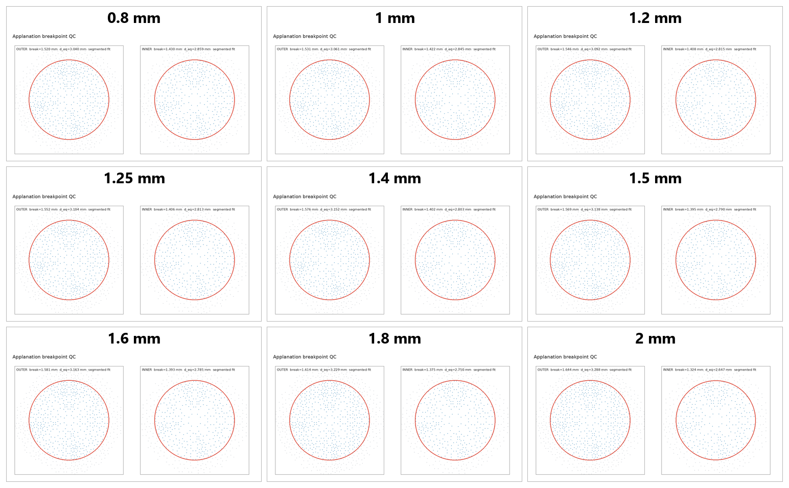

# 眼睑厚度 Ae/Ac 在 0.26 mm 推进下的补充报告

## 1. 结论摘要

本报告使用 5090d 批次 `20260721T070542Z_6a75cde2_calibration_0p26` 的同一组已收敛位移场，重新计算 9 个眼睑厚度状态的内外压平面积。模型固定 IOP `20 mmHg`、眼睑材料倍率 `1.00`、角膜材料倍率 `0.75`、角膜厚度 `0.60 mm` 和 `0.30 mm` 主网格；先建立 IOP 预应力，再保持 IOP 推进探头，从完整 `0.80 mm` 加载路径提取 `0.26 mm` 状态。

主要结论如下：

- 新口径不再用单个 `2°` 法向阈值切分压平区，而是识别中心连续近似平面段转入外侧曲面段的径向折点，并对边界内变形后三角面进行曲面积分。
- 外侧曲面积分 `Ae` 从 `7.263 mm²` 增至 `8.492 mm²`，内侧曲面积分 `Ac` 从 `6.426 mm²` 降至 `5.518 mm²`，`Ae/Ac` 从 `1.130` 增至 `1.539`，端点增幅为 `36.15%`。
- 曲面积分与沿探头轴投影的面积比最大相对差仅 `0.22%`，说明当前趋势不是投影方向造成的。
- 实际闭合接触面积只有 `5.107-6.787 mm²`，占直径 `4.32 mm` 探头名义面积 `14.657 mm²` 的 `34.8%-46.3%`。因此 `0.26 mm` 是部分接触状态，还不是 `Ae` 接近探头面积的 GAT 全压平端点。
- 旧平滑 `2°` 指标从 `1.285` 增至 `7.378`，主要由厚端内侧阈值面积缩小和粗网格跨阈值放大驱动。该数值保留追溯，但不再作为材料匹配或实验区间判断依据。
- 新口径仍给出随厚度增加而上升的正确方向，但幅度低于当前实验描述：`0.8-1.25 mm` 中只有 `1.20` 和 `1.25 mm` 相对下限 `1.5` 的偏差略小于 `20%`；`1.50 mm` 和 `2.00 mm` 明显偏低。
- 当前差异不能直接归因于材料参数或 IOP。应先通过推进距离扫描找到接触填充率接近 1、外侧压平面积接近探头名义面积的状态，再进行材料反演。

## 2. 面积定义

本报告区分三个不能互换的外侧尺度：

| 符号或字段 | 定义 | 本报告用途 |
|---|---|---|
| `outer_contact_area` | 闭合 CONTA174 单元承载面积 | 判断探头接触是否充分 |
| `Ae` / `outer_surface_area` | 外侧几何折点边界内的变形后曲面积分 | `Ae/Ac` 的正式分子 |
| `probe_area` | 直径 4.32 mm 探头的名义圆面积，`14.6574 mm²` | GAT 端点参照，不替代当前 `Ae` |

`Ac` 是内侧表面采用同一中心连续、径向折点规则得到的曲面积分。算法先用外环位移估计数值噪声，限制中心参与形变的连通区域；随后对径向高度分布进行面积加权连续分段拟合，以近似平面段转入曲面段的位置作为边界。边界穿过三角面时进行圆边界裁切，不把整块跨界面片直接计入。

沿探头轴的投影面积作为诊断量，用于检查曲率和投影选择对结果的影响。历史 `1°/2°/3°` 面积仍在 `summary.csv` 中，但不进入本报告的正式趋势结论。

## 3. 九点结果

| 眼睑厚度 (mm) | 探头反力 (N) | 闭合接触 (mm²) | 接触填充率 | `Ae` 曲面积分 (mm²) | `Ac` 曲面积分 (mm²) | `Ae/Ac` | 探头面积/`Ac` | `De` (mm) | `Dc` (mm) |
|---:|---:|---:|---:|---:|---:|---:|---:|---:|---:|
| 0.80 | 0.1460 | 5.107 | 34.8% | 7.263 | 6.426 | 1.130 | 2.281 | 3.040 | 2.859 |
| 1.00 | 0.1725 | 5.531 | 37.7% | 7.364 | 6.362 | 1.157 | 2.304 | 3.061 | 2.845 |
| 1.20 | 0.1997 | 5.690 | 38.8% | 7.509 | 6.232 | 1.205 | 2.352 | 3.092 | 2.815 |
| 1.25 | 0.2062 | 5.807 | 39.6% | 7.569 | 6.223 | 1.216 | 2.355 | 3.104 | 2.813 |
| 1.40 | 0.2257 | 6.076 | 41.5% | 7.806 | 6.181 | 1.263 | 2.371 | 3.152 | 2.803 |
| 1.50 | 0.2386 | 6.187 | 42.2% | 7.736 | 6.124 | 1.263 | 2.393 | 3.138 | 2.790 |
| 1.60 | 0.2510 | 6.035 | 41.2% | 7.857 | 6.105 | 1.287 | 2.401 | 3.163 | 2.785 |
| 1.80 | 0.2749 | 6.416 | 43.8% | 8.189 | 5.954 | 1.375 | 2.462 | 3.229 | 2.750 |
| 2.00 | 0.2969 | 6.787 | 46.3% | 8.492 | 5.518 | 1.539 | 2.656 | 3.288 | 2.647 |

`De` 和 `Dc` 分别是由 `Ae`、`Ac` 换算的等效圆直径。厚度从 `0.80 mm` 增至 `2.00 mm` 时，`De` 增加 `8.14%`，`Dc` 减少 `7.41%`。面积比增长由外侧压平区缓慢扩大和内侧压平区收缩共同形成，而不是旧口径所显示的内侧面积骤降。

## 4. GAT 端点判断

直径 `4.32 mm` 的探头选择保持不变，对应名义面积 `14.6574 mm²`。当模型状态可近似视为 GAT 全压平端点时，应同时观察到：

1. 闭合接触面积对探头名义面积的填充率接近 1；
2. 外侧几何压平面积 `Ae` 接近探头名义面积；
3. 边界质控图中的外侧折点接近探头半径 `2.16 mm`，且中心区域连续；
4. 继续推进时反力增加明显，但压平直径增长开始减缓。

当前 `0.26 mm` 状态不满足前两项：最大接触填充率只有 `46.3%`，外侧等效直径只有 `3.04-3.29 mm`，低于探头直径 `4.32 mm`。因此当前 `Ae/Ac=1.13-1.54` 应解释为推进过程中的中间状态。

`探头面积/Ac=2.281-2.656` 可用于估计“若外侧已完全覆盖探头时”的几何尺度，但它把尚未实际压平的探头区域计入分子，只能作为诊断，不能替代本次 `Ae/Ac`。

## 5. 与实验描述的比较

按目前实验描述，`0.8-1.25 mm` 的比例主要位于 `1.5-2.0`，`1.50 mm` 约为 `2.5`，`2.00 mm` 大于 `5`。与曲面积分主口径比较：

| 厚度 (mm) | 当前 `Ae/Ac` | 实验描述 | 当前判断 |
|---:|---:|---:|---|
| 0.80 | 1.130 | 1.5-2.0 | 低于下限 24.6% |
| 1.00 | 1.157 | 1.5-2.0 | 低于下限 22.8% |
| 1.20 | 1.205 | 1.5-2.0 | 低于下限 19.7% |
| 1.25 | 1.216 | 1.5-2.0 | 低于下限 18.9% |
| 1.50 | 1.263 | 约 2.5 | 低约 49.5% |
| 2.00 | 1.539 | 5 以上 | 相对 5 低约 69.2% |

这组结果不支持继续沿用旧 `2°` 指标下“薄端大部分通过、厚端进入目标范围”的结论。当前模型已复现厚度增加时比例上升的方向，但没有复现实验幅度。

材料和 IOP 会改变曲线位置与斜率，但现在更大的不确定性是比较状态不一致：实验拐点接近全探头压平，而仿真 `0.26 mm` 仍为部分接触。在确认对应推进端点前继续调整材料，可能用材料误差补偿加载状态误差。

## 6. 当前数据的 95% CI

以下为 9 个设计厚度点均值的 t 区间，只描述本次参数扫描点的离散程度，不代表重复实验、人群分布、材料参数不确定性或模型误差。

| 指标 | 均值 | 95% CI |
|---|---:|---:|
| 探头反力 (N) | 0.2235 | [0.1865, 0.2604] |
| 闭合接触面积 (mm²) | 5.9596 | [5.5781, 6.3410] |
| 接触填充率 | 0.4066 | [0.3806, 0.4326] |
| 外侧曲面积分 `Ae` (mm²) | 7.7540 | [7.4519, 8.0560] |
| 内侧曲面积分 `Ac` (mm²) | 6.1251 | [5.9202, 6.3300] |
| 曲面积分 `Ae/Ac` | 1.2707 | [1.1754, 1.3660] |
| 探头名义面积/`Ac` | 2.3973 | [2.3123, 2.4823] |
| 最大接触压力 (kPa) | 46.95 | [42.13, 51.76] |
| 最大平均穿透 (mm) | 0.01170 | [0.01026, 0.01315] |

## 7. 代表性视图

### 外侧接触压力

| 0.80 mm 眼睑 | 1.40 mm 眼睑 | 2.00 mm 眼睑 |
|---|---|---|
|  |  |  |

### 实际比例变形中央截面

| 0.80 mm 眼睑 | 1.40 mm 眼睑 | 2.00 mm 眼睑 |
|---|---|---|
|  |  |  |

不同工况使用独立自动色标，颜色不能跨图直接定量比较；绝对值以 `summary.csv` 为准。每个厚度目录包含 9 张固定视图和 1 张 `applanation_boundary_qc.png`。

## 8. 质量限制

- 9/9 状态完成，MAPDL 提取无失败；汇总 QC 为 `0 error、36 warning、1 info`。
- warning 主要来自拟合窗口尺度敏感、几何折点与闭合接触边界不一致，以及历史角度阈值敏感。它们不表示求解未收敛，但说明面积边界仍受 `0.30 mm` 网格约束。
- 外侧面积尺度敏感度为 `6.2%-12.2%`，内侧为 `15.8%-24.3%`；厚端内侧边界仍是主要不确定来源。
- 三个 `0.15 mm` 全局细网格算例未形成可用结果，因此当前适合说明趋势和端点不足，不能宣称已完成网格独立性验证。
- 眼睑—角膜保持完全 bonded，未考虑滑移和黏弹性；这些假设在后续端点与局部网格确认后再评估。

## 9. 工程结论与下一步

当前最稳健的汇报表述是：在 `20 mmHg` IOP 和 `0.26 mm` 推进下，厚度增加会使探头反力、接触压力和曲面积分 `Ae/Ac` 总体上升；新面积口径消除了旧 `2°` 判据在厚端产生的异常放大，但当前状态仅覆盖探头面积的约三分之一至二分之一，尚未达到 GAT 全压平端点。

下一轮应保持本组材料和 IOP，先对代表厚度 `0.80、1.25、1.50、2.00 mm` 执行推进距离扫描，以 `0.05-0.10 mm` 间隔搜索接触填充率接近 1 且外侧等效直径接近 `4.32 mm` 的状态。端点确定后，再用统一端点下的 `Ae/Ac` 比较实验区间并决定是否调整材料参数。局部网格只需在接触区和角膜内表面细化至 `0.15-0.20 mm`，其余区域保持 `0.30 mm`。
