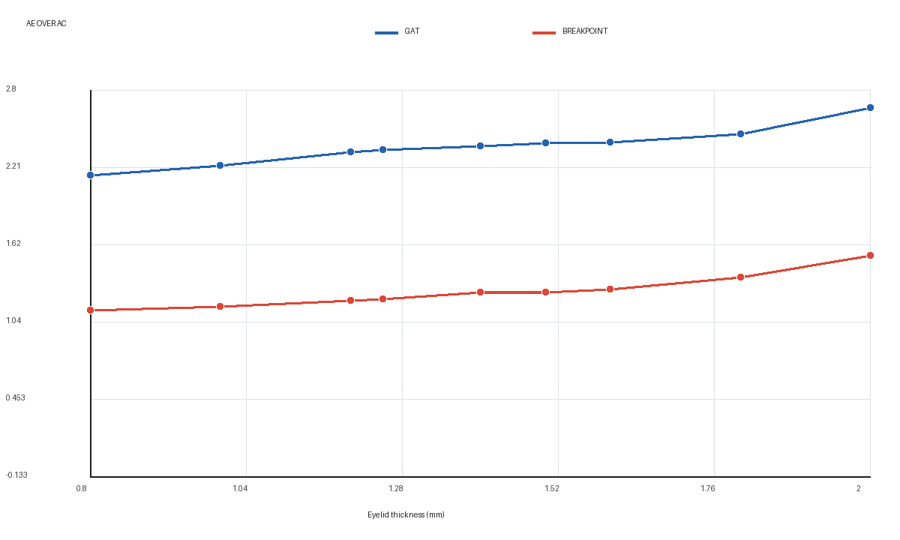
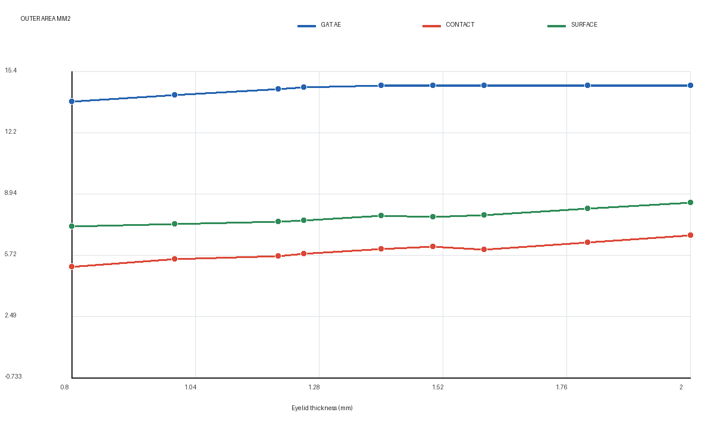
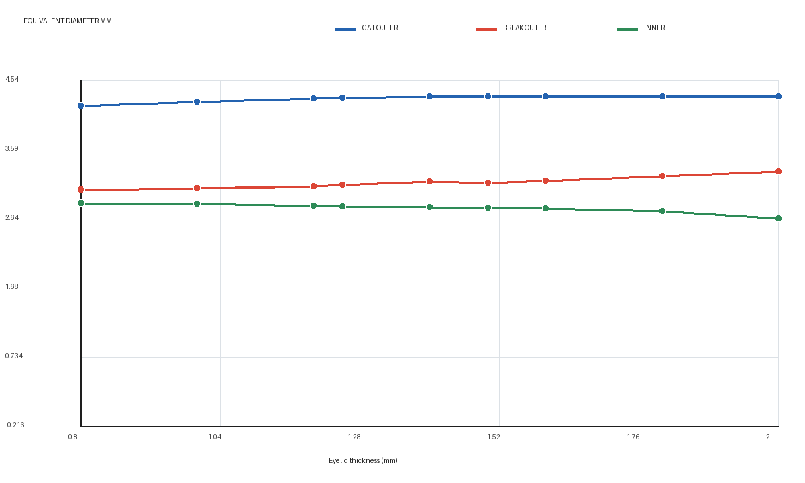
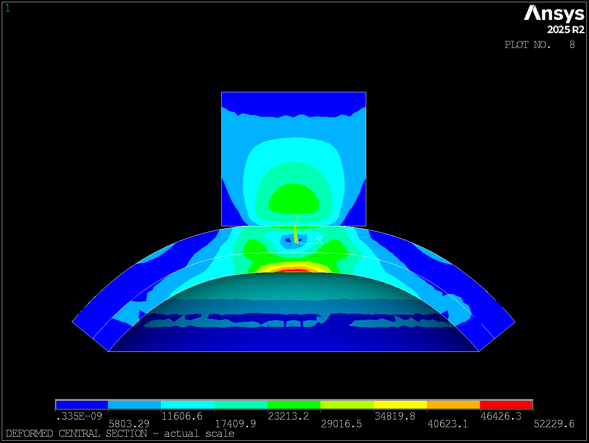
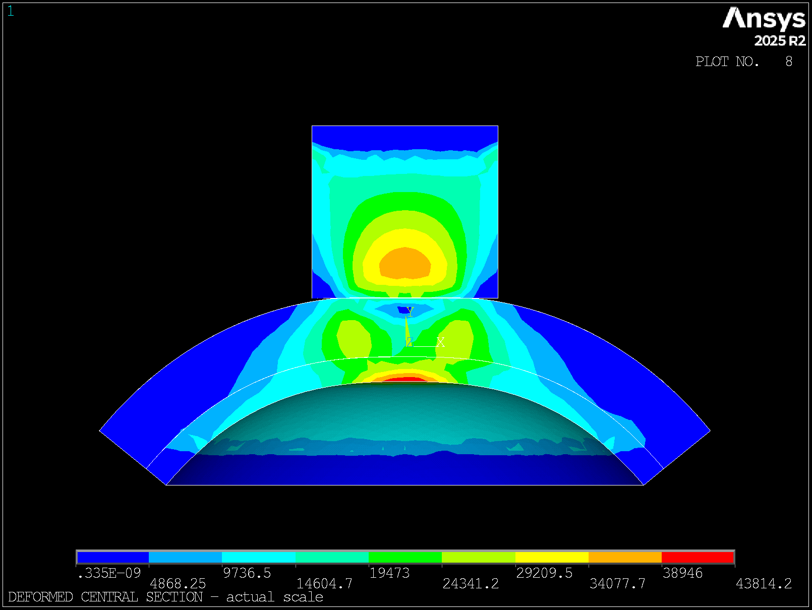
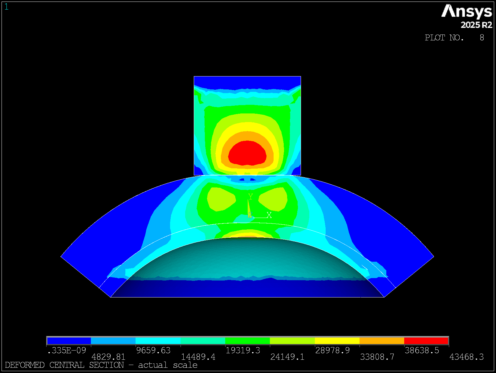
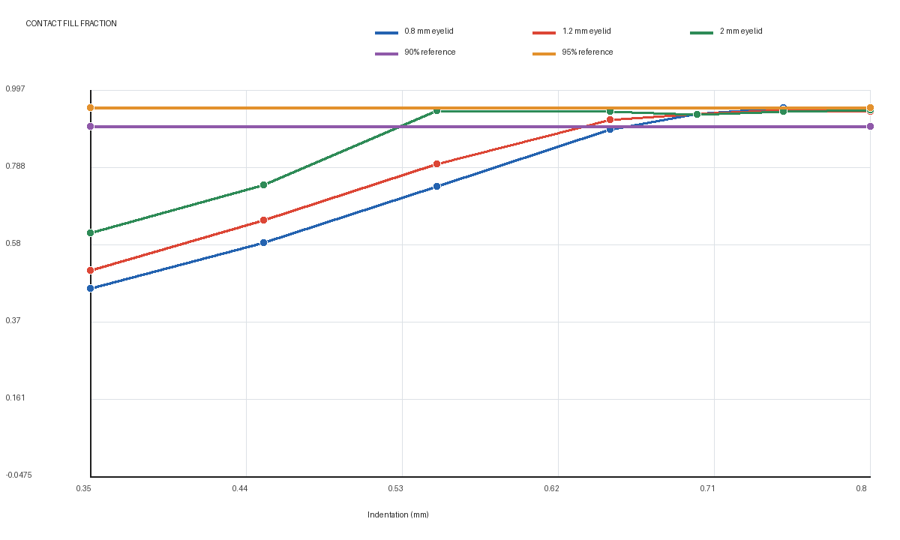

# 眼睑厚度 Ae/Ac 在 0.26 mm 推进下的补充报告

## 1. 结论摘要

本报告使用 5090d 批次 `20260721T070542Z_6a75cde2_calibration_0p26` 的同一组已收敛位移场，重新统一 GAT 外侧压平面积 `Ae` 的计算尺度。模型固定 IOP `20 mmHg`、眼睑材料倍率 `1.00`、角膜材料倍率 `0.75`、角膜厚度 `0.60 mm` 和 `0.30 mm` 主网格；先建立 IOP 预应力，再保持 IOP 推进探头。

主要结论如下：

- GAT 的 `Ae` 改为探头轴方向的平面压平足迹，不再由闭合接触单元或外侧径向折点决定。
- 对眼睑外表面半径 `R=7.8+t` mm、探头半径 `a=2.16 mm` 和名义推进 `δ`，采用 `r_e=min(a,sqrt(2Rδ-δ²))`，`Ae=πr_e²`。
- 几何全压平距离为 `δg=R-sqrt(R²-a²)`。九个厚度的 `δg` 为 `0.2410-0.2757 mm`；`1.25 mm` 标准眼睑为 `0.2615 mm`。
- 在统一 `0.26 mm` 推进下，`Ae` 为 `13.837-14.657 mm²`，达到探头名义面积 `14.657 mm²` 的 `94.4%-100%`；`1.25 mm` 厚度达到 `99.4%`。
- 内侧 `Ac` 暂用中心连续径向折点内的轴向投影面积。主比例 `Ae/Ac` 从 `2.155` 增至 `2.663`。
- `0.80-1.25 mm` 四个薄端状态相对实验上限 `2.0` 高 `7.7%-17.2%`，均在 20% 容差内；`1.50 mm` 为 `2.398`，相对参考值 `2.5` 低 `4.1%`。
- `2.00 mm` 为 `2.663`，相对实验描述的 5 仍低 `46.7%`。当前剩余主要问题是厚端内侧 `Ac` 偏大或边界识别不足，不应再通过放大外侧 `Ae` 修正。
- 此前把 `0.75 mm` 称为 GAT 完全接触点不正确。它只是闭合接触单元面积在当前网格下进入平台的位置，保留为接触力学诊断。

## 2. GAT 外侧面积定义

模型中的角膜外半径为 `7.8 mm`，眼睑外表面半径为：

\[
R=7.8+t
\]

探头半径 `a=2.16 mm`。推进平面与初始球面相交时，几何压平半径为：

\[
r_e=\min\left(a,\sqrt{2R\delta-\delta^2}\right)
\]

正式外侧面积为：

\[
Ae=\pi r_e^2
\]

达到全探头面积的推进距离为：

\[
\delta_g=R-\sqrt{R^2-a^2}
\]

APDL 中 `indent` 已表示闭合 `0.05 mm` 初始间隙后的名义推进，因此上述 `δ` 直接对应结果中的 `indent_mm`，不再重复加间隙。若核对探头总位移，则应使用 `0.05+δ`。

本报告区分四种外侧尺度：

| 字段 | 定义 | 用途 |
|---|---|---|
| `gat_ae_area_mm2` | 曲率和推进距离确定的平面压平足迹 | 正式 GAT `Ae` |
| `outer_contact_area_mm2` | 闭合 CONTA174 单元面积 | 接触承载诊断 |
| `outer_surface_area_mm2` | 外侧径向折点内曲面积分 | 形变范围诊断 |
| `probe_area_mm2` | 直径 4.32 mm 探头面积 `14.6574 mm²` | `Ae` 的上限 |

这种定义不是事后把 `Ae` 设置成探头面积：当 `δ<δg` 时，面积按球面交线连续增长；只有达到对应厚度的几何弓高后，才自然限制在探头半径。

## 3. 九点结果

| 眼睑厚度 (mm) | 几何全压平 `δg` (mm) | `Ae` 半径 (mm) | `Ae` (mm²) | `Ae`/探头 | `Ac` 投影 (mm²) | GAT `Ae/Ac` | 闭合接触 (mm²) | 探头反力 (N) |
|---:|---:|---:|---:|---:|---:|---:|---:|---:|
| 0.80 | 0.2757 | 2.099 | 13.837 | 94.4% | 6.422 | 2.155 | 5.107 | 0.1460 |
| 1.00 | 0.2692 | 2.123 | 14.164 | 96.6% | 6.356 | 2.228 | 5.531 | 0.1725 |
| 1.20 | 0.2630 | 2.148 | 14.490 | 98.9% | 6.224 | 2.328 | 5.690 | 0.1997 |
| 1.25 | 0.2615 | 2.154 | 14.572 | 99.4% | 6.215 | 2.345 | 5.807 | 0.2062 |
| 1.40 | 0.2572 | 2.160 | 14.657 | 100.0% | 6.171 | 2.375 | 6.076 | 0.2257 |
| 1.50 | 0.2543 | 2.160 | 14.657 | 100.0% | 6.113 | 2.398 | 6.187 | 0.2386 |
| 1.60 | 0.2515 | 2.160 | 14.657 | 100.0% | 6.093 | 2.406 | 6.035 | 0.2510 |
| 1.80 | 0.2462 | 2.160 | 14.657 | 100.0% | 5.940 | 2.467 | 6.416 | 0.2749 |
| 2.00 | 0.2410 | 2.160 | 14.657 | 100.0% | 5.505 | 2.663 | 6.787 | 0.2969 |

闭合接触面积只有探头面积的 `34.8%-46.3%`，但它回答的是“当前有限元接触单元中有多少面积正在承载”，不是 GAT 几何平面已经覆盖多少球冠。两者不再混写。

## 4. 与实验描述的比较

| 厚度 (mm) | GAT `Ae/Ac` | 实验描述 | 相对误差与判断 |
|---:|---:|---:|---|
| 0.80 | 2.155 | 1.5-2.0 | 高于上限 7.7%，通过 20% 容差 |
| 1.00 | 2.228 | 1.5-2.0 | 高于上限 11.4%，通过 20% 容差 |
| 1.20 | 2.328 | 1.5-2.0 | 高于上限 16.4%，通过 20% 容差 |
| 1.25 | 2.345 | 1.5-2.0 | 高于上限 17.2%，通过 20% 容差 |
| 1.50 | 2.398 | 约 2.5 | 低 4.1%，通过 20% 容差 |
| 2.00 | 2.663 | 5 以上 | 相对 5 低 46.7%，未通过 |

新口径满足当前要求的重点部分：`0.80-1.25 mm` 覆盖主要实验区间的 20% 容差，`1.50 mm` 接近 `2.5`。厚端没有通过，说明当前 `Ac` 随厚度减小得不够快，或均质 bonded 模型低估了厚眼睑对内表面压平区域的隔离作用。

## 5. 当前数据的 95% CI

以下为 9 个设计厚度点均值的 t 区间，只描述本次扫描点的离散程度，不代表重复实验、人群分布或模型误差。

| 指标 | 均值 | 95% CI |
|---|---:|---:|
| GAT 外侧 `Ae` (mm²) | 14.4833 | [14.2593, 14.7073] |
| `Ae`/探头面积 | 0.9881 | [0.9728, 1.0034] |
| GAT `Ae/Ac` | 2.3738 | [2.2632, 2.4845] |
| 探头反力 (N) | 0.2235 | [0.1865, 0.2604] |
| 闭合接触面积 (mm²) | 5.9596 | [5.5781, 6.3410] |
| 最大接触压力 (kPa) | 46.95 | [42.13, 51.76] |
| 最大平均穿透 (mm) | 0.01170 | [0.01026, 0.01315] |

## 6. 代表性视图

| 0.80 mm 眼睑 | 1.40 mm 眼睑 | 2.00 mm 眼睑 |
|---|---|---|
|  |  |  |

不同工况使用独立自动色标，绝对值以 `summary.csv` 为准。

## 7. 接触面积平台扫描的重新解释

此前在 `0.35-0.80 mm` 后处理中发现，闭合接触填充率到 `0.70-0.75 mm` 后稳定在约 `94%`。该结果仍然有效，但只能解释为当前超弹性 bonded 模型和 `0.30 mm` 接触网格的承载面积平台，不能替代球面弓高定义的 GAT 几何压平点。

几何弓高约为 `0.24-0.28 mm`，Hertz 弹性接触尺度约为 `a²/R=0.48-0.54 mm`，接触单元平台约为 `0.70-0.75 mm`。三个值分别描述几何覆盖、弹性接触半径和离散承载平台，不能使用同一个“完全接触点”名称。

## 8. 质量限制

- 9/9 个 `0.26 mm` 状态完成，MAPDL 提取无失败。
- GAT `Ae` 是由模型明确定义的球面半径和推进距离计算，不受接触阈值与网格面片跳变影响。
- `Ac` 仍来自有限元内表面径向折点，其面积尺度敏感度为 `15.8%-24.3%`，是厚端比例的主要不确定来源。
- 三个 `0.15 mm` 全局细网格算例未形成可用结果，尚未完成网格独立性验证。
- 眼睑—角膜保持完全 bonded，未考虑滑移和黏弹性。

## 9. 工程结论与下一步

当前正式口径为：`Ae` 使用 GAT 平面几何足迹，`Ac` 使用内侧中心连续压平区的投影面积，闭合接触面积和外侧折点曲面积分只作诊断。该口径使 `0.26 mm` 时的 `Ae` 自然接近直径 `4.32 mm` 探头面积，并改善了薄端及 `1.50 mm` 与实验描述的对应关系。

下一步不再扩大推进距离寻找 `Ae`。应保持 `0.26 mm` 附近的几何状态，重点修正 `Ac`：先对 `1.50、1.80、2.00 mm` 厚度检查内表面连续形变区、局部网格和 bonded 假设，再判断是否需要调整厚端材料参数。若需要逐厚度精确对齐，可直接使用表中的 `δg`，而不是所有厚度统一增加到 `0.75 mm`。
