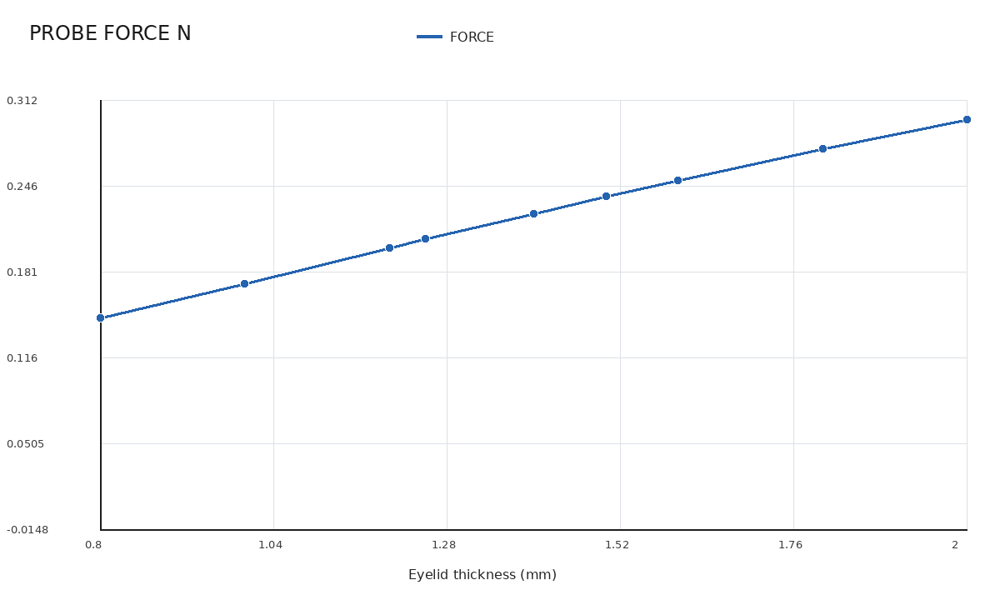

# 眼睑厚度 Ae/Ac(2°) 在 0.26 mm 推进下的补充报告

## 1. 结论摘要

本报告已同步 5090d 校准批次 `20260721T070542Z_6a75cde2_calibration_0p26` 中当前可用的 `0.30 mm` 网格结果。批次固定 IOP 为 `20 mmHg`，眼睑材料保持原倍率 `1.00`，角膜 Mooney-Rivlin 参数统一缩放为原值的 `0.75`。最终 9 个厚度状态全部完成求解和 `0.26 mm` 状态提取，QC 为 `0 error、7 warning`。

主结论如下：

- 一环节点法向平滑后的 `Ae/Ac(2°)` 随眼睑厚度单调增加，从 `1.285` 增至 `7.378`。
- 在重点厚度 `0.80、1.00、1.20、1.25 mm` 中，3 个点相对实验区间 `1.5-2.0` 的误差不超过 20%，四点平均区间误差为 `12.9%`，满足本轮宽松接受条件。
- `1.50 mm` 结果为 `3.583`，相对实验参考值 `2.5` 偏高 `43.3%`，表明 `1.25-1.50 mm` 区间的增长仍然过快。
- `2.00 mm` 结果为 `7.378`，处于实验描述的 `5-9` 范围内。
- 探头反力从 `0.1460 N` 单调增至 `0.2969 N`，最大接触压力从 `35.3 kPa` 增至 `54.7 kPa`，没有发现反力或压力方向异常。
- `0.15 mm` 全局细网格验证没有得到可用结果，因此当前数据可用于阶段性趋势汇报，不能作为已经完成网格独立性验证的最终标定曲线。

## 2. 数据来源与口径

| 项目 | 设置 |
|---|---|
| 远程运行目录 | `/home/xuanyu/PROJECT/ziyu/blueknow-data/thickness_calibration/20260721T070542Z_6a75cde2_calibration_0p26` |
| Git 来源 | `6a75cde2c7e953c2210c17e21caf279eade4291d` |
| 求解器 | ANSYS Mechanical APDL 2025 R2 |
| IOP | 2666.4 Pa（20 mmHg） |
| 角膜厚度 | 0.60 mm |
| 眼睑厚度 | 0.80、1.00、1.20、1.25、1.40、1.50、1.60、1.80、2.00 mm |
| 名义推进 | 0.26 mm；另含 0.05 mm 初始间隙闭合位移 |
| 主网格 | 0.30 mm，SOLID187 |
| 眼睑材料倍率 | 1.00 |
| 角膜材料倍率 | 0.75 |
| 眼睑-角膜界面 | 完全 bonded |
| 加载路径 | 先建立 IOP 预应力，再保持 IOP 推进探头至 0.80 mm；从同一加载路径提取 0.26 mm 状态 |

报告同时保留两种面积口径：

- `Ae/Ac raw`：直接以离散三角面法向判断是否进入 2°区域，用于保留原始可追溯值。
- `Ae/Ac smooth`：对节点法向做一环平滑后判断 2°区域，用于本轮材料筛选和主结论，降低单个粗网格面片跨越阈值造成的跳变。

平滑只改变面积识别，不改变有限元位移场、接触压力或探头反力。完整 9 点轻量结果和每点 9 张视图保存在上述远程运行目录；本地报告在不新增文件的前提下覆盖了原有 7 个厚度目录中的对应视图。

## 3. 九点结果

| 眼睑厚度 (mm) | 探头反力 (N) | `Ae` (mm²) | 平滑 `Ac(2°)` (mm²) | `Ae/Ac raw` | `Ae/Ac smooth` | `pmax` (kPa) | 穿透 (mm) |
|---:|---:|---:|---:|---:|---:|---:|---:|
| 0.80 | 0.1460 | 5.107 | 3.973 | 1.255 | 1.285 | 35.3 | 0.0080 |
| 1.00 | 0.1725 | 5.531 | 3.032 | 1.782 | 1.824 | 40.3 | 0.0103 |
| 1.20 | 0.1997 | 5.690 | 2.524 | 2.212 | 2.254 | 44.7 | 0.0106 |
| 1.25 | 0.2062 | 5.807 | 2.330 | 2.490 | 2.492 | 45.6 | 0.0110 |
| 1.40 | 0.2257 | 6.076 | 1.989 | 2.958 | 3.055 | 47.9 | 0.0122 |
| 1.50 | 0.2386 | 6.187 | 1.727 | 3.619 | 3.583 | 49.6 | 0.0124 |
| 1.60 | 0.2510 | 6.035 | 1.621 | 3.723 | 3.723 | 51.0 | 0.0130 |
| 1.80 | 0.2749 | 6.416 | 1.259 | 5.409 | 5.097 | 53.5 | 0.0135 |
| 2.00 | 0.2969 | 6.787 | 0.920 | 8.255 | 7.378 | 54.7 | 0.0141 |

面积比增加主要由内表面压平面积缩小造成。厚度从 `0.80 mm` 增至 `2.00 mm` 时，外侧面积 `Ae` 增加约 `32.9%`，平滑内侧面积从 `3.973 mm²` 降至 `0.920 mm²`，下降约 `76.8%`。因此，厚度影响主要体现在推进位移向角膜内表面的传递衰减，而不是外侧接触面积异常扩张。

## 4. 实验区间符合度

| 厚度 (mm) | 平滑比例 | 实验参考 | 区间误差 | 判断 |
|---:|---:|---:|---:|---|
| 0.80 | 1.285 | 1.5-2.0 | 低于下限 14.3% | 通过 20% 容差 |
| 1.00 | 1.824 | 1.5-2.0 | 0 | 通过 |
| 1.20 | 2.254 | 1.5-2.0 | 高于上限 12.7% | 通过 20% 容差 |
| 1.25 | 2.492 | 1.5-2.0 | 高于上限 24.6% | 未通过 |
| 1.50 | 3.583 | 约 2.5 | 相对参考值高 43.3% | 仍需修正 |
| 2.00 | 7.378 | 5-9 | 0 | 符合定性范围 |

这组参数已经将原 `2.00 mm` 工况的 `9.080` 降至 `7.378`，并使重点薄眼睑区间达到 3/4 点通过，但没有解决 `1.50 mm` 附近的斜率偏大问题。因此适合表述为“获得一组合理的阶段性参数”，不宜表述为“全厚度范围完成标定”。

## 5. 当前数据的 95% CI

以下区间使用 9 个设计厚度点计算均值的 t 区间，只描述本次扫描点的离散程度，不代表重复实验、人群分布或模型误差。

| 指标 | 均值 | 95% CI |
|---|---:|---:|
| 探头反力 (N) | 0.2235 | [0.1865, 0.2604] |
| 外侧面积 `Ae` (mm²) | 5.9596 | [5.5781, 6.3410] |
| 平滑内侧面积 `Ac(2°)` (mm²) | 2.1527 | [1.4303, 2.8751] |
| 平滑 `Ae/Ac(2°)` | 3.4102 | [1.9709, 4.8496] |
| 最大接触压力 (kPa) | 46.95 | [42.13, 51.76] |
| 最大平均穿透 (mm) | 0.01170 | [0.01026, 0.01315] |

## 6. 代表性视图

### 外侧接触压力

| 0.80 mm 眼睑 | 1.40 mm 眼睑 | 2.00 mm 眼睑 |
|---|---|---|
|  |  |  |

三组图已覆盖为本次校准参数结果。压力斑保持中心对称；各图采用独立自动色标，颜色不能跨图直接比较，绝对值以主表为准。

### 实际比例中央截面

| 0.80 mm 眼睑 | 1.40 mm 眼睑 | 2.00 mm 眼睑 |
|---|---|---|
|  |  |  |

## 7. 质量限制

- `0.30 mm` 最终扫描 9/9 完成，状态提取 9/9 完成，每个状态在远程目录中均有 9 张视图。
- QC 的 7 个 warning 均为内表面面积角度阈值敏感，从 `1.20 mm` 开始，`1°-3°` 面积跨度相当于 2°面积的 `107.3%-184.3%`。
- 平滑口径与原始口径在 `0.80-1.60 mm` 范围差异较小；到 `1.80-2.00 mm` 时差异增大。`2.00 mm` 平滑区域仅包含 32 个面，厚端绝对比例仍有较强网格依赖。
- 三个 `0.15 mm` 全局细网格验证算例均未形成可用结果：`0.80、1.20 mm` 超时，`2.00 mm` 求解报错。该阶段产生的 52-102 GB 临时求解文件已按存储策略清理。
- 细网格阶段无完整源结果后，控制器仍继续索引缺失数据并触发 `KeyError: 0.8`，因此没有发布预期的最终状态 JSON。该错误不影响此前已经落盘并通过 QC 的 `0.30 mm` 九点结果，但说明整个自动流程并非正常完成。

## 8. 工程结论

当前最合理的使用方式是：以 `0.30 mm` 结果说明厚度增加会使探头反力、峰值压力和 `Ae/Ac(2°)` 总体增加；以 `0.80-1.25 mm` 的 3/4 点通过和 `2.00 mm` 落入定性范围作为阶段性拟合证据；同时明确 `1.50 mm` 高估和厚端面积判据敏感尚未解决。

下一轮不应继续使用全局 `0.15 mm` 网格。应在接触区和角膜内表面局部采用 `0.15-0.20 mm` 网格，其余区域保持 `0.30 mm`，优先复核 `0.8、1.25、1.5、2.0 mm` 四个厚度。只有局部网格结果稳定且 `1.50 mm` 偏差降低后，才适合发布连续厚度修正函数。
