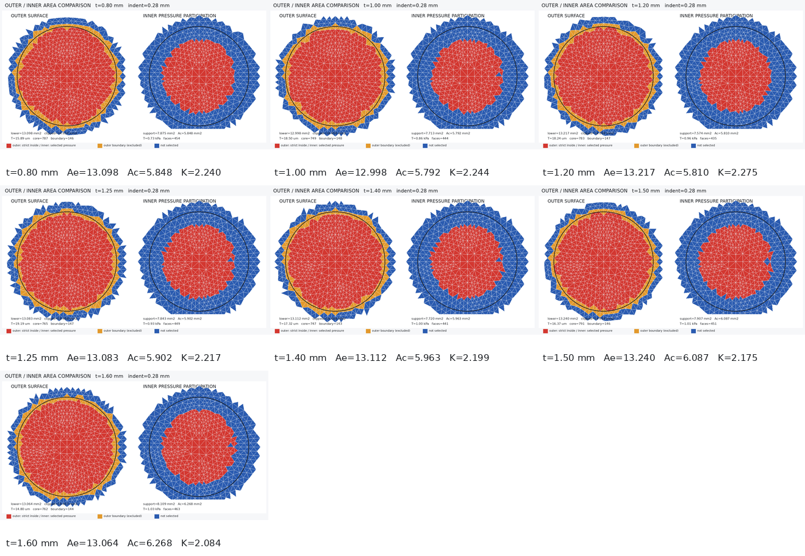
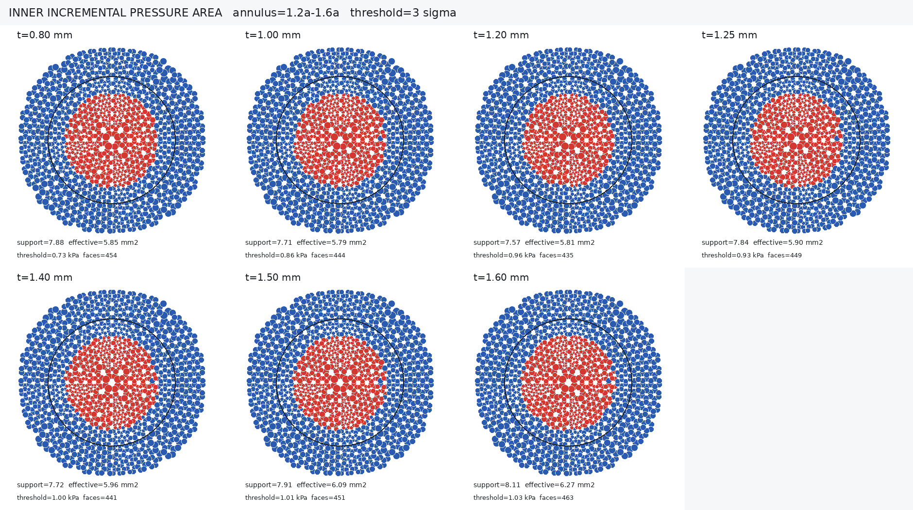
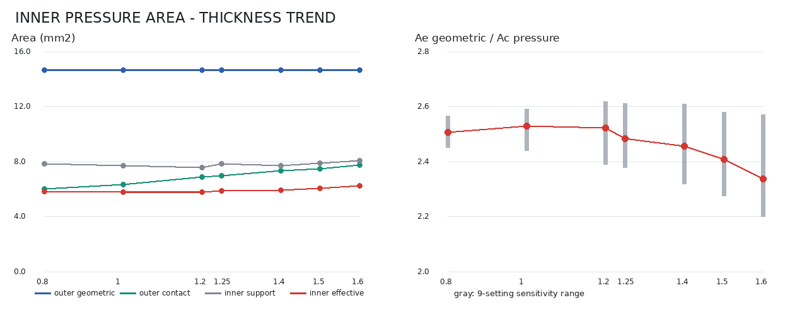

# 眼睑厚度在 0.28 mm 推进下的 Ae/Ac 补充报告

> 状态：当前面积口径已经完成方法重构，但仍为 `candidate_not_approved`。本报告只汇总已收敛且面数据完整的七个 `0.28 mm` 状态，不沿用旧 `0.26 mm` 报告中的球面相交面积。

## 1. 工况与数据范围

结果来自 5090d 批次 `20260723T114358Z_973a834a_formal_0p28`。模型先建立 IOP 预应力，再保持 IOP 推进探头。

| 项目 | 设置 |
|---|---|
| 名义推进 / 总探头位移 | `0.28 mm / 0.33 mm`，总位移包含 `0.05 mm` 初始间隙 |
| 探头直径 | `4.32 mm` |
| IOP | `20 mmHg` |
| 眼睑 / 角膜材料倍率 | `1.00 / 0.75` |
| 角膜厚度 | `0.60 mm` |
| 主网格 | `0.30 mm` |
| 界面 | 眼睑—角膜完全 bonded |

有效厚度为 `0.80、1.00、1.20、1.25、1.40、1.50、1.60 mm`。`1.80 mm` 和 `2.00 mm` 求解超时，未使用不完整面数据，也未用 `0.26 mm` 数值补齐。

## 2. 两种面积口径

### 外侧面积 Ae

外侧先根据预载到最终状态的向下位移，使用远场中位数和 MAD 噪声建立门槛

$$
T_d=\max(3\sigma_d,1\ \mu\mathrm m),
$$

并保留中央边连通位移参与区。只对三个最终投影顶点全部位于半径 `2.16 mm` 探头圆内的完整三角面片积分：

$$
A_e^L=\sum_{i\in\mathcal C_e^L}A_{i,\perp}.
$$

跨越圆边界的面片作为黄色不确定带排除。因此 $A_e^L$ 是对粗网格更稳妥的下界，而不是把所有红色位移区裁成完整探头面积。

### 内侧面积 Ac

内侧使用 bonded 界面的法向压力增量

$$
\Delta p_i=p_i^{(1)}-p_i^{(0)}
$$

扣除 `1.2a-1.6a` 外环背景，并保留超过 `3σ` 的中央连通区域。令 $q_i=\Delta p_i-b_p$，有效压力参与面积为

$$
A_c^P=
\frac{\left(\sum q_iA_i\right)^2}
{\sum q_i^2A_i}.
$$

它使用真实曲面面积；均匀压力时接近支撑面积，压力集中时小于支撑面积。内侧不用探头圆强制截断，避免把 bonded 引起的整体随动误判成完整内侧压平区。

完整定义、废弃方法和验收约束见[眼睑厚度 Ae/Ac 计算与校准](../../docs/THICKNESS_CALIBRATION.md)。

## 3. 七点结果

| 眼睑厚度 | 外侧 $A_e^L$ | 内侧支撑面积 | 内侧 $A_c^P$ | $A_e^L/A_c^P$ | 状态 |
|---:|---:|---:|---:|---:|---|
| `0.80 mm` | `13.098 mm²` | `7.875 mm²` | `5.848 mm²` | `2.240` | 候选 |
| `1.00 mm` | `12.998 mm²` | `7.713 mm²` | `5.792 mm²` | `2.244` | 候选 |
| `1.20 mm` | `13.217 mm²` | `7.574 mm²` | `5.810 mm²` | `2.275` | 候选 |
| `1.25 mm` | `13.083 mm²` | `7.843 mm²` | `5.902 mm²` | `2.217` | 候选 |
| `1.40 mm` | `13.112 mm²` | `7.720 mm²` | `5.963 mm²` | `2.199` | 候选 |
| `1.50 mm` | `13.240 mm²` | `7.907 mm²` | `6.087 mm²` | `2.175` | 候选 |
| `1.60 mm` | `13.064 mm²` | `8.109 mm²` | `6.268 mm²` | `2.084` | 候选 |

七点描述性统计如下。这里的 95% CI 是设计厚度点之间的 t 区间，不表示重复实验、人群分布或模型不确定度。

| 指标 | 均值 | 95% CI |
|---|---:|---:|
| $A_e^L$ | `13.116 mm²` | `[13.037, 13.195] mm²` |
| $A_c^P$ | `5.953 mm²` | `[5.794, 6.112] mm²` |
| $A_e^L/A_c^P$ | `2.205` | `[2.147, 2.262]` |

外侧面积基本稳定，内侧有效压力面积总体增大，因此比例由约 `2.24` 降至 `2.08`。`0.80-1.25 mm` 的结果相对实验目标区间 `1.5-2.0` 的上界高 `10.9%-13.8%`，在 `20%` 容差内；`1.50 mm` 结果相对目标约 `2.5` 低 `13.0%`。但厚度趋势方向仍不符合预期，不能只根据点误差接受当前材料参数。

## 4. 结果图

外侧图中红色面片计入 $A_e^L$，黄色面片跨越探头边界且被排除，蓝色面片不计入。

内侧图中红色区域是增量压力超过门槛的中央连通支撑区，图内同时标注支撑面积和有效压力参与面积。

## 5. 使用限制

- 探头圆面积 `14.6574 mm²` 只作为外侧几何上限，不能直接写成 $A_e$。
- 外侧闭合接触面积只用于接触 QC，不是 $A_e$。
- `0.5°/1°/2°/3°` 区域只表示近水平核心，不是正式 $A_e$ 或 $A_c$。
- 当前主网格为 `0.30 mm`，外侧边界不确定带仍为 `1.418-1.660 mm²`，需要细网格验证。
- 当前趋势表明内侧 $A_c^P$ 随厚度增大；下一轮应通过材料和 IOP 灵敏度检查其来源，不能通过调阈值强制反转趋势。
- `2.00 mm` 厚度尚无可用的 `0.28 mm` 结果，不能外推到实验中的高比例区间。

当前结果适合用于汇报计算口径、展示有限元分布和规划下一轮校准，不适合宣称已得到最终常态化厚度关系。
