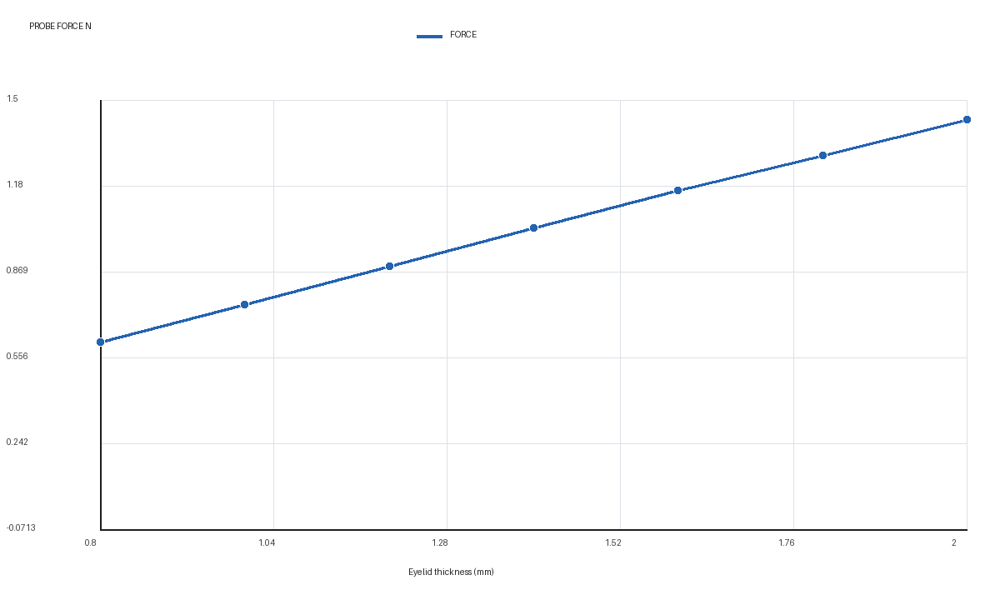
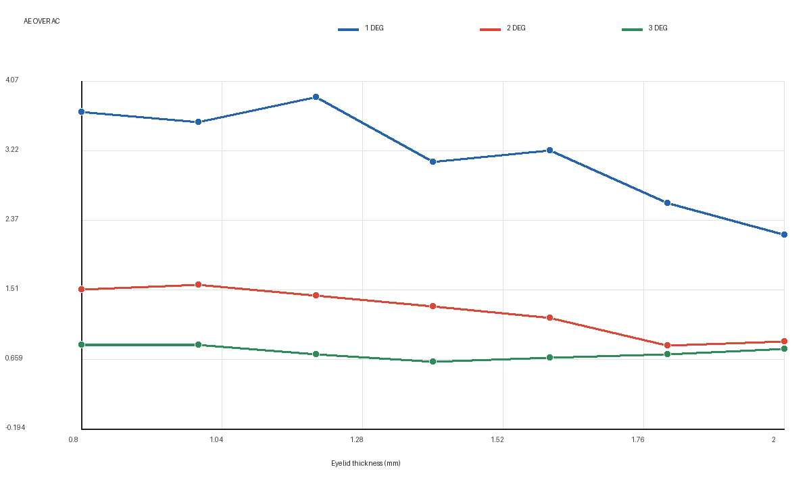
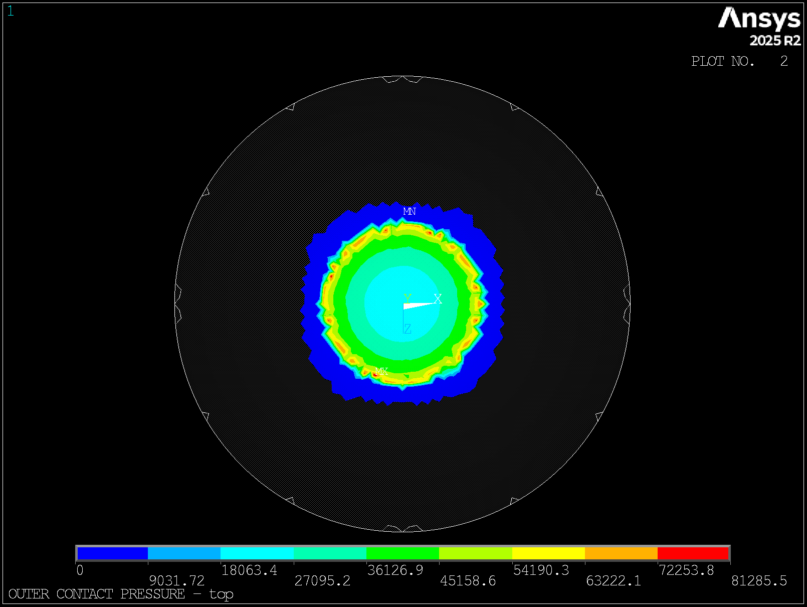
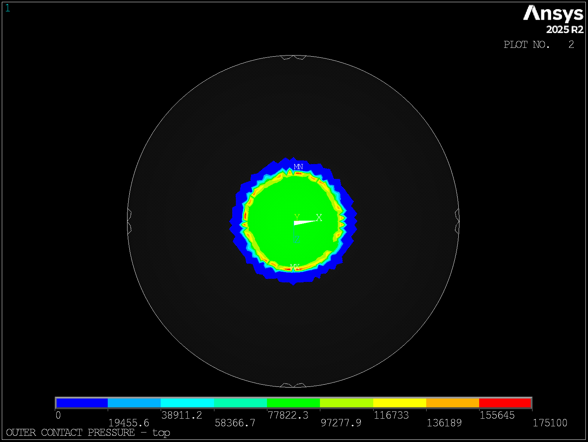
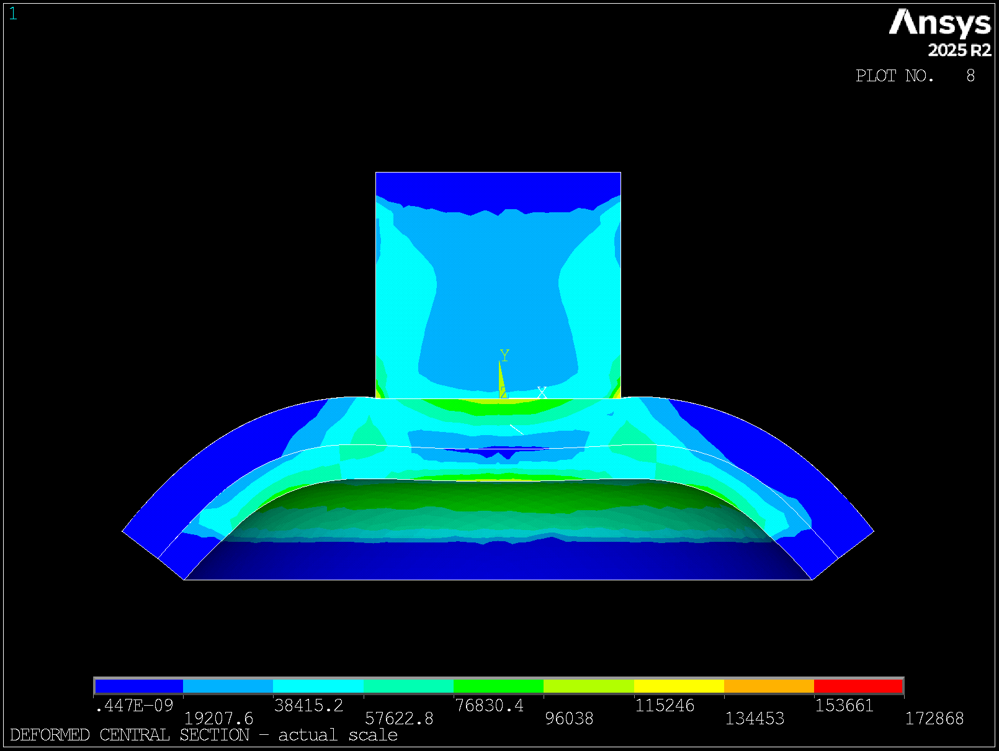
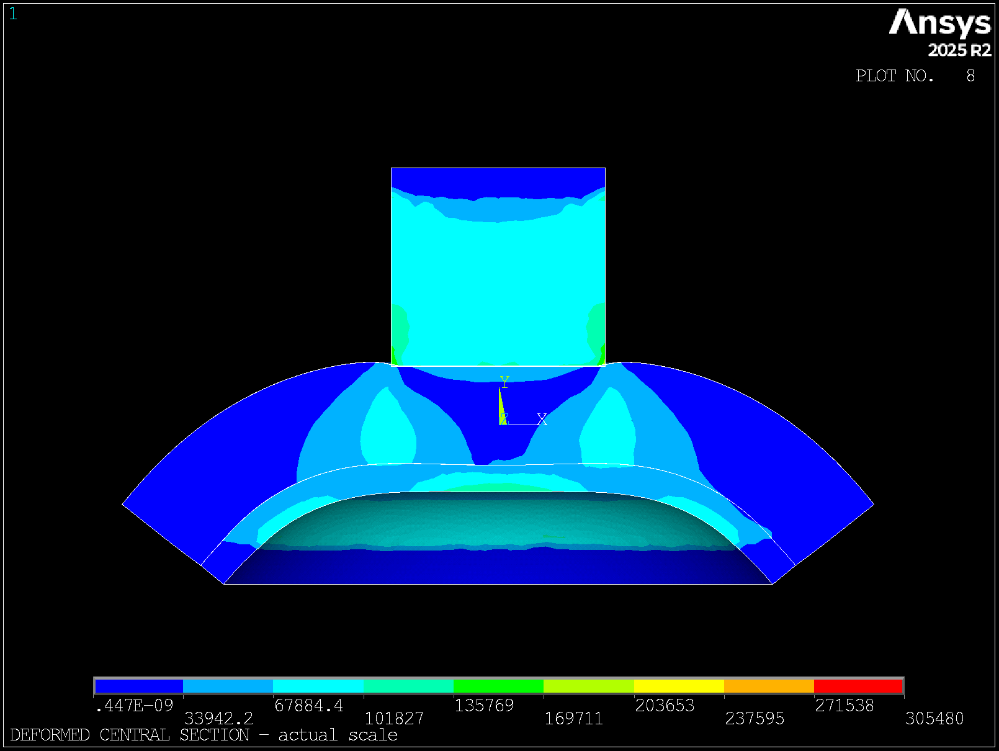

# 眼睑厚度有限元实验报告

> 口径说明：本报告记录固定 `0.80 mm` 推进的早期有限元结果，其中 `Ae` 指闭合接触面积。闭合接触、球面几何足迹和中央连续角度面积目前均只作诊断，不能作为正式 `Ae/Ac`；见[面积后处理口径复核](../../docs/THICKNESS_CALIBRATION.md#面积后处理口径复核)。

## 1. 结论摘要

本轮完成眼睑厚度 `0.80-2.00 mm`、步长 `0.20 mm` 的 7 个三维有限元状态，名义推进固定为 `0.80 mm`。7 个算例均一次完成，IOP 预载和探头压入两个载荷步全部收敛，批次 QC 为 `0 error、5 warning`；warning 均来自内侧压平面积对角度阈值敏感，不是求解失败。

主要结果如下：

- 探头轴向反力从 `0.6127 N` 增至 `1.4253 N`，增幅 `132.6%`，相对 0.80 mm 基线为 `2.326` 倍。
- 反力与眼睑厚度近似线性：`F=0.0725+0.6803t`，其中 `F` 单位为 N、`t` 单位为 mm，`R²=0.9996`。
- 外侧闭合接触面积 `Ae` 保持在 `13.656-13.915 mm²`，端点变化仅 `+0.74%`。厚度影响主要表现为载荷水平和内部形变传播变化，而不是探头外侧面积变化。
- 采用 `2°` 平面容差时，`Ae/Ac` 从 `1.523` 总体下降到 `0.881`，没有复现旧占位资料中“随厚度持续升高”的关系。
- `1°-3°` 面积结果差异较大，0.3 mm 网格下的严格角度面积会发生离散跳变，因此 `Ae/Ac(2°)` 目前只能作为判据敏感性指标，不能直接作为产品眼压换算曲线。
- 最大平均数值接触穿透为 `0.0063-0.0102 mm`，低于 `0.03 mm` 警戒线；实际比例截面未见大尺度穿模。

## 2. 模型与可追溯性

| 项目 | 设置 |
|---|---|
| Git 提交 | `2ecc9546a26e66bfaf091dc01a422a71dcedcf43` |
| 求解器 | ANSYS Mechanical APDL 2025 R2 |
| IOP | 2666.4 Pa（20 mmHg） |
| 角膜厚度 | 0.60 mm |
| 眼睑厚度 | 0.80、1.00、1.20、1.40、1.60、1.80、2.00 mm |
| 名义推进 | 0.80 mm；另含 0.05 mm 初始间隙闭合位移 |
| 网格 | 0.30 mm 主扫描网格，SOLID187 |
| 眼睑-角膜界面 | 完全 bonded |
| 加载路径 | 载荷步 1 建立 IOP 预应力；载荷步 2 保持 IOP 并压入探头 |
| 并行 | 4 个算例并行，每例 4 核 |

原始结果保存在 5090d 的外部数据区，轻量数据见 [fe_sweep 数据说明](../data/processed/fe_sweep/README.md)，完整 63 张状态图见 [视图索引](../figures/fe_sweep/views/README.md)。

## 3. 指标定义

- `Fy`：探头顶部约束节点的轴向反力总和，取绝对值作为探头机械读数。
- `Ae`：闭合探头-眼睑 CONTA174 单元面积之和。
- `Ac`：先扣除载荷步 1 的 IOP 预载位形，在压入引起的向下位移不低于最大值 5% 的内界面区域内，统计面法向与探头轴夹角不超过给定阈值的投影面积。
- 主展示口径为 `Ac(2°)`；`1°` 和 `3°` 用于判断定义敏感性。
- `C_F=F(0.8)/F(t)`：将不同厚度的固定工况机械读数归一到 0.80 mm 眼睑基线。该值不是绝对 IOP 校准系数。
- `K_A=Ae/Ac(2°)`：内外压平面积差异指标。当前判据敏感，暂不进入产品标定。

## 4. 七点结果

| 眼睑厚度 (mm) | 探头反力 (N) | 反力/0.8基线 | `C_F` | `Ae` (mm²) | `Ac(2°)` (mm²) | `Ae/Ac(2°)` | `pmax` (kPa) | 穿透 (mm) |
|---:|---:|---:|---:|---:|---:|---:|---:|---:|
| 0.80 | 0.6127 | 1.000 | 1.000 | 13.813 | 9.070 | 1.523 | 117.9 | 0.0064 |
| 1.00 | 0.7492 | 1.223 | 0.818 | 13.870 | 8.787 | 1.579 | 108.9 | 0.0063 |
| 1.20 | 0.8910 | 1.454 | 0.688 | 13.788 | 9.509 | 1.450 | 152.2 | 0.0076 |
| 1.40 | 1.0319 | 1.684 | 0.594 | 13.656 | 10.368 | 1.317 | 163.3 | 0.0084 |
| 1.60 | 1.1674 | 1.905 | 0.525 | 13.806 | 11.763 | 1.174 | 179.7 | 0.0089 |
| 1.80 | 1.2971 | 2.117 | 0.472 | 13.843 | 16.697 | 0.829 | 189.3 | 0.0092 |
| 2.00 | 1.4253 | 2.326 | 0.430 | 13.915 | 15.802 | 0.881 | 215.9 | 0.0102 |

反力随厚度单调增加且接近线性，适合用作下一轮多 IOP 标定的主响应量。`C_F` 只能表示当前固定 IOP、固定推进下相对于 0.80 mm 基线的机械归一化，不能直接把 `0.430` 等值解释成眼压修正。

`2°` 面积比总体下降，但 1.00 mm 和 1.80 mm 附近存在跳变。三条角度曲线之间差异较大，说明面积边界受到粗网格面片角度离散控制。旧占位资料的单调上升结论未被本轮 0.80 mm 推进结果支持。

## 5. 当前数据的 95% CI

以下区间使用 7 个设计厚度点计算均值的 t 区间，仅描述本次参数扫描点的离散程度，不是重复实验、人群分布或模型误差的统计区间。

| 指标 | 均值 | 95% CI |
|---|---:|---:|
| 探头反力 (N) | 1.0249 | [0.7530, 1.2968] |
| 反力/0.8基线 | 1.6728 | [1.2291, 2.1166] |
| 外侧面积 `Ae` (mm²) | 13.8131 | [13.7376, 13.8886] |
| 内侧面积 `Ac(2°)` (mm²) | 11.7136 | [8.6984, 14.7288] |
| `Ae/Ac(2°)` | 1.2503 | [0.9712, 1.5294] |
| 最大接触压力 (kPa) | 161.0 | [125.6, 196.5] |
| 最大平均穿透 (mm) | 0.00814 | [0.00679, 0.00948] |

## 6. 代表性云图

### 外侧接触压力

| 0.80 mm 眼睑 | 1.40 mm 眼睑 | 2.00 mm 眼睑 |
|---|---|---|
|  |  |  |

三个状态均保持中心对称，接触斑块外径变化较小；厚度增加后压力水平整体提高。图片使用各自自动色标，颜色不能跨图直接比较，绝对值以主表为准。

### 实际比例中央截面

| 0.80 mm 眼睑 | 2.00 mm 眼睑 |
|---|---|
|  |  |

截面显示厚眼睑内部的形变传播范围更宽。结合 `CONT:PENE` 数值和收敛日志，当前 0.80 mm 推进下没有大尺度穿模证据。

## 7. 工程判断与修正建议

1. 当前最可靠的厚度响应是探头反力。可先使用线性关系评估厚度敏感性，但正式眼压标定必须增加多个 IOP 水平和无 IOP/无眼睑基线，分离组织弹性反力与腔内压力贡献。
2. 外侧接触面积几乎不随厚度变化，单独依赖 `Ae` 无法识别眼睑厚度。
3. 面积修正指标在 0.80 mm 眼睑处为 `1.523`，符合预期起点；但后续并未持续升高。当前不能将旧占位曲线 `1.46→5.68` 作为本模型的常态化结论。
4. `Ac` 的严格平面边界需要细网格复核。建议只对 `0.8、1.4、2.0 mm` 三个代表点使用 0.15 mm 局部网格验证，并比较角度面积、曲率面积和相机分割口径。
5. 真实仿体实验仍应按 7 个厚度点、多个 IOP、独立装配重复执行。只有该数据才能给出人群或重复实验 95% CI，并将 `Fy` 与 `Ae/Ac` 转换为实际 IOP 修正函数。

## 8. 适用范围

本报告基于超弹性材料、眼睑-角膜完全 bonded、0.30 mm 网格、20 mmHg IOP 和准静态 0.80 mm 推进。峰值压力和峰值应力受接触边缘及网格影响，只用于趋势比较。报告中的机械归一化和面积指标不能替代临床或仿体标定。
