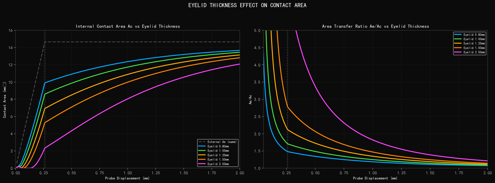
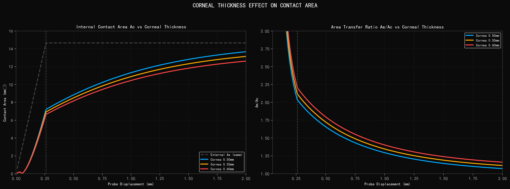
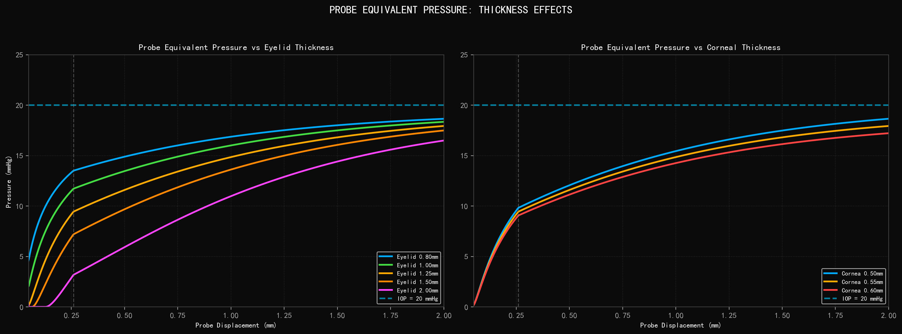
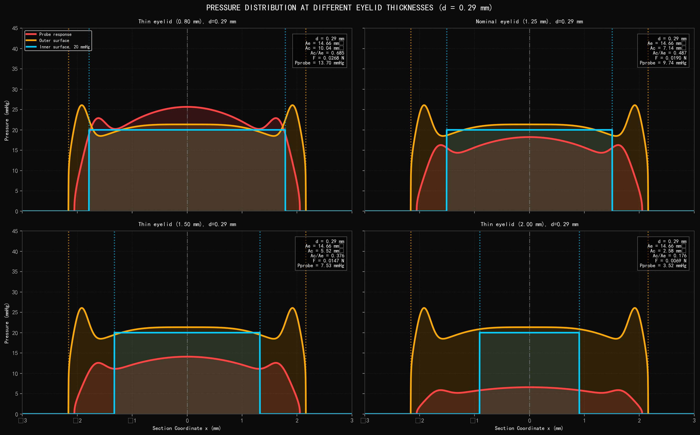

# 眼睑角膜厚度影响分析

> **数据状态：占位参数扫描。** 本文保留用于实验设计和内部汇报的当前趋势，不是重复仿体实验结果。`95% CI` 仅描述参数扫描点的离散范围；真实实验完成后，以 `thick/data/processed/` 中的可追溯结果和实验报告替换本文件的正式结论。

## Eyelid & Cornea Thickness Effect Analysis

Influence of Tissue Thickness on Inner/Outer Applanation Areas

---

### 物理背景

The eyelid acts as a mechanical buffer between the probe and the cornea. Its thickness determines how the probe contact force distributes laterally before reaching the cornea. A thicker eyelid spreads the load over a larger area, reducing the effective internal contact area Ac for a given external displacement.

Corneal thickness also plays a role: a thicker cornea has higher bending stiffness, slightly reducing the deformation and contact area under the same load.

| Parameter | Value |
|---|---|
| Eyelid thickness cases | 0.80mm, 1.00mm, 1.25mm, 1.50mm, 2.00mm |
| Corneal thickness cases | 0.50mm, 0.55mm, 0.60mm |
| Nominal eyelid thickness | 1.25 mm |
| Nominal corneal thickness | 0.55 mm |
| IOP | 20.0 mmHg (fixed) |
| Fixed displacement (grid) | d = 0.29 mm |

---

### 1. 眼睑厚度对接触面积的影响

左图：不同眼睑厚度下的内部接触面积 Ac。眼睑越厚，Ac 越小——因为眼睑软组织将探头载荷分散到更大范围。2.00mm 眼睑的 Ac 明显低于 0.80mm 眼睑。

右图：面积传递比 Ae/Ac。眼睑越厚，比值越高，表明需要更大的传递比来补偿眼睑的缓冲效应。

---

### 2. 角膜厚度对接触面积的影响

角膜厚度在生理范围内的变化对接触面积的影响远小于眼睑厚度。三条曲线几乎重叠，说明角膜厚度是相对次要的参数。

---

### 3. 探头等效压力

左图：不同眼睑厚度下的探头等效压力。眼睑越薄，等效压力越接近 IOP（20 mmHg）。2.00mm 厚眼睑的等效压力显著降低，说明需要修正系数。

右图：不同角膜厚度下的探头等效压力。三条曲线几乎重合，确认角膜厚度的影响较小。

---

### 4. 切面压力分布对比（不同眼睑厚度）

2×2 grid comparing pressure distributions at four different eyelid thicknesses (d = 0.29 mm). As eyelid thickness increases:
- The probe response (red) becomes broader and lower in amplitude
- The outer surface stress (orange) becomes more distributed
- The internal contact area Ac decreases significantly

---

### 5. 数据汇总

**眼睑厚度变化（角膜 = 0.55 mm，d = 0.29 mm）:**

| t_eyelid (mm) | Ae (mm²) | Ac (mm²) | Ac/Ae | F (N) | Pprobe (mmHg) |
|---|---|---|---|---|---|
| 0.80 | 14.66 | 10.04 | 0.685 | 0.0268 | 13.70 |
| 1.00 | 14.66 | 8.77 | 0.598 | 0.0234 | 11.96 |
| 1.25 | 14.66 | 7.14 | 0.487 | 0.0190 | 9.74 |
| 1.50 | 14.66 | 5.52 | 0.376 | 0.0147 | 7.53 |
| 2.00 | 14.66 | 2.58 | 0.176 | 0.0069 | 3.52 |

**角膜厚度变化（眼睑 = 1.25 mm，d = 0.29 mm）:**

| t_cornea (mm) | Ae (mm²) | Ac (mm²) | Ac/Ae | F (N) | Pprobe (mmHg) |
|---|---|---|---|---|---|
| 0.50 | 14.66 | 7.42 | 0.506 | 0.0198 | 10.13 |
| 0.55 | 14.66 | 7.14 | 0.487 | 0.0190 | 9.74 |
| 0.60 | 14.66 | 6.85 | 0.467 | 0.0183 | 9.35 |

### 6. 当前数据的 95% CI 置信区间

基于当前眼睑厚度参数点（0.80、1.00、1.25、1.50、2.00 mm）和角膜厚度参数点（0.50、0.55、0.60 mm）分别计算 95% CI。该区间用于描述当前参数扫描结果的稳定性和敏感性；眼睑厚度组覆盖范围较宽，因此 CI 更宽，角膜厚度组集中在生理小范围内，因此 CI 明显更窄。

| Group | Metric | Mean | 95% CI |
|---|---|---:|---:|
| Eyelid thickness | Ac (mm²) | 6.81 | [3.19, 10.43] |
| Eyelid thickness | Ac/Ae | 0.464 | [0.218, 0.711] |
| Eyelid thickness | Pprobe (mmHg) | 9.29 | [4.36, 14.22] |
| Corneal thickness | Ac (mm²) | 7.14 | [6.43, 7.84] |
| Corneal thickness | Ac/Ae | 0.487 | [0.438, 0.535] |
| Corneal thickness | Pprobe (mmHg) | 9.74 | [8.77, 10.71] |

CI 对比显示，眼睑厚度是当前模型中最主要的几何影响项：眼睑厚度组的 Ac 与 Pprobe 区间跨度明显大于角膜厚度组。角膜厚度在 0.50-0.60 mm 范围内主要造成小幅线性变化，不改变整体判断；眼睑厚度会显著改变内外压缩面积之间的传递关系。

### 7. 眼睑厚度对应内外压缩面积比例的常态化趋势

为了建立可复用的厚度修正项，建议使用 `Ae/Ac` 作为眼睑厚度归一化比例。该值表示外部探头-眼睑压缩面积与内部眼睑-角膜有效压缩面积之间的放大关系；数值越高，说明同样的外部压缩在角膜内侧形成的有效面积越小，需要更强的眼睑厚度修正。

| t_eyelid (mm) | Ac/Ae | Ae/Ac |
|---:|---:|---:|
| 0.80 | 0.685 | 1.46 |
| 1.00 | 0.598 | 1.67 |
| 1.25 | 0.487 | 2.05 |
| 1.50 | 0.376 | 2.66 |
| 2.00 | 0.176 | 5.68 |

当前数据提示，0.80-1.25 mm 区间内 `Ae/Ac` 缓慢上升，1.25-1.50 mm 后上升速度开始加快；从 1.5-1.6 mm 附近开始，眼睑缓冲效应进入更敏感区间。按当前趋势估计，`Ae/Ac` 在 1.50 mm 时约为 2.66，1.60 mm 约为 3.26，1.70 mm 约为 3.87，1.80 mm 约为 4.47，1.90 mm 约为 5.08，2.00 mm 约为 5.68。

因此，眼睑厚度修正可以先按两个区间处理：当眼睑厚度小于约 1.5 mm 时，修正比例随厚度增加呈平缓上升；当眼睑厚度达到 1.5-1.6 mm 后，修正比例快速升高，厚眼睑个体的 Pprobe 会明显低估实际 IOP。后续如果加入更多厚度点，应优先加密 1.4-1.8 mm 区间，以确定转折区间和修正曲线的斜率。

**Key observations:**
- Eyelid thickness is the dominant geometric parameter affecting the internal contact area
- A measurement correction coefficient must account for individual eyelid thickness variation
- Corneal thickness has minor influence within the physiological range (0.50-0.60mm)
- Thicker eyelids require larger correction factors for accurate IOP estimation
