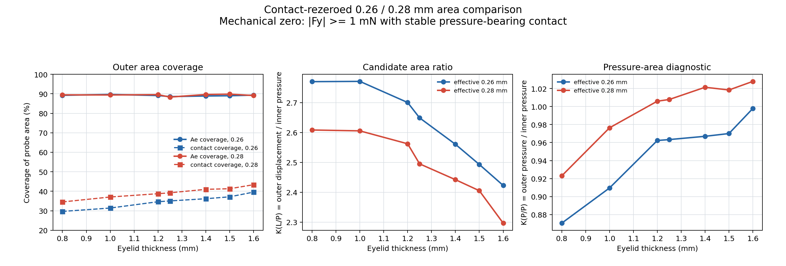
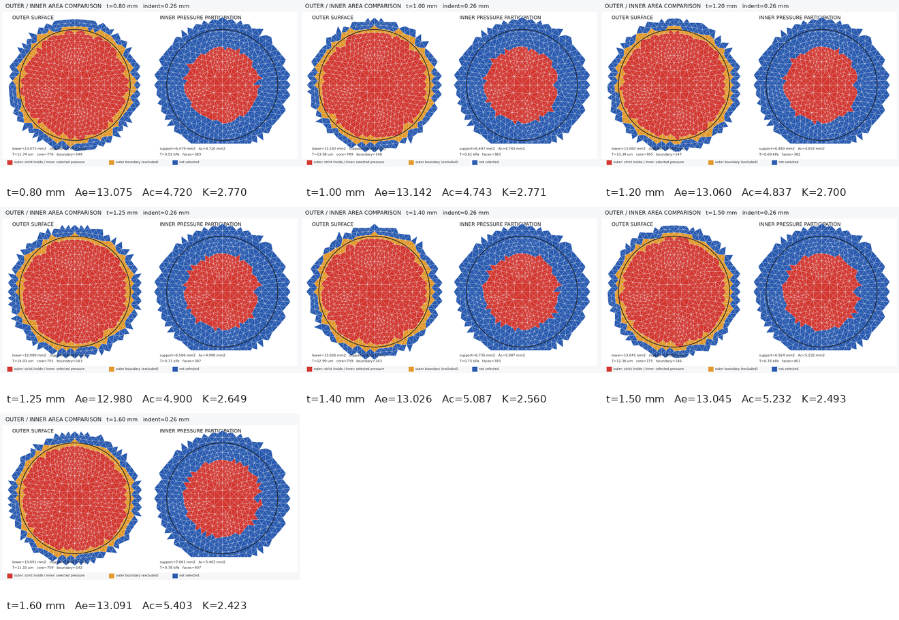
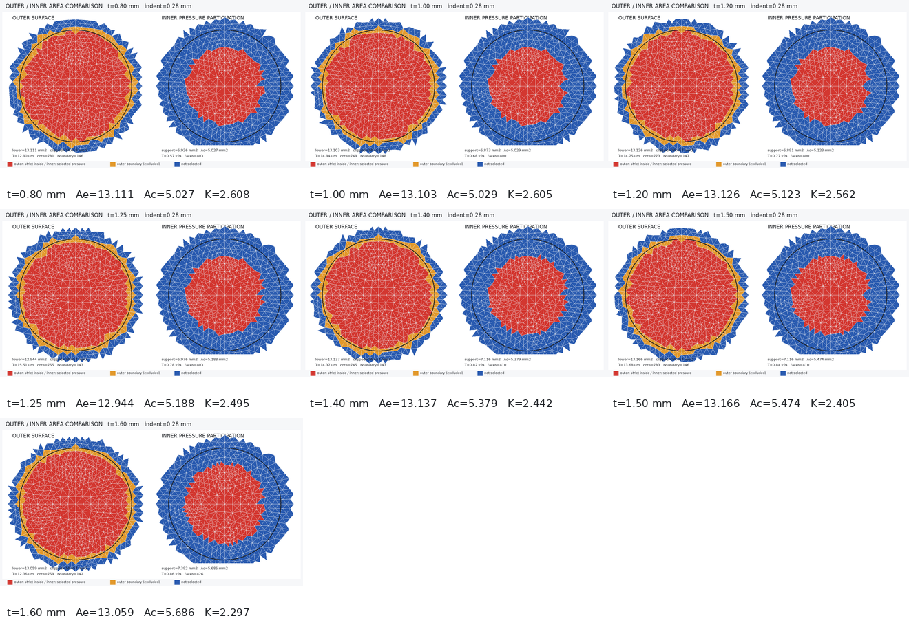

# 首次稳定接触归零后的 0.26 / 0.28 mm 面积对照

## 目的

本实验不重新进行有限元求解，而是从正式厚度批次
`20260723T114358Z_973a834a_formal_0p28` 的完整 `.rst` 加载历史中重新定义机械零点，并在同一条已收敛加载路径上提取：

- 首次稳定接触后有效推进 `0.26 mm`；
- 首次稳定接触后有效推进 `0.28 mm`。

每个状态重新导出了探头反力、闭合接触面积、外表面位移网格和眼睑—角膜 bonded 界面压力。模型参数保持不变：IOP `20 mmHg`、网格 `0.30 mm`、眼睑材料倍率 `1.00`、角膜材料倍率 `0.75`、角膜厚度 `0.60 mm`。

## 机械零点

本轮使用可复现的操作定义：

$$
|F_y|\ge1\ \mathrm{mN},
$$

同时要求存在压力不低于 `1 Pa` 的承载接触单元，并连续保持至少 3 个历史采样点。接近历史使用 `0.0025 mm` 间隔。阈值交点在相邻采样点间线性插值。

有效推进量定义为：

$$
\delta_{\mathrm{eff}}
=|U_y|-|U_{y,0}|,
$$

其中 $U_{y,0}$ 是机械零点对应的探头总位移。

| 眼睑厚度 (mm) | IOP 预载末端反力 (mN) | 预载接触面积 (mm²) | 机械零点总推进 (mm) | 新 0.26 对应旧坐标 (mm) | 新 0.28 对应旧坐标 (mm) |
|---:|---:|---:|---:|---:|---:|
| 0.80 | 5.200 | 0.808 | 0.0000 | 0.2100 | 0.2300 |
| 1.00 | 2.576 | 0.523 | 0.0000 | 0.2100 | 0.2300 |
| 1.20 | 0.705 | 0.332 | 0.0012 | 0.2112 | 0.2312 |
| 1.25 | 0.420 | 0.335 | 0.0026 | 0.2126 | 0.2326 |
| 1.40 | 0.000 | 0.000 | 0.0079 | 0.2179 | 0.2379 |
| 1.50 | 0.000 | 0.000 | 0.0104 | 0.2204 | 0.2404 |
| 1.60 | 0.000 | 0.000 | 0.0124 | 0.2224 | 0.2424 |

“旧坐标”仍按固定 `0.05 mm` 间隙扣除。结果说明，新意义上的有效 `0.28 mm` 实际对应旧报告中的约 `0.230-0.242 mm`，不是原来的名义 `0.28 mm` 状态。

### 预载接触限制

`0.80-1.25 mm` 四个薄眼睑工况在 IOP 预载末端已经出现接触；其中 `0.80/1.00 mm` 已超过 `1 mN`，所以机械零点只能记为载荷步 2 起点。它们的首次接触实际发生在 IOP 建立过程中，而不是探头主动接近过程中。

因此，本实验是对现有加载路径的**操作零点修正**，不是独立验证的真实首次接触实验。若要把零点作为正式产品定义，下一轮求解必须增大初始间隙，保证 IOP 预载末端探头完全不承载，再增加独立接近阶段。

## 面积定义

继续使用当前候选口径：

- 外侧 $A_e^L$：探头圆内、稳定参与向下位移的完整外表面网格投影面积；
- 内侧 $A_c^P$：bonded 界面增量压力场的压力平方积分有效面积；
- 候选比值：

$$
K_{L/P}=\frac{A_e^L}{A_c^P}.
$$

同时保留两个诊断量：

1. 外侧实际承载接触覆盖率 $A_{\mathrm{contact}}/A_{\mathrm{probe}}$；
2. 内外两侧统一按压力有效面积计算的 $K_{P/P}$。

探头面积为：

$$
A_{\mathrm{probe}}=14.6574\ \mathrm{mm^2}.
$$

## 结果

| 厚度 (mm) | 0.26 接触覆盖 | 0.26 $A_e^L$ | 0.26 $A_c^P$ | 0.26 $K_{L/P}$ | 0.28 接触覆盖 | 0.28 $A_e^L$ | 0.28 $A_c^P$ | 0.28 $K_{L/P}$ |
|---:|---:|---:|---:|---:|---:|---:|---:|---:|
| 0.80 | 29.7% | 13.075 | 4.720 | 2.770 | 34.5% | 13.111 | 5.027 | 2.608 |
| 1.00 | 31.4% | 13.142 | 4.743 | 2.771 | 37.1% | 13.103 | 5.029 | 2.605 |
| 1.20 | 34.6% | 13.060 | 4.837 | 2.700 | 38.7% | 13.126 | 5.123 | 2.562 |
| 1.25 | 35.0% | 12.980 | 4.900 | 2.649 | 39.2% | 12.944 | 5.188 | 2.495 |
| 1.40 | 36.2% | 13.026 | 5.087 | 2.560 | 41.0% | 13.137 | 5.379 | 2.442 |
| 1.50 | 37.1% | 13.045 | 5.232 | 2.493 | 41.3% | 13.166 | 5.474 | 2.405 |
| 1.60 | 39.6% | 13.091 | 5.403 | 2.423 | 43.4% | 13.059 | 5.686 | 2.297 |

面积单位均为 `mm²`。



### 0.26 mm 网格矩阵



### 0.28 mm 网格矩阵



## 结果解释

1. 外侧位移参与面积基本不随有效推进量和厚度变化，覆盖探头面积约 `88.3%-89.8%`。该结果主要由探头圆裁切和 `0.30 mm` 网格边界控制。
2. 实际承载接触覆盖率明显更小：`0.26 mm` 为 `29.7%-39.6%`，`0.28 mm` 为 `34.5%-43.4%`。这再次证明“外表面参与位移”不等于“探头完整承载接触”。
3. 内侧压力参与面积随眼睑厚度增加：`0.26 mm` 从 `4.720` 增至 `5.403 mm²`；`0.28 mm` 从 `5.027` 增至 `5.686 mm²`。
4. 因为 $A_e^L$ 基本不变而 $A_c^P$ 增加，$K_{L/P}$ 仍随厚度下降：`0.26 mm` 从 `2.770` 降至 `2.423`，`0.28 mm` 从 `2.608` 降至 `2.297`。重新定义零点没有恢复实验希望的上升趋势。
5. 从有效 `0.26 mm` 增加到 `0.28 mm` 后，内侧有效面积增长快于外侧面积，七个厚度的 $K_{L/P}$ 均下降，降幅约 `3.5%-6.0%`。
6. 统一压力有效面积比 $K_{P/P}$ 随厚度上升：有效 `0.26 mm` 为 `0.870-0.998`，有效 `0.28 mm` 为 `0.923-1.028`。它支持“外侧压力分布相对扩展更快”的方向，但绝对值仍接近 `1`，不能替代可见压平面积比。

与旧固定间隙的名义 `0.28 mm` 报告相比，新有效 `0.28 mm` 的 $K_{L/P}$ 高约 `10.2%-16.4%`。原因不是材料变化，而是新状态在旧坐标上只有 `0.230-0.242 mm`，内侧压力参与面积更小。

## 结论

接触归零显著改变了“`0.28 mm` 状态”实际对应的结果时间和面积绝对值，但没有改变当前模型的核心趋势：混合口径 $K_{L/P}$ 随眼睑增厚下降，统一压力口径 $K_{P/P}$ 随眼睑增厚上升且接近 `1`。

当前最重要的新发现不是面积比数值，而是 `0.05 mm` 初始间隙不足以保证所有厚度在 IOP 预载后仍与探头分离。该问题会让薄眼睑工况的预应力状态受到探头约束。上述结果可以用于评估零点敏感性，但在修正加载路径前继续标记为 `candidate_not_approved`。

## 文件

| 文件 | 内容 |
|---|---|
| `contact_zero.csv` | 七个厚度的机械零点、预载反力和接触状态 |
| `history/*.csv` | 每个厚度 133 个接近历史采样点 |
| `contact_rezeroed_area_summary.csv` | 两个有效推进量的 14 个结构化结果 |
| `contact_rezeroed_area_trends.png` | 覆盖率和两种面积比趋势 |
| `effective_*/run_manifest.csv` | 新状态的结果时间、反力和接触指标 |
| `effective_*/analysis/` | 面积 CSV、独立状态图和矩阵 |

完整 `.db/.rst` 和导出的面数据继续保存在 5090d 外部数据区：

```text
/home/xuanyu/PROJECT/ziyu/blueknow-data/thickness_contact_rezero/20260724_contact_rezeroed_0p26_0p28
```
