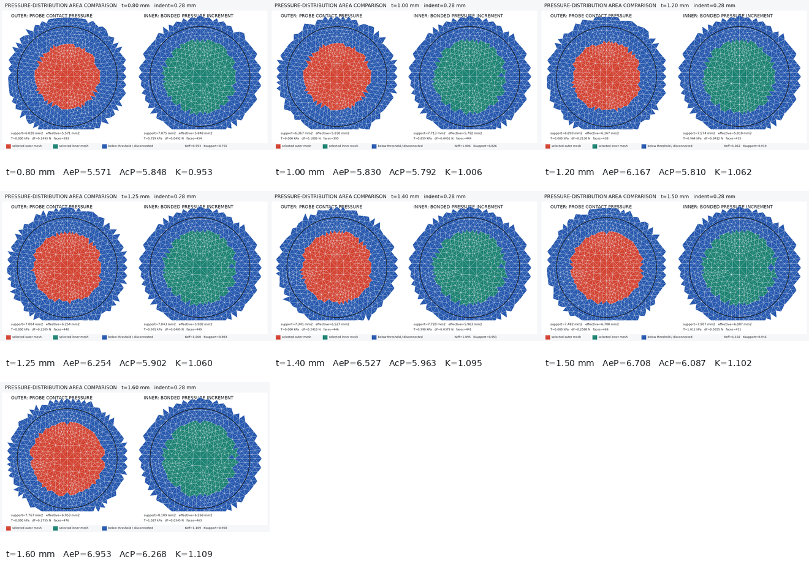

# 内外表面统一力学有效面积对照

## 目的

本实验回答一个独立问题：如果眼睑外表面和内表面都不用几何压平边界，而统一用压力分布表征有效承载面积，厚度方向的面积比如何变化？

结果来自 5090d 批次 `20260723T114358Z_973a834a_formal_0p28`，推进距离为 `0.28 mm`。本实验只重跑已有 `.db/.rst` 的后处理，没有重新求解，也不替换当前“外侧位移覆盖 / 内侧压力参与”的候选口径。

## 统一定义

对外侧探头—眼睑接触面和内侧眼睑—角膜 bonded 界面分别定义

$$
q_{s,i}=\left(p_{s,i}^{(1)}-p_{s,i}^{(0)}\right)-b_s,
\qquad s\in\{e,c\}.
$$

保留接触状态不低于 `2`、满足 $q_{s,i}>3\sigma_s$ 且与中心区域连通的面片集合 $\mathcal C_s$。两侧都使用同一个压力等效参与面积：

$$
A_s^P=
\frac{\left(\sum_{i\in\mathcal C_s}q_{s,i}A_{s,i}\right)^2}
{\sum_{i\in\mathcal C_s}q_{s,i}^2A_{s,i}},
\qquad
K_{P/P}=\frac{A_e^P}{A_c^P}.
$$

外侧预载时探头尚未承载，参考区压力和噪声均为零，所以外侧实际入选条件退化为“闭合且压力为正的中央接触区”；内侧继续在 `1.2a-1.6a` 环带扣除 IOP 预载背景。公式和压力非均匀性处理完全相同，但两侧的界面约束仍不同。

## 结果

| 眼睑厚度 | 外侧支撑面积 | 外侧 $A_e^P$ | 内侧支撑面积 | 内侧 $A_c^P$ | $K_{P/P}$ | 当前混合比值 |
|---:|---:|---:|---:|---:|---:|---:|
| `0.80 mm` | `6.028 mm²` | `5.571 mm²` | `7.875 mm²` | `5.848 mm²` | `0.953` | `2.240` |
| `1.00 mm` | `6.367 mm²` | `5.830 mm²` | `7.713 mm²` | `5.792 mm²` | `1.006` | `2.244` |
| `1.20 mm` | `6.893 mm²` | `6.167 mm²` | `7.574 mm²` | `5.810 mm²` | `1.062` | `2.275` |
| `1.25 mm` | `7.004 mm²` | `6.254 mm²` | `7.843 mm²` | `5.902 mm²` | `1.060` | `2.217` |
| `1.40 mm` | `7.341 mm²` | `6.527 mm²` | `7.720 mm²` | `5.963 mm²` | `1.095` | `2.199` |
| `1.50 mm` | `7.482 mm²` | `6.708 mm²` | `7.907 mm²` | `6.087 mm²` | `1.102` | `2.175` |
| `1.60 mm` | `7.767 mm²` | `6.953 mm²` | `8.109 mm²` | `6.268 mm²` | `1.109` | `2.084` |




## 解释

- 外侧有效压力面积由 `5.571 mm²` 增至 `6.953 mm²`，增长约 `24.8%`；内侧由 `5.848 mm²` 增至 `6.268 mm²`，增长约 `7.2%`。
- 因此外内有效面积比由 `0.953` 增至 `1.109`，端点增长约 `16.5%`。七点线性描述斜率为 `+0.199/mm`，$R^2=0.959$；`1.20-1.25 mm` 的轻微回落说明粗网格和阈值仍会产生局部波动。
- 七个设计点的均值为 `1.055`，描述性 95% t 区间为 `[1.002, 1.108]`。它不是重复实验、人群区间或模型误差范围。
- 统一压力口径恢复了“厚度增加时比例上升”的方向，但绝对值集中在 `1` 附近，不能覆盖实验观察的 `1.5-5+`。这说明实验比例并不等价于两侧压力场的等效承载面积之比。
- 当前混合口径比较的是外侧可见几何参与范围和内侧载荷传递范围，所以数值约为 `2.1-2.3`；本实验比较的是两个压力场的分布宽度和集中程度。两组数值回答不同问题，不能互相替换。

本实验状态为 `diagnostic_not_approved`。它支持的结论是：当前模型中，随眼睑增厚，探头接触压力分布扩展速度快于内侧增量压力分布，因此统一力学有效面积比总体上升；它不支持把该比值直接解释为实际内外压平面积比。

## 文件与复现

- [`mechanical_area_comparison.csv`](mechanical_area_comparison.csv)：七个厚度的完整指标；
- [`mechanical_area_trend.png`](mechanical_area_trend.png)：面积和比值趋势；
- [`mechanical_area_matrix.png`](mechanical_area_matrix.png)：七个状态的内外网格矩阵；
- [`states/`](states)：每个厚度的独立双侧网格图。

```bash
python src/postprocess/analyze_mechanical_area_comparison.py "$RUN_ROOT" \
  --output-dir thick/experiments/mechanical_area_comparison \
  --workers 4
```
