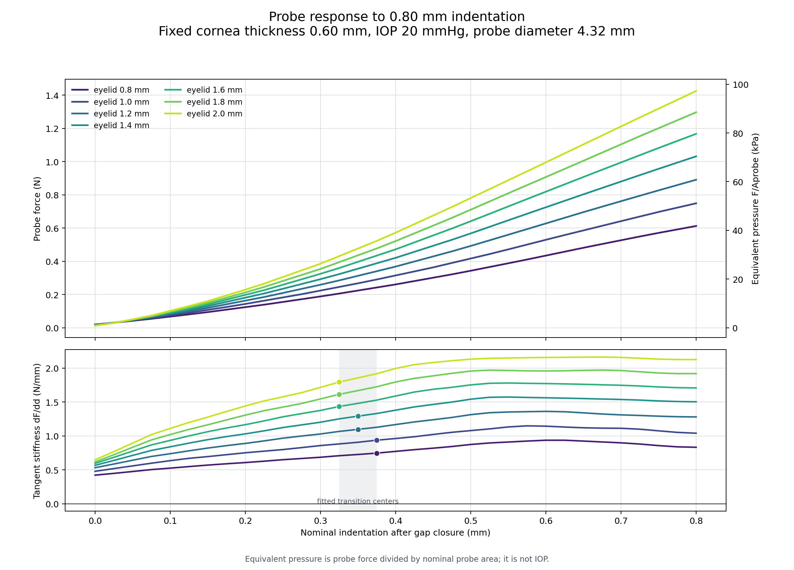

# 探头推进 0.80 mm 反力曲线与拐点检查

## 目的与工况

本实验从已经收敛的厚度主扫描结果中逐状态读取探头反力，用于判断推进到 `0.80 mm` 的过程中是否存在可辨识的力学拐点。这里变化的是**眼睑厚度** `0.80-2.00 mm`；角膜厚度固定为 `0.60 mm`，不是不同角膜厚度的对比。

主图使用七个完整的基线厚度工况：IOP `20 mmHg`、网格 `0.30 mm`、眼睑/角膜材料倍率均为 `1.00`。`calibrated_reference/` 另外保存当前校准材料组中仍保留完整结果文件的 `0.80、1.20、2.00 mm` 三个代表厚度，其中角膜材料倍率为 `0.75`。

## 计算口径

探头初始间隙为 `0.05 mm`。横轴使用间隙闭合后的名义推进量：

$$
\delta=\left|U_y\right|-0.05\ \mathrm{mm}.
$$

从探头顶部约束节点求和得到轴向反力 $F_y$。探头直径为 `4.32 mm`，名义面积为：

$$
A_{\mathrm{probe}}=\pi\left(\frac{4.32}{2}\right)^2
=14.6574\ \mathrm{mm^2}.
$$

图中右轴为探头等效压力：

$$
P_{\mathrm{eq}}=\frac{|F_y|}{A_{\mathrm{probe}}}.
$$

$P_{\mathrm{eq}}$ 是探头反力按固定探头面积归一化后的读数，不是接触平均压力，也不是 IOP。切线刚度由相邻采样点计算：

$$
k_t=\frac{\mathrm{d}F_y}{\mathrm{d}\delta}.
$$

每条曲线以 `0.025 mm` 为间隔提取 33 个点。位移由结果文件中的探头 `UY` 反算，七组最大位移误差小于 `1.2\times10^{-13} µm`。

## 过渡与拐点判据

先用连续双线段模型寻找整体刚度变化中心：

$$
F(\delta)=a+b\delta+c\max(0,\delta-\delta_*),
$$

其中 $\delta_*$ 是候选过渡中心，前后斜率分别为 $b$ 和 $b+c$。双线段拟合优于单直线，只能说明曲线存在两个不同的平均刚度区间；要判为明确机械拐点，还要求候选点前后各 `0.05 mm` 的局部斜率突变量不低于 `20%`。

| 眼睑厚度 (mm) | 过渡中心 (mm) | 0.80 mm 反力 (N) | 等效压力 (kPa) | 整体前/后斜率 (N/mm) | 局部斜率突变 | 判断 |
|---:|---:|---:|---:|---:|---:|---|
| 0.80 | 0.375 | 0.613 | 41.80 | 0.613 / 0.892 | 5.2% | 平滑过渡 |
| 1.00 | 0.375 | 0.749 | 51.11 | 0.759 / 1.103 | 7.0% | 平滑过渡 |
| 1.20 | 0.350 | 0.891 | 60.79 | 0.881 / 1.311 | 3.1% | 平滑过渡 |
| 1.40 | 0.350 | 1.032 | 70.40 | 1.026 / 1.532 | 3.4% | 平滑过渡 |
| 1.60 | 0.325 | 1.167 | 79.65 | 1.122 / 1.729 | 9.1% | 平滑过渡 |
| 1.80 | 0.325 | 1.297 | 88.49 | 1.251 / 1.931 | 6.3% | 平滑过渡 |
| 2.00 | 0.325 | 1.425 | 97.24 | 1.385 / 2.126 | 6.6% | 平滑过渡 |

## 几何压平点推导

### 1. 未变形球面的几何下限

当前探头直径为 `4.32 mm`，半径为：

$$
a=\frac{4.32}{2}=2.16\ \mathrm{mm}.
$$

模型角膜外表面曲率半径为 `7.8 mm`。眼睑与角膜完全 bonded，眼睑外表面的初始球面半径为：

$$
R=7.8+t,
$$

其中 $t$ 为眼睑厚度。以眼睑外表面顶点为名义零推进位置，半径 $r$ 处的初始球面矢高为：

$$
h(r)=R-\sqrt{R^2-r^2}.
$$

如果假设球面保持不动、探头只用一个刚性平面截切球面，那么平面到达探头边缘 $r=a$ 所需的推进量为：

$$
\boxed{
\delta_{\mathrm{geo}}
=R-\sqrt{R^2-a^2}
}
$$

各厚度对应的几何值为：

| 眼睑厚度 $t$ (mm) | 外表面半径 $R$ (mm) | 几何压平位移 $\delta_{\mathrm{geo}}$ (mm) | 加入 `0.05 mm` 间隙后的总探头位移 (mm) |
|---:|---:|---:|---:|
| 0.80 | 8.60 | 0.276 | 0.326 |
| 1.00 | 8.80 | 0.269 | 0.319 |
| 1.20 | 9.00 | 0.263 | 0.313 |
| 1.40 | 9.20 | 0.257 | 0.307 |
| 1.60 | 9.40 | 0.252 | 0.302 |
| 1.80 | 9.60 | 0.246 | 0.296 |
| 2.00 | 9.80 | 0.241 | 0.291 |

如果不考虑眼睑，直接使用裸角膜半径 $R=7.8\ \mathrm{mm}$，则：

$$
\delta_{\mathrm{geo,cornea}}
=7.8-\sqrt{7.8^2-2.16^2}
=0.305\ \mathrm{mm}.
$$

因此，之前提出的 `0.26-0.30 mm` 在几何意义上是正确的。当前统一采用 `0.28 mm` 名义推进，也落在这一区间内。

### 2. 旧球面相交面积为什么在 0.26 mm 接近探头面积

旧计算把推进平面与未变形球面的交线半径写成：

$$
r_{\mathrm{geo}}(\delta)
=\sqrt{2R\delta-\delta^2}.
$$

再将其截断到探头半径，得到：

$$
A_{\mathrm{geo}}(\delta)
=\pi\min\left(a^2,\,2R\delta-\delta^2\right).
$$

探头名义面积为：

$$
A_{\mathrm{probe}}
=\pi a^2
=14.6574\ \mathrm{mm^2}.
$$

在 `0.26 mm` 推进状态下，旧公式给出的覆盖率与有限元闭合接触覆盖率如下：

| 眼睑厚度 (mm) | 旧球面相交覆盖率 | 当前闭合接触覆盖率 | 探头反力 (N) |
|---:|---:|---:|---:|
| 0.80 | 94.4% | 34.8% | 0.146 |
| 1.00 | 96.6% | 37.7% | 0.173 |
| 1.20 | 98.9% | 38.8% | 0.200 |
| 1.40 | 100.0% | 41.5% | 0.226 |
| 1.60 | 100.0% | 41.2% | 0.251 |
| 1.80 | 100.0% | 43.8% | 0.275 |
| 2.00 | 100.0% | 46.3% | 0.297 |

旧公式在 `0.26 mm` 附近得到接近 `100%` 的面积，正是此前判断几何压平点位于 `0.26-0.30 mm` 的来源。但它只使用未变形球面和推进平面，不读取有限元位移、接触间隙或接触压力。因此，它只能表示**未变形几何下探头平面到达球面边缘的位移下限**，不能证明整个探头表面已经建立了承载接触。

### 3. GAT 面积换算

标准 GAT 的名义压平直径为 `3.06 mm`，对应面积：

$$
A_{\mathrm{GAT}}
=\pi\left(\frac{3.06}{2}\right)^2
=7.3542\ \mathrm{mm^2}.
$$

当前探头面积与 GAT 面积之比为：

$$
\frac{A_{\mathrm{probe}}}{A_{\mathrm{GAT}}}
=\frac{14.6574}{7.3542}
=1.993.
$$

因此，如果此前记录的“`2-3`”指面积倍率，当前探头面积约为 GAT 面积的 `2.0` 倍。这个倍率不是推进距离，也不意味着反力曲线一定出现拐点。

按照理想压力—面积关系，在 IOP 为 `20 mmHg = 2666.4 Pa` 时，完整探头面积上的压力反力只有：

$$
F_{\mathrm{IOP}}
=P_{\mathrm{IOP}}A_{\mathrm{probe}}
=2666.4\times14.6574\times10^{-6}
=0.0391\ \mathrm{N}.
$$

而 `0.26 mm` 状态的有限元探头反力已经达到 `0.146-0.297 N`，约为该理想压力项的 `3.7-7.6` 倍。这说明当前反力主要包含眼睑压缩、角膜与眼睑膜拉伸、bonded 界面整体随动和材料非线性，不能直接按 GAT 面积比例缩放。

### 4. 实际变形为什么推迟完全接触

初始眼睑外表面可写为：

$$
y_0(r)=-7.8+\sqrt{R^2-r^2}.
$$

间隙闭合后，探头平面推进到：

$$
y_{\mathrm{probe}}=t-\delta.
$$

实际有限元表面还包含向下位移 $u_y(r,\delta)$：

$$
y(r,\delta)=y_0(r)+u_y(r,\delta).
$$

探头边缘达到实际接触时必须满足：

$$
y(a,\delta_{\mathrm{full}})
=y_{\mathrm{probe}}.
$$

整理后得到：

$$
\boxed{
\delta_{\mathrm{full}}
=\delta_{\mathrm{geo}}
-u_y(a,\delta_{\mathrm{full}})
}
$$

边缘组织通常随中心加载向下移动，即 $u_y<0$，所以：

$$
\delta_{\mathrm{full}}>\delta_{\mathrm{geo}}.
$$

这解释了为什么未变形几何在约 `0.26 mm` 已达到探头边缘，而有限元闭合接触面积仍只有约 `35%-46%`。

### 5. 为什么反力曲线没有在几何压平点产生明显拐点

探头总反力可以概念性地分解为：

$$
F_{\mathrm{probe}}(\delta)
=P_{\mathrm{IOP}}A_{\mathrm{eff}}(\delta)
+F_{\mathrm{eyelid}}(\delta)
+F_{\mathrm{cornea}}(\delta)
+F_{\mathrm{bonded}}(\delta).
$$

即使 $A_{\mathrm{eff}}$ 在某个位置接近探头面积，只有第一项停止快速扩张；其余组织承载项仍会随推进继续增加。并且新接触的边缘环带通常从接近零压力开始承载，因此接触面积达到边缘也不必造成反力导数突跳。

当前结果反映的是：

- `0.24-0.28 mm`：未变形外表面的几何边缘到达区间；
- `0.325-0.375 mm`：反力曲线的平滑增刚中心；
- `0.55-0.70 mm`：三个代表厚度按当前闭合接触面积达到约 `90%` 的近完全承载区间。

这三个尺度描述不同物理量，不能相互替代。特别是，GAT 的光学压平面积、未变形球面相交面积和有限元承载接触面积不是同一个面积定义。

### 6. 当前仍需验证的数值问题

当前闭合接触面积通过 `CONTA174` 单元平均状态筛选，并使用 `0.30 mm` 粗网格。部分接触单元可能因积分点状态平均而被低估。因此，`35%-46%` 的覆盖率应视为当前后处理口径下的结果，而不是最终实验真值。

下一步判断实际完全压平点时，不再使用反力拐点或旧球面相交面积作为唯一依据，而应在 `0.20-0.35 mm` 范围直接提取：

1. 探头与眼睑之间的径向法向间隙 $g_n(r)$；
2. 径向接触压力 $p(r)$；
3. 变形后外表面高度 $y(r)$；
4. 探头边缘处的组织位移 $u_y(a)$；
5. 接触积分点覆盖率，而不仅是接触单元平均状态。

只有当探头半径范围内 $g_n(r)\approx0$，且中心连续区域具有有效接触压力，才能将该状态称为实际完全压平。反力曲线只用于辅助识别承载机制变化，不能单独确定压平终点。

## 结论

1. 反力随推进量和眼睑厚度单调增加。推进到 `0.80 mm` 时，反力从 `0.613 N` 增至 `1.425 N`，按探头固定面积换算为 `41.80-97.24 kPa`。
2. 七组曲线均可识别出约 `0.325-0.375 mm` 的宽缓增刚区间；厚眼睑的拟合中心略早，但当前采样间隔和粗网格只支持趋势判断。
3. 所有工况的局部斜率突变量只有 `3.1%-9.1%`，没有达到 `20%` 判据。当前结果**没有明显的尖锐力学拐点**，更符合接触面积持续扩张并逐渐转入膜拉伸主导的平滑增刚过程。
4. 历史接触扫描显示，在 `0.35 mm` 时探头闭合接触覆盖率约为 `46%-61%`，到 `0.65 mm` 才达到约 `89%-94%`。因此 `0.325-0.375 mm` 过渡不能解释为探头已完全接触，也不能直接作为 GAT 压平终点。
5. 当前校准材料组的三个代表工况仍得到 `0.325-0.375 mm` 的平滑过渡，局部斜率突变量为 `5.2%-6.2%`。材料调整降低了反力绝对值，但未形成新的尖锐拐点。

名义零推进状态仍有 `0.013-0.020 N` 反力，这是 IOP 预加载后探头完成初始间隙闭合时的基线，不应强制归零。用于设备测量时，应单独记录并扣除同一眼球状态下的接触基线。

## 文件

| 文件 | 内容 |
|---|---|
| `probe_force_curve.png` | 七个眼睑厚度的反力、等效压力和切线刚度主图 |
| `probe_force_curve.csv` | 七组、每组 33 点的结构化曲线数据 |
| `breakpoint_analysis.csv` | 双线段过渡中心、整体及局部斜率和判断 |
| `metadata.json` | 探头面积、位移误差及判据统计 |
| `extraction_metadata.json` | 5090d 源批次、宏校验和与各工况后处理状态 |
| `raw/` | MAPDL 直接输出的六列 SI 单位原始数据 |
| `calibrated_reference/` | 角膜材料倍率 `0.75` 的三个保留工况及对照图 |

完整源 `.db/.rst` 继续位于 5090d 外部数据区，Git 只管理轻量曲线、图和可复现脚本。
