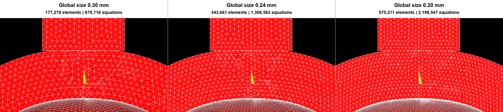
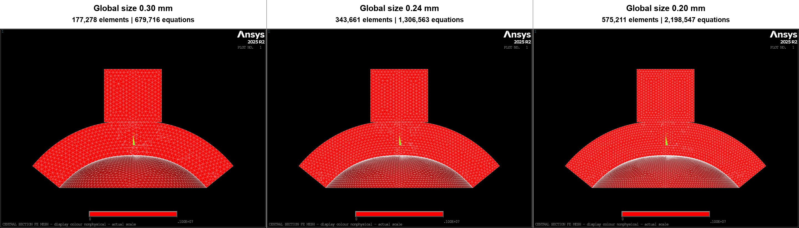
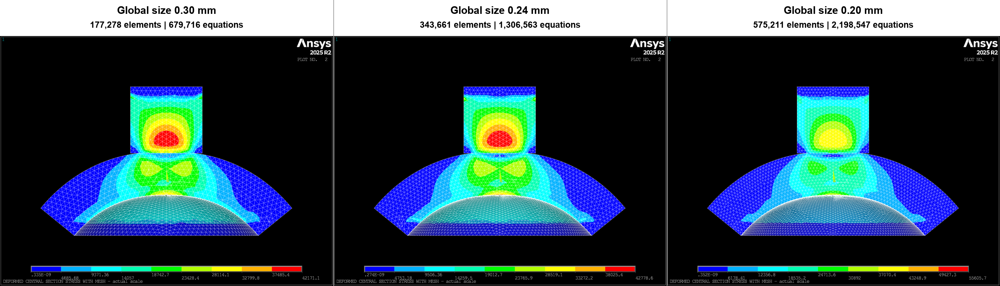

# 眼睑厚度厚端响应：三级网格审计详细报告

## 1. 报告目的与最终判定

本报告补充三级网格审计的实际 MAPDL 截图、求解规模、18 个接收终点的墙钟时间，以及被主动中止的资源预检开销。报告回答两个不同问题：

1. 眼睑厚度从 1.60 mm 增至 2.00 mm 时，图 5B 定义下的响应下降次序是否只是 0.30 mm 粗网格偶然现象；
2. 响应绝对幅值是否已达到预设的 2% 网格无关标准。

最终机器判定为：

`thick_end_order_robust_but_amplitude_not_mesh_independent`

三个全局网格均保持

\[
q(1.60\ \mathrm{mm})>q(1.80\ \mathrm{mm})>q(2.00\ \mathrm{mm}),
\]

因此厚端下降方向在当前有限元模型中具有网格稳健性。但是，0.24 mm 细化至 0.20 mm 后，三个厚度的绝对响应仍改变 11.30%–12.31%，明显超过预注册的 2% 判据。因此本研究**不支持**下列更强结论：

- 绝对 \(q\) 已网格无关；
- 1.60 mm 是真实组织的物理阈值或精确转折点；
- 当前幅值可直接外推至真实组织、其他材料、其他推进量或硬件。

## 2. 审计矩阵与统一截图工况

### 2.1 数值比较矩阵

正式比较使用 3 个眼睑厚度、3 个全局网格和 2 个压力：

- 眼睑厚度：1.60、1.80、2.00 mm；
- 全局网格尺寸：0.30、0.24、0.20 mm；
- IOP：0、20 mmHg；
- 推进量：0.28 mm；
- 角膜厚度：0.60 mm；
- 眼睑材料缩放：1.00；
- 角膜材料缩放：0.75；
- 探头初始间隙：0.30 mm；
- 体单元：SOLID187；接触单元：TARGE170/CONTA174；
- 求解器：Mechanical APDL 2025 R2。

图 5B 的观测量保持原定义：

\[
q_{20}(h)=\frac{F(h,20,d)-F(h,0,d)}{A_{\mathrm{probe}}},
\qquad
A_{\mathrm{probe}}=14.65741468458854\ \mathrm{mm^2}.
\]

这里没有混入 \(K_{\mathrm{geo}}\)、\(A_e\) 或 \(A_{c,5^\circ}\)。

### 2.2 截图控制变量

为直接显示不同网格粗细，三组截图统一选取：

| 项目 | 固定值 |
|---|---:|
| 眼睑厚度 | 2.00 mm |
| IOP | 20 mmHg |
| 探头推进 | 0.28 mm |
| 结果状态 | 载荷步 3，time = 3.0 |
| 截面 | 探头—眼睑—角膜中央剖面 |
| 几何显示 | 变形后几何，实际比例 1:1 |
| 视角 | 三档网格完全一致 |
| 云图 | 等效应力，MAPDL 原生自动色标 |

截图是对既有 DB/RST 的后处理，**没有重新求解**。统一宏为 `models/apdl/plot_mesh_independence_sections.mac`。

## 3. 实际网格截图

### 3.1 中央接触区放大对比

**图 1。** 2.00 mm 眼睑、20 mmHg、0.28 mm 推进时的同一中央区域。由左至右为 0.30、0.24 和 0.20 mm 全局网格。白线是变形后中央剖面上的实际单元边；红色仅是为了显出网格而使用的单色显示带，没有应力、应变或材料含义。三幅图使用完全相同的像素裁剪范围。

可以直接观察到：

- 探头、眼睑和角膜区域的剖面边密度随 0.30 → 0.24 → 0.20 mm 单调增加；
- 眼睑—角膜界面及中央接触区的表面离散同步加密；
- 当前方案是全局尺寸细化，不是只在接触区局部细化；
- 即使 0.20 mm 网格已经超过 57 万体单元，接触输出绝对幅值仍未满足 2% 标准。

### 3.2 完整实际比例剖面

**图 2。** 与图 1 相同工况的完整实际比例中央剖面。标题中的数值是 2.00 mm、20 mmHg 工况的求解器总单元数和方程数；图内白线只显示选中的 SOLID187 体网格。原始全分辨率截图保留在本报告第 5 节列出的路径中。

2.00 mm 工况的离散规模为：

| 全局尺寸 (mm) | 求解器单元数 | 节点数 | 方程数 | 相对 0.30 mm 单元倍数 | RST 大小 |
|---:|---:|---:|---:|---:|---:|
| 0.30 | 177,278 | 239,008 | 679,716 | 1.000 | 3.964 GB（3.692 GiB） |
| 0.24 | 343,661 | 460,814 | 1,306,563 | 1.939 | 7.781 GB（7.247 GiB） |
| 0.20 | 575,211 | 769,607 | 2,198,547 | 3.245 | 13.087 GB（12.188 GiB） |

RST 仅保存在 5090d；Git 中只保留 PNG、CSV、JSON、宏和文档。

## 4. 实际结果剖面云图

**图 3。** 2.00 mm 眼睑、20 mmHg、0.28 mm 推进、载荷步 3 的变形后中央剖面等效应力。白线为剖面单元边。每个子图保留 MAPDL 原生自动色标和单位 Pa。

读图边界如下：

1. 三个网格均显示相同的总体载荷路径：探头中央载荷经眼睑向角膜中央区传递；
2. 网格细化后，中央接触区和组织界面的梯度由更多单元解析；
3. 三个子图的自动色标上限不同，约为 42.17、42.78 和 55.61 kPa；这些上限包含当前显示选择下的全部实体，不能仅凭颜色或单个图例极值判定组织应力收敛；
4. 跨网格的定量结论使用积分探头力得到的 \(q\)、接触 QC 和明确的相对变化，而不是只比较云图颜色；
5. 该图证明实际结果场已被读取和统一后处理，但视觉相似性不能替代网格无关判据。

## 5. 原始 MAPDL 截图与可追溯路径

| 网格 | 原始网格剖面 | 原始应力剖面 |
|---:|---|---|
| 0.30 mm | [PNG](results/visual_evidence/raw/mesh_0p30_section.png) | [PNG](results/visual_evidence/raw/mesh_0p30_stress.png) |
| 0.24 mm | [PNG](results/visual_evidence/raw/mesh_0p24_section.png) | [PNG](results/visual_evidence/raw/mesh_0p24_stress.png) |
| 0.20 mm | [PNG](results/visual_evidence/raw/mesh_0p20_section.png) | [PNG](results/visual_evidence/raw/mesh_0p20_stress.png) |

外部后处理根目录为：

`/home/xuanyu/PROJECT/ziyu/blueknow-data/thickness_mesh_independence/20260810T063320Z_mesh_visual_evidence`

关键 provenance：

- 状态：`existing_rst_postprocessing_only`；
- MAPDL：2025 R2；
- 三组 `post.out` 均含 `RUN COMPLETED`；
- 三组 MAPDL error count 均为 0；
- DB、RST、PNG、宏及 driver 的路径、大小和 SHA-256：`results/visual_evidence/source_manifest.json`；
- Git 内轻量文件 SHA-256：`results/visual_evidence/artifact_manifest.json`。

0.30 mm 的 20 mmHg 图来自历史提交 `371ed27d...`，0.24/0.20 mm 图来自 `cef09f91...`。两提交间与该正压力图相关的模型宏差异只有零压力回退条件由 `LE` 改为 `LT`；对于正的 20 mmHg 输入，该差异不改变显示工况。该历史差异已显式保留，没有伪装为同一 Git SHA。

## 6. 三级网格定量结果

| 网格 (mm) | \(q(1.60)\) (mmHg) | \(q(1.80)\) (mmHg) | \(q(2.00)\) (mmHg) | 相对前一级最大变化 | 1.60→2.00 mm 下降 |
|---:|---:|---:|---:|---:|---:|
| 0.30 | 7.3720 | 7.2205 | 6.7996 | — | 7.76% |
| 0.24 | 6.6048 | 6.3904 | 5.9892 | 11.92% | 9.32% |
| 0.20 | 5.8586 | 5.6457 | 5.2518 | 12.31% | 10.36% |

**图 4。** 三级网格的绝对响应和相对变化。三个网格均保持厚端下降次序，但最新两级最大变化 12.31% 未通过 2% 判据。

0.24 → 0.20 mm 的三个厚度偏移分别约为 −0.7462、−0.7446 和 −0.7374 mmHg，偏移极差只有 0.0088 mmHg；\(q(1.60)-q(2.00)\) 的最新变化为 −1.43%。这些是事后形状诊断，说明厚端相对形状比绝对水平更稳定，但不能把主判据由失败改判为通过。

## 7. 全部接收终点的实际时间

### 7.1 统计口径

`elapsed_seconds` 来自各 runner manifest，表示单个 MAPDL 子进程从启动至返回的墙钟时间，包含模型建立、三个非线性载荷步和 runner 调用的标量后处理。它不等于 CPU 时间，也不包含排队时间或后续独立图片拼版时间。

`rank·h` 定义为：

\[
\text{rank}\cdot\mathrm{h}=\frac{\text{elapsed seconds}\times\text{requested MPI ranks}}{3600}.
\]

它是请求 rank 的占用量估计，不是实测 CPU 利用率。尤其在并行文件系统受限时，rank·h 不能等同于有效核小时。

### 7.2 18 个接受终点逐项统计

| 网格 (mm) | 厚度 (mm) | IOP (mmHg) | MPI ranks | 单元 | 方程 | 墙钟时间 (s) | h:mm:ss | rank·h | 备注 |
|---:|---:|---:|---:|---:|---:|---:|---:|---:|---|
| 0.30 | 1.60 | 0 | 8 | 151,599 | 575,145 | 948.324 | 0:15:48.32 | 2.107 | 历史工况 |
| 0.30 | 1.60 | 20 | 4 | 151,599 | 575,145 | 1301.920 | 0:21:41.92 | 1.447 | 历史工况 |
| 0.30 | 1.80 | 0 | 8 | 165,600 | 632,253 | 1212.320 | 0:20:12.32 | 2.694 | 历史工况 |
| 0.30 | 1.80 | 20 | 4 | 165,600 | 632,253 | 1635.951 | 0:27:15.95 | 1.818 | 历史工况 |
| 0.30 | 2.00 | 0 | 8 | 177,278 | 679,716 | 1333.968 | 0:22:13.97 | 2.964 | 历史工况 |
| 0.30 | 2.00 | 20 | 4 | 177,278 | 679,716 | 2651.250 | 0:44:11.25 | 2.946 | 历史工况 |
| 0.24 | 1.60 | 0 | 8 | 289,300 | 1,087,947 | 3206.890 | 0:53:26.89 | 7.126 | 接收终点 |
| 0.24 | 1.60 | 20 | 8 | 289,300 | 1,087,947 | 3754.014 | 1:02:34.01 | 8.342 | 接收终点 |
| 0.24 | 1.80 | 0 | 8 | 320,884 | 1,214,505 | 4259.690 | 1:10:59.69 | 9.466 | 接收终点 |
| 0.24 | 1.80 | 20 | 8 | 320,884 | 1,214,505 | 4860.241 | 1:21:00.24 | 10.801 | 接收终点 |
| 0.24 | 2.00 | 0 | 8 | 343,661 | 1,306,563 | 7965.081 | 2:12:45.08 | 17.700 | 接收终点 |
| 0.24 | 2.00 | 20 | 8 | 343,661 | 1,306,563 | 7924.798 | 2:12:04.80 | 17.611 | 接收终点 |
| 0.20 | 1.60 | 0 | 4 | 483,700 | 1,831,785 | 31328.528 | 8:42:08.53 | 34.809 | 资源竞争，非代表性 |
| 0.20 | 1.60 | 20 | 4 | 483,700 | 1,831,785 | 9551.594 | 2:39:11.59 | 10.613 | 接收终点 |
| 0.20 | 1.80 | 0 | 4 | 528,633 | 2,012,106 | 10078.517 | 2:47:58.52 | 11.198 | 接收终点 |
| 0.20 | 1.80 | 20 | 4 | 528,633 | 2,012,106 | 17645.269 | 4:54:05.27 | 19.606 | 接收终点 |
| 0.20 | 2.00 | 0 | 4 | 575,211 | 2,198,547 | 13359.354 | 3:42:39.35 | 14.844 | 接收终点 |
| 0.20 | 2.00 | 20 | 4 | 575,211 | 2,198,547 | 26694.627 | 7:24:54.63 | 29.661 | 接收终点 |

逐行机器可读数据见 `results/visual_evidence/simulation_timing.csv`。

### 7.3 按网格汇总

| 网格 (mm) | 接收终点 | 单算例墙钟范围 | 中位数 | 六算例墙钟和 | rank·h 总和 | 实际 campaign 说明 |
|---:|---:|---:|---:|---:|---:|---|
| 0.30 | 6 | 0.263–0.736 h | 0.366 h | 2.523 h | 13.976 | 来自不同历史 campaign，4/8 ranks 混用，不能给出单一 makespan |
| 0.24 | 6 | 0.891–2.213 h | 1.267 h | 8.881 h | 71.046 | 0/20 mmHg 两条压力流并行；实际日历时间 4:35:45 |
| 0.20 | 6 | 2.653–8.702 h | 4.306 h | 30.183 h | 120.731 | 接收的 IOP0 与 IOP20 分压力串行；两段 campaign 合计 30:11:14 |

0.20 mm 的 1.60 mm、0 mmHg 工况在前 8 h 25 min 与后来被中止的 IOP20 分支并行，墙钟时间达到 8:42:09。该终点本身完整并通过 QC，因此保留在实际历史和总用时中；但其时间不能作为独占资源条件下的代表值。

这些数据也不能被解释为受控的网格速度标定：0.30 mm 使用混合 4/8 ranks，0.24 mm 使用 8 ranks，0.20 mm 使用 4 ranks，且 campaign 的并发与 I/O 条件不同。

### 7.4 未接收资源预检的时间成本

| 事件 | 网格 | 最大并发 | 每算例 ranks | 事件墙钟 | 结局 |
|---|---:|---:|---:|---:|---|
| 四算例并行预检 | 0.24 mm | 4 | 4 | 2:11:37 | 主动中止；无完整终点 |
| 两压力、8 ranks 预检 | 0.20 mm | 2 | 8 | 0:53:50 | 主动中止；无完整终点 |
| 4 ranks 并行 IOP20 分支 | 0.20 mm | 1 | 4 | 8:25:08 | 主动中止；无完整 IOP20 终点 |

三次事件墙钟和为 11:30:35。按“事件持续时间 × 最大 MPI ranks”估算的上限为 83.13 rank·h，但这不是实测 CPU 时间。被中止分支没有任何数值进入网格比较。完整记录见 `results/visual_evidence/resource_preflight_timing.csv` 和 `RUN_LOG.md`。

### 7.5 图片后处理时间

从既有 RST 生成每个网格的两张 2143×1610 PNG 时，使用单 rank MAPDL：

| 网格 | RST 大小 | 后处理墙钟 | 最大 RSS |
|---:|---:|---:|---:|
| 0.30 mm | 3.692 GiB | 8.38 s | 1.28 GiB |
| 0.24 mm | 7.247 GiB | 10.50 s | 2.79 GiB |
| 0.20 mm | 12.188 GiB | 14.20 s | 5.54 GiB |

后处理时间与求解时间分开统计，不能相加后称为“求解耗时”。

## 8. QC 与证据边界

三级比较包含 18 个完整压力状态和 9 组同厚度—同网格压力配对。正式接收条件包括：

- runner 状态为 `complete`；
- return code 为 0；
- 三个载荷步均形成完整终点；
- ANSYS error count 为 0；
- 同厚度的 0/20 mmHg 节点数、单元数和固定参数一致；
- 最大穿透低于 0.03 mm 门限；
- 0.20 mm 全部接收状态中的最大穿透为 0.009760 mm。

这些 QC 排除了“算例未完成”“压力配对离散不同”或“明显过度穿透”作为当前三级结果的直接原因，但没有证明接触反力的绝对幅值已经离散收敛。

## 9. 对后续计算资源的实际建议

如果目标仅是证明厚端下降次序不是单一粗网格偶然现象，当前三级证据已经足够，不必继续无差别缩小全局尺寸。

如果目标是获得可定量使用的绝对 \(q\)，建议：

1. 不再直接把全局尺寸从 0.20 mm 继续整体缩小；
2. 对探头—眼睑接触区和眼睑—角膜界面做预注册局部细化；
3. 在不同厚度间保持一致的接触表面拓扑；
4. 收紧反力与接触收敛判据，并同时记录接触面积、峰值压力、穿透和自由度增长；
5. 先用一个厚度、0/20 mmHg 做资源预检，再扩大矩阵；
6. 以当前 0.20 mm 六终点实际墙钟和约 30.2 h 作为同服务器、4 ranks、压力串行方案的历史基准，并至少留出资源与 I/O 缓冲；不要用 0.30 mm 历史速度线性外推；
7. 若要定位峰值位置，应增加 1.50、1.60、1.70、1.80 mm 等密集厚度；当前细网格只有 1.60、1.80、2.00 mm，不能定位精确转折点。

## 10. 权威文件

- 正式判定：`results/confirmation/CONCLUSION.md`
- 三级数值：`results/confirmation/mesh_comparison.csv`
- 机器判定：`results/confirmation/screening_summary.json`
- 本报告时间明细：`results/visual_evidence/simulation_timing.csv`
- 时间汇总：`results/visual_evidence/timing_summary.json`
- 未接收资源事件：`results/visual_evidence/resource_preflight_timing.csv`
- 外部 DB/RST 与图片 provenance：`results/visual_evidence/source_manifest.json`
- Git 轻量文件哈希：`results/visual_evidence/artifact_manifest.json`
- 后处理脚本：`scripts/analysis/build_visual_report.py`
- MAPDL 统一截图宏：`../models/apdl/plot_mesh_independence_sections.mac`

本报告的结论仍限定为：**厚端下降方向在当前有限元模型内具有网格稳健性；绝对幅值尚未网格无关。**
